# FIX-PROTOCOL


**metamodel version:** 1.11.0

**version:** None


FIX Protocol - LinkML Schema


## Class Diagram

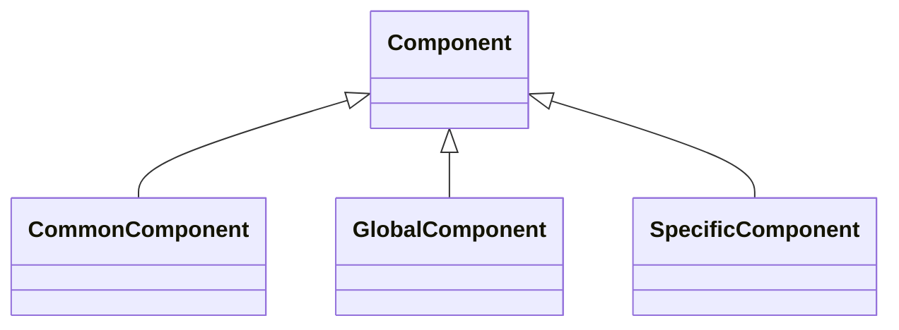

## ERD Diagram

```mermaid
erDiagram
AllocationFragmentationFieldMap {
    string fragment_count_field  
    string message_name  
    string msg_type  
    string principal_message_reference  
    string total_count_field  
}
AllocationStatusDescription {
    string description  
    string status_code  
    string status_label  
}
ApplicationMessageReferenceKey {
    string business_reject_ref_id_value  
    string category_label  
    string fix_message  
}
BusinessArea {
    string description  
    BusinessAreaEnum area  
    string title  
}
BusinessRejectReasonDescription {
    integer reject_reason_code  
    string reject_reason_label  
}
ClearingServicePostTradeProcessingFormat {
    ClearingServiceForPostTradeProcessingEnum message_format  
    stringList supported_actions  
}
CommonComponent {
    BusinessAreaEnum business_area  
    ComponentScope scope  
    string description  
    string component_name  
    boolean is_repeating_group  
}
CommonComponentDetail {
    string description  
    PreTradeCommonComponentName component_name  
    uri layout_url  
    ComponentRepetition repetition  
}
ComponentTableFootnote {
    string component_name  
    integer footnote_number  
    string introduced_in  
    PreTradeCategoryEnum sole_category  
    string text  
}
ExtensionPack {
    boolean applies_to_fixml_only  
    boolean applies_to_session_layer_only  
    string enhancement_summary  
    ExtensionPackNumber number  
    ExtensionPackSize size  
    string title  
}
FIXDatatype {
    FIXDatatypeName datatype_name  
    string definition  
    boolean deprecated_for_new_designs  
    string external_code_set  
    integerList footnote_numbers  
    integer index_lower_bound  
    integer index_upper_bound  
    integer maximum_value  
    integer minimum_value  
    integer radix  
    string repertoire  
    TimePrecisionList time_unit  
    ISO11404ValueSpaceList value_space  
    string value_space_notes  
}
FIXFamilyStandard {
    string id  
    string name  
    string description  
    string acronym  
    StandardEncodingName encoding_name  
    StandardLayer layer  
    uriList see_also  
    SessionProtocolName session_profile  
    string version  
}
FIXIntroduction {
    string introduction_text  
    string preface  
    ProductCoverageList product_coverage  
    date published_date  
    string published_version  
    string publisher  
    string utc_leap_seconds_note  
}
FIXProtocolLimited {
    string brand_name  
    uri committees_url  
    FPLCommitteeRoleList governance_bodies  
    string legal_name  
    uri member_firms_url  
    FPLMemberTypeList member_types  
    FPLProductGroupList product_committees  
    FPLRegionList regional_committees  
    uri website  
    uri working_groups_url  
}
Field {
    string description  
    FIXDatatypeName datatype  
    string field_name  
    boolean is_user_defined  
    FieldRequirement requirement  
    TagNumber tag  
}
GlobalComponent {
    boolean applies_to_instrument  
    boolean applies_to_leg  
    boolean applies_to_underlying  
    ComponentGroup component_group  
    stringList conceptually_identical_to  
    integer gc_id  
    GlobalComponentBusinessAreaEnumList gc_referenced_in  
    ComponentScope scope  
    string description  
    string component_name  
    boolean is_repeating_group  
}
InfrastructureBusinessArea {
    BusinessAreaEnum area  
    string components_overview_note  
    string diagram_conventions  
    InfrastructureComponentNameList infra_common_components  
    string infra_introduction  
    string messages_overview_note  
    string published_version  
    string publisher  
    string title  
}
InfrastructureCategorySection {
    string description  
    ApplicationMessageReportTypeEnumList application_message_report_uses  
    InfrastructureCategoryEnum category  
    string category_components_note  
    NetworkRequestTypeEnumList network_request_types_referenced  
    NetworkStatusScenarioEnumList network_status_scenarios  
    string title  
}
InfrastructureComponentDetail {
    string description  
    string component_name  
    uri layout_url  
    ComponentRepetition repetition  
}
InfrastructureComponentEntry {
    InfrastructureCategoryEnum category  
    string component_name  
    integer footnote_number  
    ComponentRepetition repetition  
}
InfrastructureComponentTableFootnote {
    string component_name  
    integer footnote_number  
    InfrastructureCategoryEnum infra_sole_category  
    string introduced_in  
    string text  
}
InfrastructureGlobalComponentReference {
    stringList infra_global_component_field_names  
    integerList infra_global_component_field_tags  
    stringList infra_global_component_msg_types  
    InfrastructureGlobalComponentName infra_global_component_name  
    string infra_global_component_repetition  
    InfrastructureCategoryEnumList infra_global_component_used_in  
}
InfrastructureLayoutRow {
    string infra_layout_description  
    string infra_layout_element_name  
    integer infra_layout_field_tag  
    InfrastructureLayoutRowKindEnum infra_layout_kind  
    boolean infra_layout_nested  
    boolean infra_layout_required  
}
InfrastructureMessageDetail {
    string description  
    uri layout_url  
    string message_name  
    string msg_type  
}
InfrastructureMessageEntry {
    InfrastructureCategoryEnum category  
    string message_name  
    string msg_type  
}
Message {
    string description  
    MessageCategoryEnum category  
    string message_name  
    string msg_type  
}
MessageCategory {
    string description  
    BusinessAreaEnum business_area  
    MessageCategoryEnum category  
    string title  
}
MessageGroup {
    string description  
    string group_title  
}
PostTradeBusinessArea {
    BusinessAreaEnum area  
    string components_overview_note  
    string diagram_conventions  
    string messages_overview_note  
    PostTradeCommonComponentNameList post_common_components  
    string post_introduction  
    string published_version  
    string publisher  
    string title  
}
PostTradeCategorySection {
    string description  
    AllocationRoleEnumList allocation_roles  
    AllocationScenarioEnumList allocation_scenarios  
    PostTradeCategoryEnum category  
    string category_components_note  
    ClearingServiceForPositionManagementEnumList clearing_services_for_position_management  
    CollateralAssignmentPurposeEnumList collateral_assignment_purposes  
    CollateralManagementUsageEnumList collateral_management_usages  
    PostTradeAllocationPricingMethodEnumList post_trade_allocation_pricing_methods  
    string title  
}
PostTradeCommonComponentDetail {
    string description  
    PostTradeCommonComponentName component_name  
    uri layout_url  
    ComponentRepetition repetition  
}
PostTradeComponentDetail {
    string description  
    string component_name  
    uri layout_url  
    ComponentRepetition repetition  
}
PostTradeComponentEntry {
    string category  
    string component_name  
    integer footnote_number  
    boolean is_common  
    ComponentRepetition repetition  
}
PostTradeComponentTableFootnote {
    string component_name  
    integer footnote_number  
    string introduced_in  
    PostTradeCategoryEnum post_sole_category  
    string text  
}
PostTradeLayoutRow {
    string post_layout_description  
    string post_layout_element_name  
    integer post_layout_field_tag  
    PostTradeLayoutRowKindEnum post_layout_kind  
    boolean post_layout_nested  
    boolean post_layout_required  
}
PostTradeMessageDetail {
    string description  
    uri layout_url  
    string message_name  
    string msg_type  
}
PostTradeMessageEntry {
    PostTradeCategoryEnum category  
    string message_name  
    string msg_type  
}
PostTradeMessageGroup {
    string group_title  
}
PreTradeBusinessArea {
    BusinessAreaEnum area  
    PreTradeCommonComponentNameList common_components  
    string components_overview_note  
    string diagram_conventions  
    string introduction  
    string messages_overview_note  
    string published_version  
    string publisher  
    string title  
}
PreTradeCategorySection {
    string description  
    PreTradeCategoryEnum category  
    string category_components_note  
    QuoteModelEnumList quote_models  
    string title  
}
PreTradeComponentDetail {
    string description  
    string component_name  
    uri layout_url  
    ComponentRepetition repetition  
}
PreTradeComponentEntry {
    string category  
    string component_name  
    integer footnote_number  
    boolean is_common  
    ComponentRepetition repetition  
}
PreTradeLayoutRow {
    string pre_layout_description  
    string pre_layout_element_name  
    integer pre_layout_field_tag  
    PreTradeLayoutRowKindEnum pre_layout_kind  
    boolean pre_layout_nested  
    boolean pre_layout_required  
}
PreTradeMessageDetail {
    string description  
    uri layout_url  
    string message_name  
    string msg_type  
}
PreTradeMessageEntry {
    PreTradeCategoryEnum category  
    string message_name  
    string msg_type  
}
RegistrationStatusDescription {
    string description  
    string status_code  
    string status_label  
}
SpecificComponent {
    BusinessAreaEnum business_area  
    MessageCategoryEnum category  
    ComponentScope scope  
    string description  
    string component_name  
    boolean is_repeating_group  
}
StandardResponseMapping {
    string appropriate_responses  
    string category_label  
    string fix_message  
}
TradeAppendix {
    string description  
    string published_version  
    string publisher  
    string title  
}
TradeAppendixSection {
    string description  
    string title  
    string trade_appendix_category  
}
TradeBusinessArea {
    string published_version  
    string publisher  
    string title  
    BusinessAreaEnum trade_area  
    TradeCommonComponentNameList trade_common_components  
    string trade_components_overview_note  
    string trade_diagram_conventions  
    string trade_introduction  
    uri trade_message_diagram_template_url  
    string trade_messages_overview_note  
}
TradeCaptureReportIdentifierRule {
    string description  
    TradeCaptureReportIdentifierRoleEnum identifier_role  
}
TradeCaptureReportUsage {
    string description  
    TradeCaptureReportIdentifierRoleEnum identifier_role  
    string status_label  
}
TradeCategorySection {
    string description  
    TradeCategoryEnum category  
    string title  
    string trade_category_background  
    string trade_category_components_note  
}
TradeCommonComponentDetail {
    string description  
    TradeCommonComponentName component_name  
    uri trade_layout_url  
    TradeComponentRepetition trade_repetition  
}
TradeComponentDetail {
    string description  
    string component_name  
    uri trade_layout_url  
    TradeComponentRepetition trade_repetition  
}
TradeComponentEntry {
    string category  
    string component_name  
    integer trade_footnote_number  
    boolean trade_is_common  
    TradeComponentRepetition trade_repetition  
}
TradeComponentTableFootnote {
    string component_name  
    integer trade_footnote_number  
    string trade_footnote_text  
    string trade_introduced_in  
    TradeCategoryEnum trade_sole_category  
}
TradeFragmentationEntry {
    string trade_fragmentation_message  
    string trade_fragmentation_repeating_group  
    string trade_fragmentation_total_entries_field  
}
TradeLayoutRow {
    string trade_layout_description  
    string trade_layout_element_name  
    integer trade_layout_field_tag  
    TradeLayoutRowKindEnum trade_layout_kind  
    boolean trade_layout_nested  
    boolean trade_layout_required  
}
TradeMessageDetail {
    string description  
    string message_name  
    string msg_type  
    uri trade_layout_url  
}
TradeMessageEntry {
    TradeCategoryEnum category  
    string message_name  
    string msg_type  
}
TradeMessageGroup {
    string description  
    string trade_group_title  
}
TradeOrdStatusPrecedenceEntry {
    string description  
    string trade_ord_status_label  
    integer trade_ord_status_precedence  
}
UDFTagRange {
    string description  
    TagNumber high_tag  
    TagNumber low_tag  
    string range_id  
    boolean requires_registration  
    UDFTagRangeUsage usage  
}

BusinessArea ||--}o MessageCategory : "categories"
CommonComponent ||--}o Component : "nested_components"
CommonComponent ||--}o Field : "fields"
CommonComponentDetail ||--}o PreTradeLayoutRow : "pre_layout_rows"
FIXIntroduction ||--|o FIXProtocolLimited : "about_fpl"
FIXIntroduction ||--}o BusinessArea : "business_areas"
FIXIntroduction ||--}o ExtensionPack : "extension_packs"
FIXIntroduction ||--}o FIXDatatype : "datatypes"
FIXIntroduction ||--}o FIXFamilyStandard : "standards"
FIXIntroduction ||--}o GlobalComponent : "global_components"
FIXIntroduction ||--}o UDFTagRange : "udf_ranges"
GlobalComponent ||--}o Component : "nested_components"
GlobalComponent ||--}o Field : "fields"
InfrastructureBusinessArea ||--}o ApplicationMessageReferenceKey : "key_fields_post_trade, key_fields_pre_trade, key_fields_trade"
InfrastructureBusinessArea ||--}o BusinessRejectReasonDescription : "business_reject_reason_descriptions"
InfrastructureBusinessArea ||--}o GlobalComponent : "referenced_global_components"
InfrastructureBusinessArea ||--}o InfrastructureCategorySection : "infra_category_sections"
InfrastructureBusinessArea ||--}o InfrastructureComponentTableFootnote : "infra_footnotes"
InfrastructureBusinessArea ||--}o InfrastructureGlobalComponentReference : "infra_global_components"
InfrastructureBusinessArea ||--}o StandardResponseMapping : "standard_responses_post_trade, standard_responses_pre_trade, standard_responses_trade"
InfrastructureBusinessArea ||--}| InfrastructureComponentEntry : "components"
InfrastructureBusinessArea ||--}| InfrastructureMessageEntry : "messages"
InfrastructureCategorySection ||--}o InfrastructureComponentDetail : "infra_category_specific_components"
InfrastructureCategorySection ||--}o InfrastructureMessageDetail : "messages"
InfrastructureComponentDetail ||--}o InfrastructureLayoutRow : "infra_layout_rows"
InfrastructureMessageDetail ||--}o InfrastructureLayoutRow : "infra_layout_rows"
Message ||--}o Component : "components"
Message ||--}o Field : "fields"
MessageCategory ||--}o Message : "messages"
MessageGroup ||--}| PreTradeMessageDetail : "messages"
PostTradeBusinessArea ||--}o GlobalComponent : "referenced_global_components"
PostTradeBusinessArea ||--}o PostTradeCategorySection : "post_category_sections"
PostTradeBusinessArea ||--}o PostTradeCommonComponentDetail : "post_common_component_details"
PostTradeBusinessArea ||--}o PostTradeComponentTableFootnote : "post_footnotes"
PostTradeBusinessArea ||--}| PostTradeComponentEntry : "components"
PostTradeBusinessArea ||--}| PostTradeMessageEntry : "messages"
PostTradeCategorySection ||--}o AllocationFragmentationFieldMap : "fragmentation_field_map"
PostTradeCategorySection ||--}o AllocationStatusDescription : "allocation_status_descriptions"
PostTradeCategorySection ||--}o ClearingServicePostTradeProcessingFormat : "clearing_services_for_post_trade_processing"
PostTradeCategorySection ||--}o PostTradeComponentDetail : "post_category_specific_components"
PostTradeCategorySection ||--}o PostTradeMessageDetail : "messages"
PostTradeCategorySection ||--}o PostTradeMessageGroup : "post_message_groups"
PostTradeCategorySection ||--}o RegistrationStatusDescription : "registration_status_descriptions"
PostTradeCategorySection ||--}o TradeCaptureReportIdentifierRule : "trade_capture_report_identifier_rules"
PostTradeCategorySection ||--}o TradeCaptureReportUsage : "trade_capture_report_usages"
PostTradeCommonComponentDetail ||--}o PostTradeLayoutRow : "post_layout_rows"
PostTradeComponentDetail ||--}o PostTradeLayoutRow : "post_layout_rows"
PostTradeMessageDetail ||--}o PostTradeLayoutRow : "post_layout_rows"
PostTradeMessageGroup ||--}| PostTradeMessageDetail : "messages"
PreTradeBusinessArea ||--}o CommonComponentDetail : "common_component_details"
PreTradeBusinessArea ||--}o ComponentTableFootnote : "footnotes"
PreTradeBusinessArea ||--}o GlobalComponent : "referenced_global_components"
PreTradeBusinessArea ||--}o PreTradeCategorySection : "category_sections"
PreTradeBusinessArea ||--}o PreTradeComponentEntry : "components"
PreTradeBusinessArea ||--}o PreTradeMessageEntry : "messages"
PreTradeCategorySection ||--}o MessageGroup : "message_groups"
PreTradeCategorySection ||--}o PreTradeComponentDetail : "category_specific_components"
PreTradeCategorySection ||--}o PreTradeMessageDetail : "messages"
PreTradeComponentDetail ||--}o PreTradeLayoutRow : "pre_layout_rows"
PreTradeMessageDetail ||--}o PreTradeLayoutRow : "pre_layout_rows"
SpecificComponent ||--}o Component : "nested_components"
SpecificComponent ||--}o Field : "fields"
TradeAppendix ||--}o TradeAppendixSection : "trade_appendix_sections"
TradeAppendixSection ||--}o TradeComponentDetail : "components"
TradeAppendixSection ||--}o TradeMessageDetail : "messages"
TradeBusinessArea ||--}o GlobalComponent : "referenced_global_components"
TradeBusinessArea ||--}o TradeCategorySection : "trade_category_sections"
TradeBusinessArea ||--}o TradeCommonComponentDetail : "trade_common_component_details"
TradeBusinessArea ||--}o TradeComponentEntry : "components"
TradeBusinessArea ||--}o TradeComponentTableFootnote : "trade_footnotes"
TradeBusinessArea ||--}o TradeMessageEntry : "messages"
TradeCategorySection ||--}o TradeComponentDetail : "trade_category_specific_components"
TradeCategorySection ||--}o TradeFragmentationEntry : "trade_fragmentation_entries"
TradeCategorySection ||--}o TradeMessageDetail : "messages"
TradeCategorySection ||--}o TradeMessageGroup : "trade_message_groups"
TradeCommonComponentDetail ||--}o TradeLayoutRow : "trade_layout_rows"
TradeComponentDetail ||--}o TradeLayoutRow : "trade_layout_rows"
TradeMessageDetail ||--}o TradeLayoutRow : "trade_layout_rows"
TradeMessageGroup ||--}o TradeOrdStatusPrecedenceEntry : "trade_ord_status_precedence_entries"
TradeMessageGroup ||--}| TradeMessageDetail : "messages"

```

## Base Classes


Foundational classes in the hierarchy (root classes and direct children of Thing):

| Class | Description |
| --- | --- |
| [Component](#Component) | A FIX component — a named set of related fields. |

## Abstract Classes


### Component

A FIX component — a named set of related fields.

```mermaid
erDiagram
Component {

}
Field {

}
InfrastructureBusinessArea {

}
Message {

}
PostTradeBusinessArea {

}
PreTradeBusinessArea {

}
TradeAppendixSection {

}
TradeBusinessArea {

}

Component ||--}o Component : "nested_components"
Component ||--}o Field : "fields"
InfrastructureBusinessArea ||--}o ApplicationMessageReferenceKey : "key_fields_post_trade, key_fields_pre_trade, key_fields_trade"
InfrastructureBusinessArea ||--}o BusinessRejectReasonDescription : "business_reject_reason_descriptions"
InfrastructureBusinessArea ||--}o GlobalComponent : "referenced_global_components"
InfrastructureBusinessArea ||--}o InfrastructureCategorySection : "infra_category_sections"
InfrastructureBusinessArea ||--}o InfrastructureComponentTableFootnote : "infra_footnotes"
InfrastructureBusinessArea ||--}o InfrastructureGlobalComponentReference : "infra_global_components"
InfrastructureBusinessArea ||--}o StandardResponseMapping : "standard_responses_post_trade, standard_responses_pre_trade, standard_responses_trade"
InfrastructureBusinessArea ||--}| InfrastructureComponentEntry : "components"
InfrastructureBusinessArea ||--}| InfrastructureMessageEntry : "messages"
Message ||--}o Component : "components"
Message ||--}o Field : "fields"
PostTradeBusinessArea ||--}o GlobalComponent : "referenced_global_components"
PostTradeBusinessArea ||--}o PostTradeCategorySection : "post_category_sections"
PostTradeBusinessArea ||--}o PostTradeCommonComponentDetail : "post_common_component_details"
PostTradeBusinessArea ||--}o PostTradeComponentTableFootnote : "post_footnotes"
PostTradeBusinessArea ||--}| PostTradeComponentEntry : "components"
PostTradeBusinessArea ||--}| PostTradeMessageEntry : "messages"
PreTradeBusinessArea ||--}o CommonComponentDetail : "common_component_details"
PreTradeBusinessArea ||--}o ComponentTableFootnote : "footnotes"
PreTradeBusinessArea ||--}o GlobalComponent : "referenced_global_components"
PreTradeBusinessArea ||--}o PreTradeCategorySection : "category_sections"
PreTradeBusinessArea ||--}o PreTradeComponentEntry : "components"
PreTradeBusinessArea ||--}o PreTradeMessageEntry : "messages"
TradeAppendixSection ||--}o TradeComponentDetail : "components"
TradeAppendixSection ||--}o TradeMessageDetail : "messages"
TradeBusinessArea ||--}o GlobalComponent : "referenced_global_components"
TradeBusinessArea ||--}o TradeCategorySection : "trade_category_sections"
TradeBusinessArea ||--}o TradeCommonComponentDetail : "trade_common_component_details"
TradeBusinessArea ||--}o TradeComponentEntry : "components"
TradeBusinessArea ||--}o TradeComponentTableFootnote : "trade_footnotes"
TradeBusinessArea ||--}o TradeMessageEntry : "messages"

```

#### Attributes

| Name | Cardinality: | Type | Description |
| --- | --- | --- | --- |
| **[description](#Description)** | <sub>0..1</sub> | string | Description of the component. |
| **[component_name](#ComponentName)** | <sub>1..1</sub> | string | PascalCase name of the component. |
| **[fields](#Fields)** | <sub>0..\*</sub> | [Field](#Field) | Fields directly contained by the enclosing element. |
| **[is_repeating_group](#IsRepeatingGroup)** | <sub>0..1</sub> | boolean | True when the component is a repeating group. |
| **[nested_components](#NestedComponents)** | <sub>0..\*</sub> | [Component](#Component) | Components nested within this component. |
| **[scope](#Scope)** | <sub>1..1</sub> | [ComponentScope](#ComponentScope) | Sharing scope of the component. |

#### Children

 * [CommonComponent](#CommonComponent) - A component used only by messages within a single business area.
 * [GlobalComponent](#GlobalComponent) - A component shared by messages of two or more business areas.
 * [SpecificComponent](#SpecificComponent) - A component used only by messages within a single category.

#### Referenced by:

 *  **[InfrastructureBusinessArea](#InfrastructureBusinessArea)** : components  <sub>0..\*</sub> 
 *  **[Message](#Message)** : components  <sub>0..\*</sub> 
 *  **[PostTradeBusinessArea](#PostTradeBusinessArea)** : components  <sub>0..\*</sub> 
 *  **[PreTradeBusinessArea](#PreTradeBusinessArea)** : components  <sub>0..\*</sub> 
 *  **[TradeAppendixSection](#TradeAppendixSection)** : components  <sub>0..\*</sub> 
 *  **[TradeBusinessArea](#TradeBusinessArea)** : components  <sub>0..\*</sub> 
 *  **[Component](#Component)** : nested_components  <sub>0..\*</sub> 


## Classes


### AllocationFragmentationFieldMap

One row of the table mapping an allocation message to its fragmentation-related fields.

```mermaid
erDiagram
AllocationFragmentationFieldMap {

}
PostTradeCategorySection {

}

PostTradeCategorySection ||--}o AllocationFragmentationFieldMap : "fragmentation_field_map"
PostTradeCategorySection ||--}o AllocationStatusDescription : "allocation_status_descriptions"
PostTradeCategorySection ||--}o ClearingServicePostTradeProcessingFormat : "clearing_services_for_post_trade_processing"
PostTradeCategorySection ||--}o PostTradeComponentDetail : "post_category_specific_components"
PostTradeCategorySection ||--}o PostTradeMessageDetail : "messages"
PostTradeCategorySection ||--}o PostTradeMessageGroup : "post_message_groups"
PostTradeCategorySection ||--}o RegistrationStatusDescription : "registration_status_descriptions"
PostTradeCategorySection ||--}o TradeCaptureReportIdentifierRule : "trade_capture_report_identifier_rules"
PostTradeCategorySection ||--}o TradeCaptureReportUsage : "trade_capture_report_usages"

```

#### Attributes

| Name | Cardinality: | Type | Description |
| --- | --- | --- | --- |
| **[fragment_count_field](#FragmentCountField)** | <sub>1..1</sub> | string | Field carrying the number of entries in the current message fragment (e.g. NoAllocs). |
| **[message_name](#MessageName)** | <sub>1..1</sub> | string | PascalCase name of the message. |
| **[msg_type](#MsgType)** | <sub>1..1</sub> | string | MsgType(35) wire value identifying the message. |
| **[principal_message_reference](#PrincipalMessageReference)** | <sub>1..1</sub> | string | Principal message reference field used to bind allocation message fragments together (e.g. AllocID, AllocReportID). |
| **[total_count_field](#TotalCountField)** | <sub>1..1</sub> | string | Field carrying the total number of repeating-group entries across all fragments (e.g. TotNoAllocs). |

#### Referenced by:

 *  **[PostTradeCategorySection](#PostTradeCategorySection)** : fragmentation_field_map  <sub>0..\*</sub> 


### AllocationStatusDescription

One row of the AllocStatus(87) value/description table.


#### Attributes

| Name | Cardinality: | Type | Description |
| --- | --- | --- | --- |
| **[description](#Description)** | <sub>0..1</sub> | string | Free-text description. |
| **[status_code](#StatusCode)** | <sub>1..1</sub> | string | Wire status code as referenced in the chapter. |
| **[status_label](#StatusLabel)** | <sub>1..1</sub> | string | Human-readable label of the status code. |

#### Referenced by:

 *  **[PostTradeCategorySection](#PostTradeCategorySection)** : allocation_status_descriptions  <sub>0..\*</sub> 


### ApplicationMessageReferenceKey

One row of a "Key Fields for <area> Application Message References" table identifying the field whose value is copied into BusinessRejectRefID(379).

```mermaid
erDiagram
ApplicationMessageReferenceKey {

}
InfrastructureBusinessArea {

}

InfrastructureBusinessArea ||--}o ApplicationMessageReferenceKey : "key_fields_post_trade, key_fields_pre_trade, key_fields_trade"
InfrastructureBusinessArea ||--}o BusinessRejectReasonDescription : "business_reject_reason_descriptions"
InfrastructureBusinessArea ||--}o GlobalComponent : "referenced_global_components"
InfrastructureBusinessArea ||--}o InfrastructureCategorySection : "infra_category_sections"
InfrastructureBusinessArea ||--}o InfrastructureComponentTableFootnote : "infra_footnotes"
InfrastructureBusinessArea ||--}o InfrastructureGlobalComponentReference : "infra_global_components"
InfrastructureBusinessArea ||--}o StandardResponseMapping : "standard_responses_post_trade, standard_responses_pre_trade, standard_responses_trade"
InfrastructureBusinessArea ||--}| InfrastructureComponentEntry : "components"
InfrastructureBusinessArea ||--}| InfrastructureMessageEntry : "messages"

```

#### Attributes

| Name | Cardinality: | Type | Description |
| --- | --- | --- | --- |
| **[business_reject_ref_id_value](#BusinessRejectRefIdValue)** | <sub>1..1</sub> | string | Source field copied into BusinessRejectRefID(379) when the target message lacks its own reject. May enumerate several alternatives joined by "or". |
| **[category_label](#CategoryLabel)** | <sub>1..1</sub> | string | Category label as printed in the source table (free text; may include parenthesised sub-categories such as "Single General Order Handling"). |
| **[fix_message](#FixMessage)** | <sub>1..1</sub> | string | FIX message name with MsgType in parentheses, e.g. AllocationInstruction(35=J). |

#### Referenced by:

 *  **[InfrastructureBusinessArea](#InfrastructureBusinessArea)** : key_fields_post_trade  <sub>0..\*</sub> 
 *  **[InfrastructureBusinessArea](#InfrastructureBusinessArea)** : key_fields_pre_trade  <sub>0..\*</sub> 
 *  **[InfrastructureBusinessArea](#InfrastructureBusinessArea)** : key_fields_trade  <sub>0..\*</sub> 


### BusinessArea

A top-level business area of the FIX Latest specification.

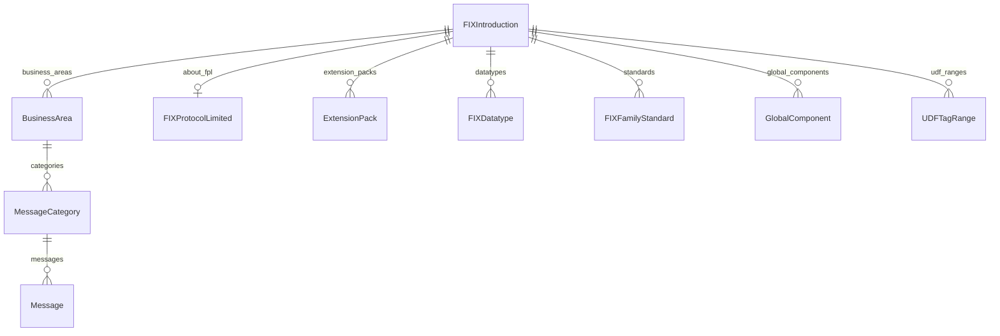

#### Attributes

| Name | Cardinality: | Type | Description |
| --- | --- | --- | --- |
| **[description](#Description)** | <sub>0..1</sub> | string | Description of the area. |
| **[area](#Area)** | <sub>1..1</sub> | [BusinessAreaEnum](#BusinessAreaEnum) | Identity of the business area. |
| **[categories](#Categories)** | <sub>0..\*</sub> | [MessageCategory](#MessageCategory) | Message categories defined within a business area. |
| **[title](#Title)** | <sub>0..1</sub> | string | Display title of the area. |

#### Referenced by:

 *  **[FIXIntroduction](#FIXIntroduction)** : business_areas  <sub>0..\*</sub> 


### BusinessRejectReasonDescription

One entry of the BusinessRejectReason(380) code table.


#### Attributes

| Name | Cardinality: | Type | Description |
| --- | --- | --- | --- |
| **[reject_reason_code](#RejectReasonCode)** | <sub>1..1</sub> | integer | Numeric code value of BusinessRejectReason(380). |
| **[reject_reason_label](#RejectReasonLabel)** | <sub>1..1</sub> | string | Human-readable label of a BusinessRejectReason(380) code. |

#### Referenced by:

 *  **[InfrastructureBusinessArea](#InfrastructureBusinessArea)** : business_reject_reason_descriptions  <sub>0..\*</sub> 


### ClearingServicePostTradeProcessingFormat

One message-format row from the Post-Trade Processing Clearing Services section, with its supported actions.


#### Attributes

| Name | Cardinality: | Type | Description |
| --- | --- | --- | --- |
| **[message_format](#MessageFormat)** | <sub>1..1</sub> | [ClearingServiceForPostTradeProcessingEnum](#ClearingServiceForPostTradeProcessingEnum) | Clearing-service message format family referenced in the chapter. |
| **[supported_actions](#SupportedActions)** | <sub>1..\*</sub> | string | Action labels (e.g. Allocation, Accept, Reject, Release, Change, Delete) supported by a clearing-service message format. |

#### Referenced by:

 *  **[PostTradeCategorySection](#PostTradeCategorySection)** : clearing_services_for_post_trade_processing  <sub>0..\*</sub> 


### CommonComponent

A component used only by messages within a single business area.

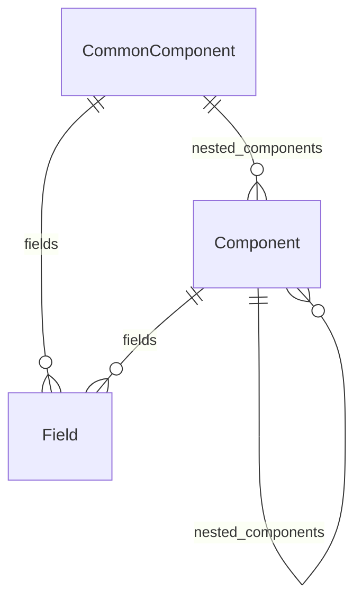

#### Attributes

| Name | Cardinality: | Type | Description |
| --- | --- | --- | --- |
| **[description](#Description)** | <sub>0..1</sub> | string | Description of the component. |
| **[component_name](#ComponentName)** | <sub>1..1</sub> | string | PascalCase name of the component. |
| **[fields](#Fields)** | <sub>0..\*</sub> | [Field](#Field) | Fields directly contained by the enclosing element. |
| **[is_repeating_group](#IsRepeatingGroup)** | <sub>0..1</sub> | boolean | True when the component is a repeating group. |
| **[nested_components](#NestedComponents)** | <sub>0..\*</sub> | [Component](#Component) | Components nested within this component. |
| **[business_area](#BusinessArea)** | <sub>1..1</sub> | [BusinessAreaEnum](#BusinessAreaEnum) | Business area the element belongs to. |
| **[scope](#Scope)** | <sub>1..1</sub> | [ComponentScope](#ComponentScope) | Sharing scope of the component. |

#### Parents

 * [Component](#Component) - A FIX component — a named set of related fields.


### CommonComponentDetail

Per-common-component description.

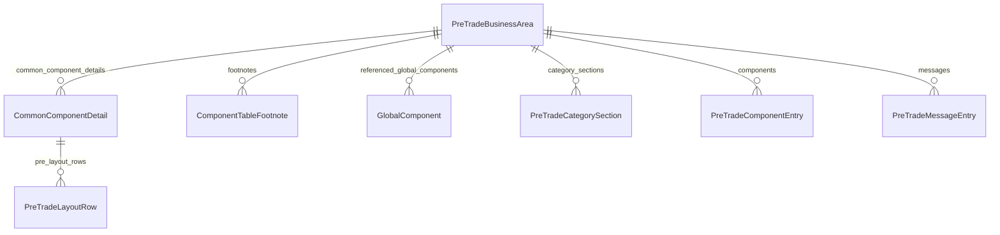

#### Attributes

| Name | Cardinality: | Type | Description |
| --- | --- | --- | --- |
| **[description](#Description)** | <sub>0..1</sub> | string | Description of the common component's purpose. |
| **[component_name](#ComponentName)** | <sub>1..1</sub> | [PreTradeCommonComponentName](#PreTradeCommonComponentName) | PascalCase name of the component. |
| **[layout_url](#LayoutUrl)** | <sub>0..1</sub> | uri | URL of the detailed message- or component-layout. |
| **[pre_layout_rows](#PreLayoutRows)** | <sub>0..\*</sub> | [PreTradeLayoutRow](#PreTradeLayoutRow) | Ordered rows of the layout table published for the message or component in the Pre-Trade Appendix. |
| **[repetition](#Repetition)** | <sub>0..1</sub> | [ComponentRepetition](#ComponentRepetition) | REPEATING or NON_REPEATING. |

#### Referenced by:

 *  **[PreTradeBusinessArea](#PreTradeBusinessArea)** : common_component_details  <sub>0..\*</sub> 


### ComponentTableFootnote

A footnote on the area-wide components table.

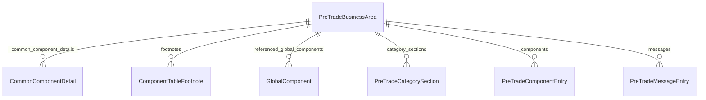

#### Attributes

| Name | Cardinality: | Type | Description |
| --- | --- | --- | --- |
| **[component_name](#ComponentName)** | <sub>1..1</sub> | string | PascalCase name of the component. |
| **[footnote_number](#FootnoteNumber)** | <sub>1..1</sub> | integer | Footnote indicator on a component-table row. |
| **[introduced_in](#IntroducedIn)** | <sub>1..1</sub> | string | FIX version or Extension Pack that introduced the component. |
| **[sole_category](#SoleCategory)** | <sub>1..1</sub> | [PreTradeCategoryEnum](#PreTradeCategoryEnum) | Single category that actually uses the component. |
| **[text](#Text)** | <sub>0..1</sub> | string | Footnote text. |

#### Referenced by:

 *  **[PreTradeBusinessArea](#PreTradeBusinessArea)** : footnotes  <sub>0..\*</sub> 


### ExtensionPack

A unit of change to FIX Latest.

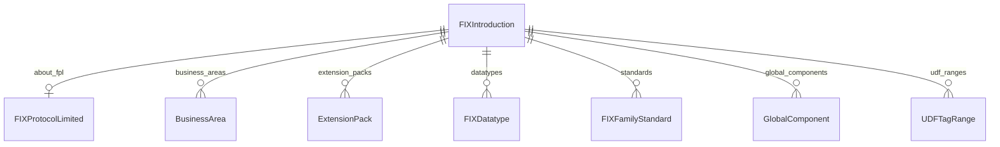

#### Attributes

| Name | Cardinality: | Type | Description |
| --- | --- | --- | --- |
| **[applies_to_fixml_only](#AppliesToFixmlOnly)** | <sub>0..1</sub> | boolean | True when the EP applies only to the FIXML encoding. |
| **[applies_to_session_layer_only](#AppliesToSessionLayerOnly)** | <sub>0..1</sub> | boolean | True when the EP applies only to the FIX Session Layer. |
| **[enhancement_summary](#EnhancementSummary)** | <sub>0..1</sub> | string | Narrative summary of what the EP introduces. |
| **[number](#Number)** | <sub>1..1</sub> | ExtensionPackNumber | Sequential identifier of the Extension Pack. |
| **[size](#Size)** | <sub>0..1</sub> | [ExtensionPackSize](#ExtensionPackSize) | Qualitative size indicator (XXS..XXL). |
| **[title](#Title)** | <sub>1..1</sub> | string | Short descriptive title. |

#### Referenced by:

 *  **[FIXIntroduction](#FIXIntroduction)** : extension_packs  <sub>0..\*</sub> 


### FIXDatatype

A FIX Protocol datatype.


#### Attributes

| Name | Cardinality: | Type | Description |
| --- | --- | --- | --- |
| **[datatype_name](#DatatypeName)** | <sub>1..1</sub> | [FIXDatatypeName](#FIXDatatypeName) | Canonical FIX datatype name. |
| **[definition](#Definition)** | <sub>1..1</sub> | string | Prose definition of the datatype. |
| **[deprecated_for_new_designs](#DeprecatedForNewDesigns)** | <sub>0..1</sub> | boolean | True for datatypes not permitted in new designs. |
| **[external_code_set](#ExternalCodeSet)** | <sub>0..1</sub> | string | Reference standard for datatypes backed by an external code set. |
| **[footnote_numbers](#FootnoteNumbers)** | <sub>0..\*</sub> | integer | Footnote indicators attached to a datatype row. |
| **[index_lower_bound](#IndexLowerBound)** | <sub>0..1</sub> | integer | Inclusive lower bound of a bounded-array index. |
| **[index_upper_bound](#IndexUpperBound)** | <sub>0..1</sub> | integer | Inclusive upper bound of a bounded-array index. |
| **[maximum_value](#MaximumValue)** | <sub>0..1</sub> | integer | Inclusive upper bound on the integer value space. |
| **[minimum_value](#MinimumValue)** | <sub>0..1</sub> | integer | Inclusive lower bound on the integer value space. |
| **[radix](#Radix)** | <sub>0..1</sub> | integer | Numeric radix for scaled value-space datatypes. |
| **[repertoire](#Repertoire)** | <sub>0..1</sub> | string | Character repertoire for character/string datatypes. |
| **[time_unit](#TimeUnit)** | <sub>0..\*</sub> | [TimePrecision](#TimePrecision) | Time-unit precision for time-bearing datatypes. |
| **[value_space](#ValueSpace)** | <sub>0..\*</sub> | [ISO11404ValueSpace](#ISO11404ValueSpace) | ISO/IEC 11404:2007 GPD value space assigned to the datatype. |
| **[value_space_notes](#ValueSpaceNotes)** | <sub>0..1</sub> | string | Additional value-space constraints. |

#### Referenced by:

 *  **[FIXIntroduction](#FIXIntroduction)** : datatypes  <sub>0..\*</sub> 


### FIXFamilyStandard

A member standard of the FIX Family of Standards.


#### Attributes

| Name | Cardinality: | Type | Description |
| --- | --- | --- | --- |
| **[id](#Id)** | <sub>1..1</sub> | string | Unique identifier (CURIE or local name) of the element. |
| **[name](#Name)** | <sub>1..1</sub> | string | Display name of the element. |
| **[description](#Description)** | <sub>0..1</sub> | string | Free-text description. |
| **[acronym](#Acronym)** | <sub>0..1</sub> | string | Short acronym used to refer to the standard. |
| **[encoding_name](#EncodingName)** | <sub>0..1</sub> | [StandardEncodingName](#StandardEncodingName) | Named encoding, when layer is ENCODING. |
| **[layer](#Layer)** | <sub>1..1</sub> | [StandardLayer](#StandardLayer) | The layer the standard belongs to. |
| **[see_also](#SeeAlso)** | <sub>0..\*</sub> | uri | Related external resources. |
| **[session_profile](#SessionProfile)** | <sub>0..1</sub> | [SessionProtocolName](#SessionProtocolName) | Name of the session profile for session-layer variants. |
| **[version](#Version)** | <sub>0..1</sub> | string | Version of the standard, if applicable. |

#### Referenced by:

 *  **[FIXIntroduction](#FIXIntroduction)** : standards  <sub>0..\*</sub> 


### FIXIntroduction

Container for the structural elements of the FIX Latest Introduction section. Tree root for instance data.

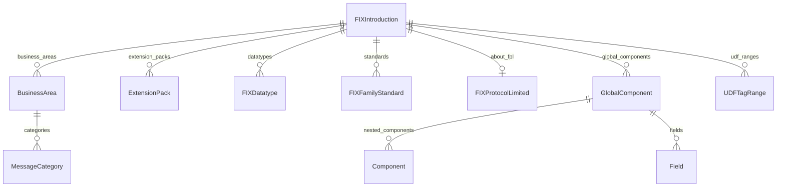

#### Attributes

| Name | Cardinality: | Type | Description |
| --- | --- | --- | --- |
| **[about_fpl](#AboutFpl)** | <sub>0..1</sub> | [FIXProtocolLimited](#FIXProtocolLimited) | Information about FIX Protocol Limited. |
| **[business_areas](#BusinessAreas)** | <sub>0..\*</sub> | [BusinessArea](#BusinessArea) | Top-level business areas of FIX Latest. |
| **[datatypes](#Datatypes)** | <sub>0..\*</sub> | [FIXDatatype](#FIXDatatype) | FIX Protocol datatype definitions and value spaces. |
| **[extension_packs](#ExtensionPacks)** | <sub>0..\*</sub> | [ExtensionPack](#ExtensionPack) | The list of Extension Packs. |
| **[global_components](#GlobalComponents)** | <sub>0..\*</sub> | [GlobalComponent](#GlobalComponent) | Global Components defined in the Introduction. |
| **[introduction_text](#IntroductionText)** | <sub>0..1</sub> | string | The Introduction prose section. |
| **[preface](#Preface)** | <sub>0..1</sub> | string | The Preface text of the specification. |
| **[product_coverage](#ProductCoverage)** | <sub>0..\*</sub> | [ProductCoverage](#ProductCoverage) | Product/asset classes covered by FIX at the application layer. |
| **[published_date](#PublishedDate)** | <sub>0..1</sub> | date | Publication date of the document. |
| **[published_version](#PublishedVersion)** | <sub>0..1</sub> | string | Version stamp from the document header. |
| **[publisher](#Publisher)** | <sub>0..1</sub> | string | Publishing body of the FIX Latest specification. |
| **[standards](#Standards)** | <sub>0..\*</sub> | [FIXFamilyStandard](#FIXFamilyStandard) | The FIX Family of Standards. |
| **[udf_ranges](#UdfRanges)** | <sub>0..\*</sub> | [UDFTagRange](#UDFTagRange) | Reserved ranges of user-defined-field tag numbers. |
| **[utc_leap_seconds_note](#UtcLeapSecondsNote)** | <sub>0..1</sub> | string | Prose note on UTC leap-second handling for UTCTimestamp. |


### FIXProtocolLimited

The organization that maintains the FIX Protocol specification.


#### Attributes

| Name | Cardinality: | Type | Description |
| --- | --- | --- | --- |
| **[brand_name](#BrandName)** | <sub>0..1</sub> | string | Brand name used by the organization. |
| **[committees_url](#CommitteesUrl)** | <sub>0..1</sub> | uri | URL listing Product and Regional Committees. |
| **[governance_bodies](#GovernanceBodies)** | <sub>0..\*</sub> | [FPLCommitteeRole](#FPLCommitteeRole) | High-level governance bodies that represent FPL. |
| **[legal_name](#LegalName)** | <sub>0..1</sub> | string | Legal name of the organization. |
| **[member_firms_url](#MemberFirmsUrl)** | <sub>0..1</sub> | uri | URL listing current FPL Member firms. |
| **[member_types](#MemberTypes)** | <sub>0..\*</sub> | [FPLMemberType](#FPLMemberType) | Organization categories represented in FPL membership. |
| **[product_committees](#ProductCommittees)** | <sub>0..\*</sub> | [FPLProductGroup](#FPLProductGroup) | Global Product Committees maintained by FPL. |
| **[regional_committees](#RegionalCommittees)** | <sub>0..\*</sub> | [FPLRegion](#FPLRegion) | Regional Committees maintained by FPL. |
| **[website](#Website)** | <sub>0..1</sub> | uri | Main website URL of the organization. |
| **[working_groups_url](#WorkingGroupsUrl)** | <sub>0..1</sub> | uri | URL listing currently active FPL Working Groups. |

#### Referenced by:

 *  **[FIXIntroduction](#FIXIntroduction)** : about_fpl  <sub>0..1</sub> 


### Field

A FIX field — a uniquely tagged data element with a FIX datatype.

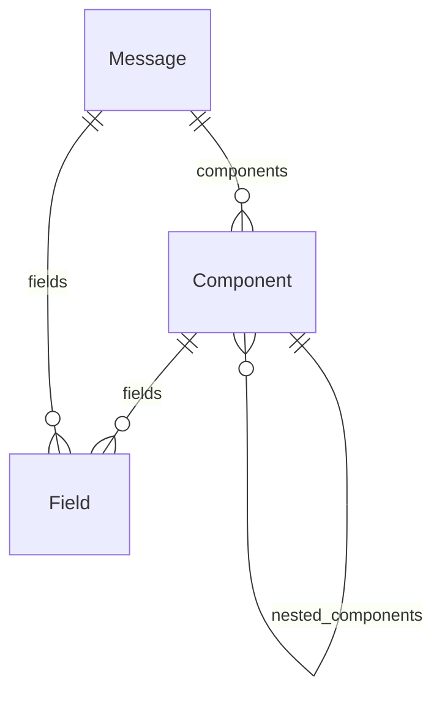

#### Attributes

| Name | Cardinality: | Type | Description |
| --- | --- | --- | --- |
| **[description](#Description)** | <sub>0..1</sub> | string | Description of the field's purpose. |
| **[datatype](#Datatype)** | <sub>1..1</sub> | [FIXDatatypeName](#FIXDatatypeName) | FIX datatype of the field. |
| **[field_name](#FieldName)** | <sub>1..1</sub> | string | PascalCase name of the field. |
| **[is_user_defined](#IsUserDefined)** | <sub>0..1</sub> | boolean | True when the field is a User Defined Field. |
| **[requirement](#Requirement)** | <sub>0..1</sub> | [FieldRequirement](#FieldRequirement) | Required-status of the field within the enclosing context. |
| **[tag](#Tag)** | <sub>1..1</sub> | TagNumber | Numeric tag of the field. |

#### Referenced by:

 *  **[Component](#Component)** : fields  <sub>0..\*</sub> 
 *  **[Message](#Message)** : fields  <sub>0..\*</sub> 


### GlobalComponent

A component shared by messages of two or more business areas.

```mermaid
erDiagram
Component {

}
FIXIntroduction {

}
Field {

}
GlobalComponent {

}
InfrastructureBusinessArea {

}
PostTradeBusinessArea {

}
PreTradeBusinessArea {

}
TradeBusinessArea {

}

Component ||--}o Component : "nested_components"
Component ||--}o Field : "fields"
FIXIntroduction ||--|o FIXProtocolLimited : "about_fpl"
FIXIntroduction ||--}o BusinessArea : "business_areas"
FIXIntroduction ||--}o ExtensionPack : "extension_packs"
FIXIntroduction ||--}o FIXDatatype : "datatypes"
FIXIntroduction ||--}o FIXFamilyStandard : "standards"
FIXIntroduction ||--}o GlobalComponent : "global_components"
FIXIntroduction ||--}o UDFTagRange : "udf_ranges"
GlobalComponent ||--}o Component : "nested_components"
GlobalComponent ||--}o Field : "fields"
InfrastructureBusinessArea ||--}o ApplicationMessageReferenceKey : "key_fields_post_trade, key_fields_pre_trade, key_fields_trade"
InfrastructureBusinessArea ||--}o BusinessRejectReasonDescription : "business_reject_reason_descriptions"
InfrastructureBusinessArea ||--}o GlobalComponent : "referenced_global_components"
InfrastructureBusinessArea ||--}o InfrastructureCategorySection : "infra_category_sections"
InfrastructureBusinessArea ||--}o InfrastructureComponentTableFootnote : "infra_footnotes"
InfrastructureBusinessArea ||--}o InfrastructureGlobalComponentReference : "infra_global_components"
InfrastructureBusinessArea ||--}o StandardResponseMapping : "standard_responses_post_trade, standard_responses_pre_trade, standard_responses_trade"
InfrastructureBusinessArea ||--}| InfrastructureComponentEntry : "components"
InfrastructureBusinessArea ||--}| InfrastructureMessageEntry : "messages"
PostTradeBusinessArea ||--}o GlobalComponent : "referenced_global_components"
PostTradeBusinessArea ||--}o PostTradeCategorySection : "post_category_sections"
PostTradeBusinessArea ||--}o PostTradeCommonComponentDetail : "post_common_component_details"
PostTradeBusinessArea ||--}o PostTradeComponentTableFootnote : "post_footnotes"
PostTradeBusinessArea ||--}| PostTradeComponentEntry : "components"
PostTradeBusinessArea ||--}| PostTradeMessageEntry : "messages"
PreTradeBusinessArea ||--}o CommonComponentDetail : "common_component_details"
PreTradeBusinessArea ||--}o ComponentTableFootnote : "footnotes"
PreTradeBusinessArea ||--}o GlobalComponent : "referenced_global_components"
PreTradeBusinessArea ||--}o PreTradeCategorySection : "category_sections"
PreTradeBusinessArea ||--}o PreTradeComponentEntry : "components"
PreTradeBusinessArea ||--}o PreTradeMessageEntry : "messages"
TradeBusinessArea ||--}o GlobalComponent : "referenced_global_components"
TradeBusinessArea ||--}o TradeCategorySection : "trade_category_sections"
TradeBusinessArea ||--}o TradeCommonComponentDetail : "trade_common_component_details"
TradeBusinessArea ||--}o TradeComponentEntry : "components"
TradeBusinessArea ||--}o TradeComponentTableFootnote : "trade_footnotes"
TradeBusinessArea ||--}o TradeMessageEntry : "messages"

```

#### Attributes

| Name | Cardinality: | Type | Description |
| --- | --- | --- | --- |
| **[description](#Description)** | <sub>0..1</sub> | string | Description of the component. |
| **[component_name](#ComponentName)** | <sub>1..1</sub> | string | PascalCase name of the component. |
| **[fields](#Fields)** | <sub>0..\*</sub> | [Field](#Field) | Fields directly contained by the enclosing element. |
| **[is_repeating_group](#IsRepeatingGroup)** | <sub>0..1</sub> | boolean | True when the component is a repeating group. |
| **[nested_components](#NestedComponents)** | <sub>0..\*</sub> | [Component](#Component) | Components nested within this component. |
| **[applies_to_instrument](#AppliesToInstrument)** | <sub>0..1</sub> | boolean | Applicable at the Instrument level. |
| **[applies_to_leg](#AppliesToLeg)** | <sub>0..1</sub> | boolean | Applicable at the InstrumentLeg level. |
| **[applies_to_underlying](#AppliesToUnderlying)** | <sub>0..1</sub> | boolean | Applicable at the UnderlyingInstrument level. |
| **[component_group](#ComponentGroup)** | <sub>1..1</sub> | [ComponentGroup](#ComponentGroup) | Thematic group under which the component is presented. |
| **[conceptually_identical_to](#ConceptuallyIdenticalTo)** | <sub>0..\*</sub> | string | Names of other components conceptually identical to this one. |
| **[gc_id](#GcId)** | <sub>0..1</sub> | integer | Numeric component identifier extracted from the FIX Latest "Global Components" page anchor ID (e.g. "comp1057-1" → 1057). Stable across Extension Packs and shared with the FIX Orchestra repository. |
| **[gc_referenced_in](#GcReferencedIn)** | <sub>0..\*</sub> | [GlobalComponentBusinessAreaEnum](#GlobalComponentBusinessAreaEnum) | FIX business areas whose messages embed the Global Component. |
| **[scope](#Scope)** | <sub>1..1</sub> | [ComponentScope](#ComponentScope) | Sharing scope of the component. |

#### Parents

 * [Component](#Component) - A FIX component — a named set of related fields.

#### Referenced by:

 *  **[FIXIntroduction](#FIXIntroduction)** : global_components  <sub>0..\*</sub> 
 *  **[InfrastructureBusinessArea](#InfrastructureBusinessArea)** : referenced_global_components  <sub>0..\*</sub> 
 *  **[PostTradeBusinessArea](#PostTradeBusinessArea)** : referenced_global_components  <sub>0..\*</sub> 
 *  **[PreTradeBusinessArea](#PreTradeBusinessArea)** : referenced_global_components  <sub>0..\*</sub> 
 *  **[TradeBusinessArea](#TradeBusinessArea)** : referenced_global_components  <sub>0..\*</sub> 


### InfrastructureBusinessArea

Tree-root container for the Infrastructure business area of FIX Latest.

```mermaid
erDiagram
ApplicationMessageReferenceKey {

}
BusinessRejectReasonDescription {

}
GlobalComponent {

}
InfrastructureBusinessArea {

}
InfrastructureCategorySection {

}
InfrastructureComponentEntry {

}
InfrastructureComponentTableFootnote {

}
InfrastructureGlobalComponentReference {

}
InfrastructureMessageEntry {

}
StandardResponseMapping {

}

GlobalComponent ||--}o Component : "nested_components"
GlobalComponent ||--}o Field : "fields"
InfrastructureBusinessArea ||--}o ApplicationMessageReferenceKey : "key_fields_post_trade, key_fields_pre_trade, key_fields_trade"
InfrastructureBusinessArea ||--}o BusinessRejectReasonDescription : "business_reject_reason_descriptions"
InfrastructureBusinessArea ||--}o GlobalComponent : "referenced_global_components"
InfrastructureBusinessArea ||--}o InfrastructureCategorySection : "infra_category_sections"
InfrastructureBusinessArea ||--}o InfrastructureComponentTableFootnote : "infra_footnotes"
InfrastructureBusinessArea ||--}o InfrastructureGlobalComponentReference : "infra_global_components"
InfrastructureBusinessArea ||--}o StandardResponseMapping : "standard_responses_post_trade, standard_responses_pre_trade, standard_responses_trade"
InfrastructureBusinessArea ||--}| InfrastructureComponentEntry : "components"
InfrastructureBusinessArea ||--}| InfrastructureMessageEntry : "messages"
InfrastructureCategorySection ||--}o InfrastructureComponentDetail : "infra_category_specific_components"
InfrastructureCategorySection ||--}o InfrastructureMessageDetail : "messages"

```

#### Attributes

| Name | Cardinality: | Type | Description |
| --- | --- | --- | --- |
| **[area](#Area)** | <sub>1..1</sub> | [BusinessAreaEnum](#BusinessAreaEnum) | Identity of the business area. |
| **[business_reject_reason_descriptions](#BusinessRejectReasonDescriptions)** | <sub>0..\*</sub> | [BusinessRejectReasonDescription](#BusinessRejectReasonDescription) | Descriptions tied to BusinessRejectReason(380) values. |
| **[components](#Components)** | <sub>1..\*</sub> | [InfrastructureComponentEntry](#InfrastructureComponentEntry) | Components referenced by the enclosing element. |
| **[components_overview_note](#ComponentsOverviewNote)** | <sub>0..1</sub> | string | Intro prose of the area-wide Components sub-section. |
| **[diagram_conventions](#DiagramConventions)** | <sub>0..1</sub> | string | Sentence describing diagram conventions used in the chapter. |
| **[infra_category_sections](#InfraCategorySections)** | <sub>0..\*</sub> | [InfrastructureCategorySection](#InfrastructureCategorySection) | Per-category sub-sections of the Infrastructure chapter. |
| **[infra_common_components](#InfraCommonComponents)** | <sub>0..\*</sub> | [InfrastructureComponentName](#InfrastructureComponentName) | Component names declared in the area-wide components listing. Per the chapter prose, none of these are shared across categories within the area. |
| **[infra_footnotes](#InfraFootnotes)** | <sub>0..\*</sub> | [InfrastructureComponentTableFootnote](#InfrastructureComponentTableFootnote) | Footnotes attached to the area-wide Infrastructure components table. |
| **[infra_global_components](#InfraGlobalComponents)** | <sub>0..\*</sub> | [InfrastructureGlobalComponentReference](#InfrastructureGlobalComponentReference) | Global Components (from the FIX Latest "Global Components" page) that are explicitly referenced by messages in the Infrastructure business area, together with their tag set and usage scope. |
| **[infra_introduction](#InfraIntroduction)** | <sub>0..1</sub> | string | Prose introduction of the Infrastructure chapter. |
| **[key_fields_post_trade](#KeyFieldsPostTrade)** | <sub>0..\*</sub> | [ApplicationMessageReferenceKey](#ApplicationMessageReferenceKey) | "Key Fields for Post-Trade Application Message References" table rows. |
| **[key_fields_pre_trade](#KeyFieldsPreTrade)** | <sub>0..\*</sub> | [ApplicationMessageReferenceKey](#ApplicationMessageReferenceKey) | "Key Fields for Pre-Trade Application Message References" table rows. |
| **[key_fields_trade](#KeyFieldsTrade)** | <sub>0..\*</sub> | [ApplicationMessageReferenceKey](#ApplicationMessageReferenceKey) | "Key Fields for Trade Application Message References" table rows. |
| **[messages](#Messages)** | <sub>1..\*</sub> | [InfrastructureMessageEntry](#InfrastructureMessageEntry) | Messages defined within the enclosing element. |
| **[messages_overview_note](#MessagesOverviewNote)** | <sub>0..1</sub> | string | Intro prose of the area-wide Messages sub-section. |
| **[published_version](#PublishedVersion)** | <sub>0..1</sub> | string | Version stamp from the document header. |
| **[publisher](#Publisher)** | <sub>0..1</sub> | string | Publishing body of the FIX Latest specification. |
| **[referenced_global_components](#ReferencedGlobalComponents)** | <sub>0..\*</sub> | [GlobalComponent](#GlobalComponent) | Names of Global Components from the FIX Latest "Global Components" page that are referenced by messages in the containing business area. References instances of the :class:`GlobalComponent` class (declared in fix_base) by name. |
| **[standard_responses_post_trade](#StandardResponsesPostTrade)** | <sub>0..\*</sub> | [StandardResponseMapping](#StandardResponseMapping) | "Standard Responses for Post-Trade Messages" table rows. |
| **[standard_responses_pre_trade](#StandardResponsesPreTrade)** | <sub>0..\*</sub> | [StandardResponseMapping](#StandardResponseMapping) | "Standard Responses for Pre-Trade Messages" table rows. |
| **[standard_responses_trade](#StandardResponsesTrade)** | <sub>0..\*</sub> | [StandardResponseMapping](#StandardResponseMapping) | "Standard Responses for Trade Messages" table rows. |
| **[title](#Title)** | <sub>0..1</sub> | string | Display title. |


### InfrastructureCategorySection

A "Category – <name>" sub-section of the Infrastructure chapter.

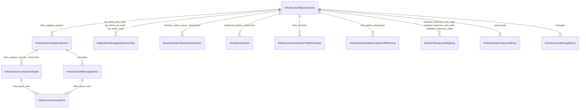

#### Attributes

| Name | Cardinality: | Type | Description |
| --- | --- | --- | --- |
| **[description](#Description)** | <sub>0..1</sub> | string | Free-text description. |
| **[application_message_report_uses](#ApplicationMessageReportUses)** | <sub>0..\*</sub> | [ApplicationMessageReportTypeEnum](#ApplicationMessageReportTypeEnum) | Documented uses of ApplicationMessageReport(35=BY). |
| **[category](#Category)** | <sub>1..1</sub> | [InfrastructureCategoryEnum](#InfrastructureCategoryEnum) | Message category. |
| **[category_components_note](#CategoryComponentsNote)** | <sub>0..1</sub> | string | Intro prose of a category's Components sub-section. |
| **[infra_category_specific_components](#InfraCategorySpecificComponents)** | <sub>0..\*</sub> | [InfrastructureComponentDetail](#InfrastructureComponentDetail) | Per-component descriptions appearing in a category's Components sub-section. |
| **[messages](#Messages)** | <sub>0..\*</sub> | [InfrastructureMessageDetail](#InfrastructureMessageDetail) | Messages defined within the enclosing element. |
| **[network_request_types_referenced](#NetworkRequestTypesReferenced)** | <sub>0..\*</sub> | [NetworkRequestTypeEnum](#NetworkRequestTypeEnum) | NetworkRequestType(935) values explicitly cited in the Network Status Communication category prose. |
| **[network_status_scenarios](#NetworkStatusScenarios)** | <sub>0..\*</sub> | [NetworkStatusScenarioEnum](#NetworkStatusScenarioEnum) | Network Status Communication usage scenarios. |
| **[title](#Title)** | <sub>0..1</sub> | string | Display title. |

#### Referenced by:

 *  **[InfrastructureBusinessArea](#InfrastructureBusinessArea)** : infra_category_sections  <sub>0..\*</sub> 


### InfrastructureComponentDetail

Per-component description appearing in a category's Components sub-section.

```mermaid
erDiagram
InfrastructureCategorySection {

}
InfrastructureComponentDetail {

}
InfrastructureLayoutRow {

}

InfrastructureCategorySection ||--}o InfrastructureComponentDetail : "infra_category_specific_components"
InfrastructureCategorySection ||--}o InfrastructureMessageDetail : "messages"
InfrastructureComponentDetail ||--}o InfrastructureLayoutRow : "infra_layout_rows"

```

#### Attributes

| Name | Cardinality: | Type | Description |
| --- | --- | --- | --- |
| **[description](#Description)** | <sub>0..1</sub> | string | Free-text description. |
| **[component_name](#ComponentName)** | <sub>1..1</sub> | string | PascalCase name of the component. |
| **[infra_layout_rows](#InfraLayoutRows)** | <sub>0..\*</sub> | [InfrastructureLayoutRow](#InfrastructureLayoutRow) | Ordered rows of the layout table published for the message or component in the Infrastructure Appendix. |
| **[layout_url](#LayoutUrl)** | <sub>0..1</sub> | uri | URL of the detailed message- or component-layout. |
| **[repetition](#Repetition)** | <sub>0..1</sub> | [ComponentRepetition](#ComponentRepetition) | REPEATING or NON_REPEATING. |

#### Referenced by:

 *  **[InfrastructureCategorySection](#InfrastructureCategorySection)** : infra_category_specific_components  <sub>0..\*</sub> 


### InfrastructureComponentEntry

One row of the area-wide "Components for Infrastructure Business Area" table.

```mermaid
erDiagram
InfrastructureBusinessArea {

}
InfrastructureComponentEntry {

}

InfrastructureBusinessArea ||--}o ApplicationMessageReferenceKey : "key_fields_post_trade, key_fields_pre_trade, key_fields_trade"
InfrastructureBusinessArea ||--}o BusinessRejectReasonDescription : "business_reject_reason_descriptions"
InfrastructureBusinessArea ||--}o GlobalComponent : "referenced_global_components"
InfrastructureBusinessArea ||--}o InfrastructureCategorySection : "infra_category_sections"
InfrastructureBusinessArea ||--}o InfrastructureComponentTableFootnote : "infra_footnotes"
InfrastructureBusinessArea ||--}o InfrastructureGlobalComponentReference : "infra_global_components"
InfrastructureBusinessArea ||--}o StandardResponseMapping : "standard_responses_post_trade, standard_responses_pre_trade, standard_responses_trade"
InfrastructureBusinessArea ||--}| InfrastructureComponentEntry : "components"
InfrastructureBusinessArea ||--}| InfrastructureMessageEntry : "messages"

```

#### Attributes

| Name | Cardinality: | Type | Description |
| --- | --- | --- | --- |
| **[category](#Category)** | <sub>1..1</sub> | [InfrastructureCategoryEnum](#InfrastructureCategoryEnum) | Message category. |
| **[component_name](#ComponentName)** | <sub>1..1</sub> | string | PascalCase name of the component. |
| **[footnote_number](#FootnoteNumber)** | <sub>0..1</sub> | integer | Footnote indicator on a component-table row. |
| **[repetition](#Repetition)** | <sub>1..1</sub> | [ComponentRepetition](#ComponentRepetition) | REPEATING or NON_REPEATING. |

#### Referenced by:

 *  **[InfrastructureBusinessArea](#InfrastructureBusinessArea)** : components  <sub>1..\*</sub> 


### InfrastructureComponentTableFootnote

A footnote attached to a row of the area-wide Infrastructure components table.

```mermaid
erDiagram
InfrastructureBusinessArea {

}
InfrastructureComponentTableFootnote {

}

InfrastructureBusinessArea ||--}o ApplicationMessageReferenceKey : "key_fields_post_trade, key_fields_pre_trade, key_fields_trade"
InfrastructureBusinessArea ||--}o BusinessRejectReasonDescription : "business_reject_reason_descriptions"
InfrastructureBusinessArea ||--}o GlobalComponent : "referenced_global_components"
InfrastructureBusinessArea ||--}o InfrastructureCategorySection : "infra_category_sections"
InfrastructureBusinessArea ||--}o InfrastructureComponentTableFootnote : "infra_footnotes"
InfrastructureBusinessArea ||--}o InfrastructureGlobalComponentReference : "infra_global_components"
InfrastructureBusinessArea ||--}o StandardResponseMapping : "standard_responses_post_trade, standard_responses_pre_trade, standard_responses_trade"
InfrastructureBusinessArea ||--}| InfrastructureComponentEntry : "components"
InfrastructureBusinessArea ||--}| InfrastructureMessageEntry : "messages"

```

#### Attributes

| Name | Cardinality: | Type | Description |
| --- | --- | --- | --- |
| **[component_name](#ComponentName)** | <sub>1..1</sub> | string | PascalCase name of the component. |
| **[footnote_number](#FootnoteNumber)** | <sub>1..1</sub> | integer | Footnote indicator on a component-table row. |
| **[infra_sole_category](#InfraSoleCategory)** | <sub>1..1</sub> | [InfrastructureCategoryEnum](#InfrastructureCategoryEnum) | Single Infrastructure category that actually uses the footnoted component. |
| **[introduced_in](#IntroducedIn)** | <sub>1..1</sub> | string | FIX version or Extension Pack that introduced the component. |
| **[text](#Text)** | <sub>0..1</sub> | string | Footnote text. |

#### Referenced by:

 *  **[InfrastructureBusinessArea](#InfrastructureBusinessArea)** : infra_footnotes  <sub>0..\*</sub> 


### InfrastructureGlobalComponentReference

A reference from the Infrastructure business area to a Global Component declared on the FIX Latest "Global Components" page. Records the component name, the FIX tags it contributes, and the Infrastructure categories and messages that embed it.

```mermaid
erDiagram
InfrastructureBusinessArea {

}
InfrastructureGlobalComponentReference {

}

InfrastructureBusinessArea ||--}o ApplicationMessageReferenceKey : "key_fields_post_trade, key_fields_pre_trade, key_fields_trade"
InfrastructureBusinessArea ||--}o BusinessRejectReasonDescription : "business_reject_reason_descriptions"
InfrastructureBusinessArea ||--}o GlobalComponent : "referenced_global_components"
InfrastructureBusinessArea ||--}o InfrastructureCategorySection : "infra_category_sections"
InfrastructureBusinessArea ||--}o InfrastructureComponentTableFootnote : "infra_footnotes"
InfrastructureBusinessArea ||--}o InfrastructureGlobalComponentReference : "infra_global_components"
InfrastructureBusinessArea ||--}o StandardResponseMapping : "standard_responses_post_trade, standard_responses_pre_trade, standard_responses_trade"
InfrastructureBusinessArea ||--}| InfrastructureComponentEntry : "components"
InfrastructureBusinessArea ||--}| InfrastructureMessageEntry : "messages"

```

#### Attributes

| Name | Cardinality: | Type | Description |
| --- | --- | --- | --- |
| **[infra_global_component_field_names](#InfraGlobalComponentFieldNames)** | <sub>0..\*</sub> | string | Human-readable field names of the tags contributed by the referenced Global Component. |
| **[infra_global_component_field_tags](#InfraGlobalComponentFieldTags)** | <sub>0..\*</sub> | integer | FIX tag numbers contributed by the referenced Global Component (as listed on the Global Components page). |
| **[infra_global_component_msg_types](#InfraGlobalComponentMsgTypes)** | <sub>0..\*</sub> | string | MsgType values within the Infrastructure business area that embed the referenced Global Component. |
| **[infra_global_component_name](#InfraGlobalComponentName)** | <sub>1..1</sub> | [InfrastructureGlobalComponentName](#InfrastructureGlobalComponentName) | Name of a Global Component referenced from within the Infrastructure business area. |
| **[infra_global_component_repetition](#InfraGlobalComponentRepetition)** | <sub>0..1</sub> | string | Repetition indicator for the Global Component as it appears in the referenced Infrastructure messages. |
| **[infra_global_component_used_in](#InfraGlobalComponentUsedIn)** | <sub>1..\*</sub> | [InfrastructureCategoryEnum](#InfrastructureCategoryEnum) | Infrastructure categories that reference the Global Component. |

#### Referenced by:

 *  **[InfrastructureBusinessArea](#InfrastructureBusinessArea)** : infra_global_components  <sub>0..\*</sub> 


### InfrastructureLayoutRow

One row of the layout table published in the Infrastructure Appendix for a message or component. Each row identifies either a FIX field (by tag number + name) or an embedded component (by name), records whether it is required, carries the Description-column text, and flags whether it appears as a nested child of a repeating-group counter.

```mermaid
erDiagram
InfrastructureComponentDetail {

}
InfrastructureLayoutRow {

}
InfrastructureMessageDetail {

}

InfrastructureComponentDetail ||--}o InfrastructureLayoutRow : "infra_layout_rows"
InfrastructureMessageDetail ||--}o InfrastructureLayoutRow : "infra_layout_rows"

```

#### Attributes

| Name | Cardinality: | Type | Description |
| --- | --- | --- | --- |
| **[infra_layout_description](#InfraLayoutDescription)** | <sub>0..1</sub> | string | Free-text content of the Description column of the row (may be empty). |
| **[infra_layout_element_name](#InfraLayoutElementName)** | <sub>1..1</sub> | string | Element name as printed in the Name column — either the FIX field name (e.g. ApplReqID) or the component name (e.g. StandardHeader, ApplIDRequestGrp). |
| **[infra_layout_field_tag](#InfraLayoutFieldTag)** | <sub>0..1</sub> | integer | FIX tag number drawn from the Tag column when the row is a field (i.e. layout_kind = FIELD). Absent for COMPONENT rows. |
| **[infra_layout_kind](#InfraLayoutKind)** | <sub>1..1</sub> | [InfrastructureLayoutRowKindEnum](#InfrastructureLayoutRowKindEnum) | Row kind — either a FIX field (numeric Tag) or an embedded component (literal "Component" in the Tag column of the source table). |
| **[infra_layout_nested](#InfraLayoutNested)** | <sub>0..1</sub> | boolean | Whether the row appears nested under a repeating-group counter (i.e. its Tag column is prefixed with the "→" arrow in the source table). |
| **[infra_layout_required](#InfraLayoutRequired)** | <sub>0..1</sub> | boolean | Whether the field or component is required, as printed in the Req’d column of the source layout table ("Y" / "N"). |

#### Referenced by:

 *  **[InfrastructureComponentDetail](#InfrastructureComponentDetail)** : infra_layout_rows  <sub>0..\*</sub> 
 *  **[InfrastructureMessageDetail](#InfrastructureMessageDetail)** : infra_layout_rows  <sub>0..\*</sub> 


### InfrastructureMessageDetail

Per-message description appearing in a category's Messages sub-section.

```mermaid
erDiagram
InfrastructureCategorySection {

}
InfrastructureLayoutRow {

}
InfrastructureMessageDetail {

}

InfrastructureCategorySection ||--}o InfrastructureComponentDetail : "infra_category_specific_components"
InfrastructureCategorySection ||--}o InfrastructureMessageDetail : "messages"
InfrastructureMessageDetail ||--}o InfrastructureLayoutRow : "infra_layout_rows"

```

#### Attributes

| Name | Cardinality: | Type | Description |
| --- | --- | --- | --- |
| **[description](#Description)** | <sub>0..1</sub> | string | Free-text description. |
| **[infra_layout_rows](#InfraLayoutRows)** | <sub>0..\*</sub> | [InfrastructureLayoutRow](#InfrastructureLayoutRow) | Ordered rows of the layout table published for the message or component in the Infrastructure Appendix. |
| **[layout_url](#LayoutUrl)** | <sub>0..1</sub> | uri | URL of the detailed message- or component-layout. |
| **[message_name](#MessageName)** | <sub>1..1</sub> | string | PascalCase name of the message. |
| **[msg_type](#MsgType)** | <sub>1..1</sub> | string | MsgType(35) wire value identifying the message. |

#### Referenced by:

 *  **[InfrastructureCategorySection](#InfrastructureCategorySection)** : messages  <sub>0..\*</sub> 


### InfrastructureMessageEntry

One row of the area-wide "Messages for Infrastructure Business Area" table.

```mermaid
erDiagram
InfrastructureBusinessArea {

}
InfrastructureMessageEntry {

}

InfrastructureBusinessArea ||--}o ApplicationMessageReferenceKey : "key_fields_post_trade, key_fields_pre_trade, key_fields_trade"
InfrastructureBusinessArea ||--}o BusinessRejectReasonDescription : "business_reject_reason_descriptions"
InfrastructureBusinessArea ||--}o GlobalComponent : "referenced_global_components"
InfrastructureBusinessArea ||--}o InfrastructureCategorySection : "infra_category_sections"
InfrastructureBusinessArea ||--}o InfrastructureComponentTableFootnote : "infra_footnotes"
InfrastructureBusinessArea ||--}o InfrastructureGlobalComponentReference : "infra_global_components"
InfrastructureBusinessArea ||--}o StandardResponseMapping : "standard_responses_post_trade, standard_responses_pre_trade, standard_responses_trade"
InfrastructureBusinessArea ||--}| InfrastructureComponentEntry : "components"
InfrastructureBusinessArea ||--}| InfrastructureMessageEntry : "messages"

```

#### Attributes

| Name | Cardinality: | Type | Description |
| --- | --- | --- | --- |
| **[category](#Category)** | <sub>1..1</sub> | [InfrastructureCategoryEnum](#InfrastructureCategoryEnum) | Message category. |
| **[message_name](#MessageName)** | <sub>1..1</sub> | string | PascalCase name of the message. |
| **[msg_type](#MsgType)** | <sub>1..1</sub> | string | MsgType(35) wire value identifying the message. |

#### Referenced by:

 *  **[InfrastructureBusinessArea](#InfrastructureBusinessArea)** : messages  <sub>1..\*</sub> 


### Message

A FIX application message.

```mermaid
erDiagram
Component {

}
Field {

}
InfrastructureBusinessArea {

}
InfrastructureCategorySection {

}
Message {

}
MessageCategory {

}
MessageGroup {

}
PostTradeBusinessArea {

}
PostTradeCategorySection {

}
PostTradeMessageGroup {

}
PreTradeBusinessArea {

}
PreTradeCategorySection {

}
TradeAppendixSection {

}
TradeBusinessArea {

}
TradeCategorySection {

}
TradeMessageGroup {

}

Component ||--}o Component : "nested_components"
Component ||--}o Field : "fields"
InfrastructureBusinessArea ||--}o ApplicationMessageReferenceKey : "key_fields_post_trade, key_fields_pre_trade, key_fields_trade"
InfrastructureBusinessArea ||--}o BusinessRejectReasonDescription : "business_reject_reason_descriptions"
InfrastructureBusinessArea ||--}o GlobalComponent : "referenced_global_components"
InfrastructureBusinessArea ||--}o InfrastructureCategorySection : "infra_category_sections"
InfrastructureBusinessArea ||--}o InfrastructureComponentTableFootnote : "infra_footnotes"
InfrastructureBusinessArea ||--}o InfrastructureGlobalComponentReference : "infra_global_components"
InfrastructureBusinessArea ||--}o StandardResponseMapping : "standard_responses_post_trade, standard_responses_pre_trade, standard_responses_trade"
InfrastructureBusinessArea ||--}| InfrastructureComponentEntry : "components"
InfrastructureBusinessArea ||--}| InfrastructureMessageEntry : "messages"
InfrastructureCategorySection ||--}o InfrastructureComponentDetail : "infra_category_specific_components"
InfrastructureCategorySection ||--}o InfrastructureMessageDetail : "messages"
Message ||--}o Component : "components"
Message ||--}o Field : "fields"
MessageCategory ||--}o Message : "messages"
MessageGroup ||--}| PreTradeMessageDetail : "messages"
PostTradeBusinessArea ||--}o GlobalComponent : "referenced_global_components"
PostTradeBusinessArea ||--}o PostTradeCategorySection : "post_category_sections"
PostTradeBusinessArea ||--}o PostTradeCommonComponentDetail : "post_common_component_details"
PostTradeBusinessArea ||--}o PostTradeComponentTableFootnote : "post_footnotes"
PostTradeBusinessArea ||--}| PostTradeComponentEntry : "components"
PostTradeBusinessArea ||--}| PostTradeMessageEntry : "messages"
PostTradeCategorySection ||--}o AllocationFragmentationFieldMap : "fragmentation_field_map"
PostTradeCategorySection ||--}o AllocationStatusDescription : "allocation_status_descriptions"
PostTradeCategorySection ||--}o ClearingServicePostTradeProcessingFormat : "clearing_services_for_post_trade_processing"
PostTradeCategorySection ||--}o PostTradeComponentDetail : "post_category_specific_components"
PostTradeCategorySection ||--}o PostTradeMessageDetail : "messages"
PostTradeCategorySection ||--}o PostTradeMessageGroup : "post_message_groups"
PostTradeCategorySection ||--}o RegistrationStatusDescription : "registration_status_descriptions"
PostTradeCategorySection ||--}o TradeCaptureReportIdentifierRule : "trade_capture_report_identifier_rules"
PostTradeCategorySection ||--}o TradeCaptureReportUsage : "trade_capture_report_usages"
PostTradeMessageGroup ||--}| PostTradeMessageDetail : "messages"
PreTradeBusinessArea ||--}o CommonComponentDetail : "common_component_details"
PreTradeBusinessArea ||--}o ComponentTableFootnote : "footnotes"
PreTradeBusinessArea ||--}o GlobalComponent : "referenced_global_components"
PreTradeBusinessArea ||--}o PreTradeCategorySection : "category_sections"
PreTradeBusinessArea ||--}o PreTradeComponentEntry : "components"
PreTradeBusinessArea ||--}o PreTradeMessageEntry : "messages"
PreTradeCategorySection ||--}o MessageGroup : "message_groups"
PreTradeCategorySection ||--}o PreTradeComponentDetail : "category_specific_components"
PreTradeCategorySection ||--}o PreTradeMessageDetail : "messages"
TradeAppendixSection ||--}o TradeComponentDetail : "components"
TradeAppendixSection ||--}o TradeMessageDetail : "messages"
TradeBusinessArea ||--}o GlobalComponent : "referenced_global_components"
TradeBusinessArea ||--}o TradeCategorySection : "trade_category_sections"
TradeBusinessArea ||--}o TradeCommonComponentDetail : "trade_common_component_details"
TradeBusinessArea ||--}o TradeComponentEntry : "components"
TradeBusinessArea ||--}o TradeComponentTableFootnote : "trade_footnotes"
TradeBusinessArea ||--}o TradeMessageEntry : "messages"
TradeCategorySection ||--}o TradeComponentDetail : "trade_category_specific_components"
TradeCategorySection ||--}o TradeFragmentationEntry : "trade_fragmentation_entries"
TradeCategorySection ||--}o TradeMessageDetail : "messages"
TradeCategorySection ||--}o TradeMessageGroup : "trade_message_groups"
TradeMessageGroup ||--}o TradeOrdStatusPrecedenceEntry : "trade_ord_status_precedence_entries"
TradeMessageGroup ||--}| TradeMessageDetail : "messages"

```

#### Attributes

| Name | Cardinality: | Type | Description |
| --- | --- | --- | --- |
| **[description](#Description)** | <sub>0..1</sub> | string | Description of the message's purpose. |
| **[category](#Category)** | <sub>0..1</sub> | [MessageCategoryEnum](#MessageCategoryEnum) | Message category. |
| **[components](#Components)** | <sub>0..\*</sub> | [Component](#Component) | Components referenced by the enclosing element. |
| **[fields](#Fields)** | <sub>0..\*</sub> | [Field](#Field) | Fields directly contained by the enclosing element. |
| **[message_name](#MessageName)** | <sub>1..1</sub> | string | PascalCase name of the message. |
| **[msg_type](#MsgType)** | <sub>1..1</sub> | string | MsgType(35) wire value identifying the message. |

#### Referenced by:

 *  **[InfrastructureBusinessArea](#InfrastructureBusinessArea)** : messages  <sub>0..\*</sub> 
 *  **[InfrastructureCategorySection](#InfrastructureCategorySection)** : messages  <sub>0..\*</sub> 
 *  **[MessageCategory](#MessageCategory)** : messages  <sub>0..\*</sub> 
 *  **[MessageGroup](#MessageGroup)** : messages  <sub>0..\*</sub> 
 *  **[PostTradeBusinessArea](#PostTradeBusinessArea)** : messages  <sub>0..\*</sub> 
 *  **[PostTradeCategorySection](#PostTradeCategorySection)** : messages  <sub>0..\*</sub> 
 *  **[PostTradeMessageGroup](#PostTradeMessageGroup)** : messages  <sub>0..\*</sub> 
 *  **[PreTradeBusinessArea](#PreTradeBusinessArea)** : messages  <sub>0..\*</sub> 
 *  **[PreTradeCategorySection](#PreTradeCategorySection)** : messages  <sub>0..\*</sub> 
 *  **[TradeAppendixSection](#TradeAppendixSection)** : messages  <sub>0..\*</sub> 
 *  **[TradeBusinessArea](#TradeBusinessArea)** : messages  <sub>0..\*</sub> 
 *  **[TradeCategorySection](#TradeCategorySection)** : messages  <sub>0..\*</sub> 
 *  **[TradeMessageGroup](#TradeMessageGroup)** : messages  <sub>0..\*</sub> 


### MessageCategory

A message category within a business area.

```mermaid
erDiagram
BusinessArea {

}
Message {

}
MessageCategory {

}

BusinessArea ||--}o MessageCategory : "categories"
Message ||--}o Component : "components"
Message ||--}o Field : "fields"
MessageCategory ||--}o Message : "messages"

```

#### Attributes

| Name | Cardinality: | Type | Description |
| --- | --- | --- | --- |
| **[description](#Description)** | <sub>0..1</sub> | string | Description of the category. |
| **[business_area](#BusinessArea)** | <sub>1..1</sub> | [BusinessAreaEnum](#BusinessAreaEnum) | Business area the element belongs to. |
| **[category](#Category)** | <sub>1..1</sub> | [MessageCategoryEnum](#MessageCategoryEnum) | Identity of the message category. |
| **[messages](#Messages)** | <sub>0..\*</sub> | [Message](#Message) | Messages defined within the enclosing element. |
| **[title](#Title)** | <sub>0..1</sub> | string | Display title of the category. |

#### Referenced by:

 *  **[BusinessArea](#BusinessArea)** : categories  <sub>0..\*</sub> 


### MessageGroup

Purpose-grouped sub-section inside a category's Messages section.

```mermaid
erDiagram
MessageGroup {

}
PreTradeCategorySection {

}
PreTradeMessageDetail {

}

MessageGroup ||--}| PreTradeMessageDetail : "messages"
PreTradeCategorySection ||--}o MessageGroup : "message_groups"
PreTradeCategorySection ||--}o PreTradeComponentDetail : "category_specific_components"
PreTradeCategorySection ||--}o PreTradeMessageDetail : "messages"
PreTradeMessageDetail ||--}o PreTradeLayoutRow : "pre_layout_rows"

```

#### Attributes

| Name | Cardinality: | Type | Description |
| --- | --- | --- | --- |
| **[description](#Description)** | <sub>0..1</sub> | string | Description of the purpose-group's role within the category. |
| **[group_title](#GroupTitle)** | <sub>1..1</sub> | string | Purpose-group heading inside a category's Messages sub-section. |
| **[messages](#Messages)** | <sub>1..\*</sub> | [PreTradeMessageDetail](#PreTradeMessageDetail) | Messages bundled under the purpose-group heading. |

#### Referenced by:

 *  **[PreTradeCategorySection](#PreTradeCategorySection)** : message_groups  <sub>0..\*</sub> 


### PostTradeBusinessArea

Tree-root container for the Post-Trade business area of FIX Latest.

```mermaid
erDiagram
GlobalComponent {

}
PostTradeBusinessArea {

}
PostTradeCategorySection {

}
PostTradeCommonComponentDetail {

}
PostTradeComponentEntry {

}
PostTradeComponentTableFootnote {

}
PostTradeMessageEntry {

}

GlobalComponent ||--}o Component : "nested_components"
GlobalComponent ||--}o Field : "fields"
PostTradeBusinessArea ||--}o GlobalComponent : "referenced_global_components"
PostTradeBusinessArea ||--}o PostTradeCategorySection : "post_category_sections"
PostTradeBusinessArea ||--}o PostTradeCommonComponentDetail : "post_common_component_details"
PostTradeBusinessArea ||--}o PostTradeComponentTableFootnote : "post_footnotes"
PostTradeBusinessArea ||--}| PostTradeComponentEntry : "components"
PostTradeBusinessArea ||--}| PostTradeMessageEntry : "messages"
PostTradeCategorySection ||--}o AllocationFragmentationFieldMap : "fragmentation_field_map"
PostTradeCategorySection ||--}o AllocationStatusDescription : "allocation_status_descriptions"
PostTradeCategorySection ||--}o ClearingServicePostTradeProcessingFormat : "clearing_services_for_post_trade_processing"
PostTradeCategorySection ||--}o PostTradeComponentDetail : "post_category_specific_components"
PostTradeCategorySection ||--}o PostTradeMessageDetail : "messages"
PostTradeCategorySection ||--}o PostTradeMessageGroup : "post_message_groups"
PostTradeCategorySection ||--}o RegistrationStatusDescription : "registration_status_descriptions"
PostTradeCategorySection ||--}o TradeCaptureReportIdentifierRule : "trade_capture_report_identifier_rules"
PostTradeCategorySection ||--}o TradeCaptureReportUsage : "trade_capture_report_usages"
PostTradeCommonComponentDetail ||--}o PostTradeLayoutRow : "post_layout_rows"

```

#### Attributes

| Name | Cardinality: | Type | Description |
| --- | --- | --- | --- |
| **[area](#Area)** | <sub>1..1</sub> | [BusinessAreaEnum](#BusinessAreaEnum) | Identity of the business area. |
| **[components](#Components)** | <sub>1..\*</sub> | [PostTradeComponentEntry](#PostTradeComponentEntry) | Components referenced by the enclosing element. |
| **[components_overview_note](#ComponentsOverviewNote)** | <sub>0..1</sub> | string | Intro prose of the area-wide Components sub-section. |
| **[diagram_conventions](#DiagramConventions)** | <sub>0..1</sub> | string | Sentence describing diagram conventions used in the chapter. |
| **[messages](#Messages)** | <sub>1..\*</sub> | [PostTradeMessageEntry](#PostTradeMessageEntry) | Messages defined within the enclosing element. |
| **[messages_overview_note](#MessagesOverviewNote)** | <sub>0..1</sub> | string | Intro prose of the area-wide Messages sub-section. |
| **[post_category_sections](#PostCategorySections)** | <sub>0..\*</sub> | [PostTradeCategorySection](#PostTradeCategorySection) | Per-category sub-sections of the Post-Trade chapter. |
| **[post_common_component_details](#PostCommonComponentDetails)** | <sub>0..\*</sub> | [PostTradeCommonComponentDetail](#PostTradeCommonComponentDetail) | Per-common-component descriptions from the chapter's final Common Components section. |
| **[post_common_components](#PostCommonComponents)** | <sub>0..\*</sub> | [PostTradeCommonComponentName](#PostTradeCommonComponentName) | Common Components declared at the top of the Post-Trade chapter. |
| **[post_footnotes](#PostFootnotes)** | <sub>0..\*</sub> | [PostTradeComponentTableFootnote](#PostTradeComponentTableFootnote) | Footnotes attached to the area-wide components table. |
| **[post_introduction](#PostIntroduction)** | <sub>0..1</sub> | string | Prose introduction of the Post-Trade chapter. |
| **[published_version](#PublishedVersion)** | <sub>0..1</sub> | string | Version stamp from the document header. |
| **[publisher](#Publisher)** | <sub>0..1</sub> | string | Publishing body of the FIX Latest specification. |
| **[referenced_global_components](#ReferencedGlobalComponents)** | <sub>0..\*</sub> | [GlobalComponent](#GlobalComponent) | Names of Global Components from the FIX Latest "Global Components" page that are referenced by messages in the containing business area. References instances of the :class:`GlobalComponent` class (declared in fix_base) by name. |
| **[title](#Title)** | <sub>0..1</sub> | string | Display title. |


### PostTradeCategorySection

A "Category – <name>" sub-section of the Post-Trade chapter.

```mermaid
erDiagram
AllocationFragmentationFieldMap {

}
AllocationStatusDescription {

}
ClearingServicePostTradeProcessingFormat {

}
PostTradeBusinessArea {

}
PostTradeCategorySection {

}
PostTradeComponentDetail {

}
PostTradeMessageDetail {

}
PostTradeMessageGroup {

}
RegistrationStatusDescription {

}
TradeCaptureReportIdentifierRule {

}
TradeCaptureReportUsage {

}

PostTradeBusinessArea ||--}o GlobalComponent : "referenced_global_components"
PostTradeBusinessArea ||--}o PostTradeCategorySection : "post_category_sections"
PostTradeBusinessArea ||--}o PostTradeCommonComponentDetail : "post_common_component_details"
PostTradeBusinessArea ||--}o PostTradeComponentTableFootnote : "post_footnotes"
PostTradeBusinessArea ||--}| PostTradeComponentEntry : "components"
PostTradeBusinessArea ||--}| PostTradeMessageEntry : "messages"
PostTradeCategorySection ||--}o AllocationFragmentationFieldMap : "fragmentation_field_map"
PostTradeCategorySection ||--}o AllocationStatusDescription : "allocation_status_descriptions"
PostTradeCategorySection ||--}o ClearingServicePostTradeProcessingFormat : "clearing_services_for_post_trade_processing"
PostTradeCategorySection ||--}o PostTradeComponentDetail : "post_category_specific_components"
PostTradeCategorySection ||--}o PostTradeMessageDetail : "messages"
PostTradeCategorySection ||--}o PostTradeMessageGroup : "post_message_groups"
PostTradeCategorySection ||--}o RegistrationStatusDescription : "registration_status_descriptions"
PostTradeCategorySection ||--}o TradeCaptureReportIdentifierRule : "trade_capture_report_identifier_rules"
PostTradeCategorySection ||--}o TradeCaptureReportUsage : "trade_capture_report_usages"
PostTradeComponentDetail ||--}o PostTradeLayoutRow : "post_layout_rows"
PostTradeMessageDetail ||--}o PostTradeLayoutRow : "post_layout_rows"
PostTradeMessageGroup ||--}| PostTradeMessageDetail : "messages"

```

#### Attributes

| Name | Cardinality: | Type | Description |
| --- | --- | --- | --- |
| **[description](#Description)** | <sub>0..1</sub> | string | Free-text description. |
| **[allocation_roles](#AllocationRoles)** | <sub>0..\*</sub> | [AllocationRoleEnum](#AllocationRoleEnum) | Role labels used throughout the Allocation category prose. |
| **[allocation_scenarios](#AllocationScenarios)** | <sub>0..\*</sub> | [AllocationScenarioEnum](#AllocationScenarioEnum) | Communication options supported by the Allocation category for conveying allocation instructions. |
| **[allocation_status_descriptions](#AllocationStatusDescriptions)** | <sub>0..\*</sub> | [AllocationStatusDescription](#AllocationStatusDescription) | Descriptions tied to AllocStatus(87) values as listed in the Allocation Instruction Acknowledgements section. |
| **[category](#Category)** | <sub>1..1</sub> | [PostTradeCategoryEnum](#PostTradeCategoryEnum) | Message category. |
| **[category_components_note](#CategoryComponentsNote)** | <sub>0..1</sub> | string | Intro prose of a category's Components sub-section. |
| **[clearing_services_for_position_management](#ClearingServicesForPositionManagement)** | <sub>0..\*</sub> | [ClearingServiceForPositionManagementEnum](#ClearingServiceForPositionManagementEnum) | Business functions exposed by the Position Management Clearing Services. |
| **[clearing_services_for_post_trade_processing](#ClearingServicesForPostTradeProcessing)** | <sub>0..\*</sub> | [ClearingServicePostTradeProcessingFormat](#ClearingServicePostTradeProcessingFormat) | Per-format action sets exposed by the Post-Trade Processing Clearing Services. |
| **[collateral_assignment_purposes](#CollateralAssignmentPurposes)** | <sub>0..\*</sub> | [CollateralAssignmentPurposeEnum](#CollateralAssignmentPurposeEnum) | Documented purposes for the CollateralAssignment(35=AY) message. |
| **[collateral_management_usages](#CollateralManagementUsages)** | <sub>0..\*</sub> | [CollateralManagementUsageEnum](#CollateralManagementUsageEnum) | Documented usages for the Collateral Management messages. |
| **[fragmentation_field_map](#FragmentationFieldMap)** | <sub>0..\*</sub> | [AllocationFragmentationFieldMap](#AllocationFragmentationFieldMap) | Per-message mapping of fragmentation-related fields used by the Allocation messages. |
| **[messages](#Messages)** | <sub>0..\*</sub> | [PostTradeMessageDetail](#PostTradeMessageDetail) | Messages defined within the enclosing element. |
| **[post_category_specific_components](#PostCategorySpecificComponents)** | <sub>0..\*</sub> | [PostTradeComponentDetail](#PostTradeComponentDetail) | Components used exclusively by messages within a category. |
| **[post_message_groups](#PostMessageGroups)** | <sub>0..\*</sub> | [PostTradeMessageGroup](#PostTradeMessageGroup) | Purpose-grouped message descriptions inside a Post-Trade category. |
| **[post_trade_allocation_pricing_methods](#PostTradeAllocationPricingMethods)** | <sub>0..\*</sub> | [PostTradeAllocationPricingMethodEnum](#PostTradeAllocationPricingMethodEnum) | Methods supported for computing post-trade allocations. |
| **[registration_status_descriptions](#RegistrationStatusDescriptions)** | <sub>0..\*</sub> | [RegistrationStatusDescription](#RegistrationStatusDescription) | Descriptions tied to RegistStatus(506) values. |
| **[title](#Title)** | <sub>0..1</sub> | string | Display title. |
| **[trade_capture_report_identifier_rules](#TradeCaptureReportIdentifierRules)** | <sub>0..\*</sub> | [TradeCaptureReportIdentifierRule](#TradeCaptureReportIdentifierRule) | Rules governing TradeCaptureReport(35=AE) identifier fields. |
| **[trade_capture_report_usages](#TradeCaptureReportUsages)** | <sub>0..\*</sub> | [TradeCaptureReportUsage](#TradeCaptureReportUsage) | Usages described in the "Trade Capture Report Usages" sub-section of the Trade Capture Reporting category. |

#### Referenced by:

 *  **[PostTradeBusinessArea](#PostTradeBusinessArea)** : post_category_sections  <sub>0..\*</sub> 


### PostTradeCommonComponentDetail

Per-common-component description block from the chapter's final "Common Components" section.

```mermaid
erDiagram
PostTradeBusinessArea {

}
PostTradeCommonComponentDetail {

}
PostTradeLayoutRow {

}

PostTradeBusinessArea ||--}o GlobalComponent : "referenced_global_components"
PostTradeBusinessArea ||--}o PostTradeCategorySection : "post_category_sections"
PostTradeBusinessArea ||--}o PostTradeCommonComponentDetail : "post_common_component_details"
PostTradeBusinessArea ||--}o PostTradeComponentTableFootnote : "post_footnotes"
PostTradeBusinessArea ||--}| PostTradeComponentEntry : "components"
PostTradeBusinessArea ||--}| PostTradeMessageEntry : "messages"
PostTradeCommonComponentDetail ||--}o PostTradeLayoutRow : "post_layout_rows"

```

#### Attributes

| Name | Cardinality: | Type | Description |
| --- | --- | --- | --- |
| **[description](#Description)** | <sub>0..1</sub> | string | Free-text description. |
| **[component_name](#ComponentName)** | <sub>1..1</sub> | [PostTradeCommonComponentName](#PostTradeCommonComponentName) | PascalCase name of the component. |
| **[layout_url](#LayoutUrl)** | <sub>0..1</sub> | uri | URL of the detailed message- or component-layout. |
| **[post_layout_rows](#PostLayoutRows)** | <sub>0..\*</sub> | [PostTradeLayoutRow](#PostTradeLayoutRow) | Ordered rows of the layout table published for the message or component in the Post-Trade Appendix. |
| **[repetition](#Repetition)** | <sub>0..1</sub> | [ComponentRepetition](#ComponentRepetition) | REPEATING or NON_REPEATING. |

#### Referenced by:

 *  **[PostTradeBusinessArea](#PostTradeBusinessArea)** : post_common_component_details  <sub>0..\*</sub> 


### PostTradeComponentDetail

Per-component description block from a Post-Trade category section's Components sub-section.

```mermaid
erDiagram
PostTradeCategorySection {

}
PostTradeComponentDetail {

}
PostTradeLayoutRow {

}

PostTradeCategorySection ||--}o AllocationFragmentationFieldMap : "fragmentation_field_map"
PostTradeCategorySection ||--}o AllocationStatusDescription : "allocation_status_descriptions"
PostTradeCategorySection ||--}o ClearingServicePostTradeProcessingFormat : "clearing_services_for_post_trade_processing"
PostTradeCategorySection ||--}o PostTradeComponentDetail : "post_category_specific_components"
PostTradeCategorySection ||--}o PostTradeMessageDetail : "messages"
PostTradeCategorySection ||--}o PostTradeMessageGroup : "post_message_groups"
PostTradeCategorySection ||--}o RegistrationStatusDescription : "registration_status_descriptions"
PostTradeCategorySection ||--}o TradeCaptureReportIdentifierRule : "trade_capture_report_identifier_rules"
PostTradeCategorySection ||--}o TradeCaptureReportUsage : "trade_capture_report_usages"
PostTradeComponentDetail ||--}o PostTradeLayoutRow : "post_layout_rows"

```

#### Attributes

| Name | Cardinality: | Type | Description |
| --- | --- | --- | --- |
| **[description](#Description)** | <sub>0..1</sub> | string | Free-text description. |
| **[component_name](#ComponentName)** | <sub>1..1</sub> | string | PascalCase name of the component. |
| **[layout_url](#LayoutUrl)** | <sub>0..1</sub> | uri | URL of the detailed message- or component-layout. |
| **[post_layout_rows](#PostLayoutRows)** | <sub>0..\*</sub> | [PostTradeLayoutRow](#PostTradeLayoutRow) | Ordered rows of the layout table published for the message or component in the Post-Trade Appendix. |
| **[repetition](#Repetition)** | <sub>0..1</sub> | [ComponentRepetition](#ComponentRepetition) | REPEATING or NON_REPEATING. |

#### Referenced by:

 *  **[PostTradeCategorySection](#PostTradeCategorySection)** : post_category_specific_components  <sub>0..\*</sub> 


### PostTradeComponentEntry

One row of the area-wide "Components for Post-Trade Business Area" table.

```mermaid
erDiagram
PostTradeBusinessArea {

}
PostTradeComponentEntry {

}

PostTradeBusinessArea ||--}o GlobalComponent : "referenced_global_components"
PostTradeBusinessArea ||--}o PostTradeCategorySection : "post_category_sections"
PostTradeBusinessArea ||--}o PostTradeCommonComponentDetail : "post_common_component_details"
PostTradeBusinessArea ||--}o PostTradeComponentTableFootnote : "post_footnotes"
PostTradeBusinessArea ||--}| PostTradeComponentEntry : "components"
PostTradeBusinessArea ||--}| PostTradeMessageEntry : "messages"

```

#### Attributes

| Name | Cardinality: | Type | Description |
| --- | --- | --- | --- |
| **[category](#Category)** | <sub>1..1</sub> | string | Category label as printed in the component table; the token "Common Components" is allowed in addition to the PostTradeCategoryEnum values. |
| **[component_name](#ComponentName)** | <sub>1..1</sub> | string | PascalCase name of the component. |
| **[footnote_number](#FootnoteNumber)** | <sub>0..1</sub> | integer | Footnote indicator on a component-table row. |
| **[is_common](#IsCommon)** | <sub>0..1</sub> | boolean | True when the component is declared as a Common Component. |
| **[repetition](#Repetition)** | <sub>1..1</sub> | [ComponentRepetition](#ComponentRepetition) | REPEATING or NON_REPEATING. |

#### Referenced by:

 *  **[PostTradeBusinessArea](#PostTradeBusinessArea)** : components  <sub>1..\*</sub> 


### PostTradeComponentTableFootnote

A footnote attached to a row of the area-wide Post-Trade components table.

```mermaid
erDiagram
PostTradeBusinessArea {

}
PostTradeComponentTableFootnote {

}

PostTradeBusinessArea ||--}o GlobalComponent : "referenced_global_components"
PostTradeBusinessArea ||--}o PostTradeCategorySection : "post_category_sections"
PostTradeBusinessArea ||--}o PostTradeCommonComponentDetail : "post_common_component_details"
PostTradeBusinessArea ||--}o PostTradeComponentTableFootnote : "post_footnotes"
PostTradeBusinessArea ||--}| PostTradeComponentEntry : "components"
PostTradeBusinessArea ||--}| PostTradeMessageEntry : "messages"

```

#### Attributes

| Name | Cardinality: | Type | Description |
| --- | --- | --- | --- |
| **[component_name](#ComponentName)** | <sub>1..1</sub> | string | PascalCase name of the component. |
| **[footnote_number](#FootnoteNumber)** | <sub>1..1</sub> | integer | Footnote indicator on a component-table row. |
| **[introduced_in](#IntroducedIn)** | <sub>1..1</sub> | string | FIX version or Extension Pack that introduced the component. |
| **[post_sole_category](#PostSoleCategory)** | <sub>1..1</sub> | [PostTradeCategoryEnum](#PostTradeCategoryEnum) | Single Post-Trade category that actually uses the component (per footnote). |
| **[text](#Text)** | <sub>0..1</sub> | string | Footnote text. |

#### Referenced by:

 *  **[PostTradeBusinessArea](#PostTradeBusinessArea)** : post_footnotes  <sub>0..\*</sub> 


### PostTradeLayoutRow

One row of the layout table published in the Post-Trade Appendix for a message or component. Each row identifies either a FIX field (by tag number + name) or an embedded component (by name), records whether it is required, carries the Description-column text, and flags whether it appears as a nested child of a repeating-group counter.

```mermaid
erDiagram
PostTradeCommonComponentDetail {

}
PostTradeComponentDetail {

}
PostTradeLayoutRow {

}
PostTradeMessageDetail {

}

PostTradeCommonComponentDetail ||--}o PostTradeLayoutRow : "post_layout_rows"
PostTradeComponentDetail ||--}o PostTradeLayoutRow : "post_layout_rows"
PostTradeMessageDetail ||--}o PostTradeLayoutRow : "post_layout_rows"

```

#### Attributes

| Name | Cardinality: | Type | Description |
| --- | --- | --- | --- |
| **[post_layout_description](#PostLayoutDescription)** | <sub>0..1</sub> | string | Free-text content of the Description column of the row (may be empty). |
| **[post_layout_element_name](#PostLayoutElementName)** | <sub>1..1</sub> | string | Element name as printed in the Name column — either the FIX field name or the component name. |
| **[post_layout_field_tag](#PostLayoutFieldTag)** | <sub>0..1</sub> | integer | FIX tag number drawn from the Tag column when the row is a field (i.e. layout_kind = FIELD). Absent for COMPONENT rows. |
| **[post_layout_kind](#PostLayoutKind)** | <sub>1..1</sub> | [PostTradeLayoutRowKindEnum](#PostTradeLayoutRowKindEnum) | Row kind — either a FIX field (numeric Tag) or an embedded component (literal "Component" in the Tag column of the source table). |
| **[post_layout_nested](#PostLayoutNested)** | <sub>0..1</sub> | boolean | Whether the row appears nested under a repeating-group counter (i.e. its Tag column is prefixed with the "→" arrow in the source table). |
| **[post_layout_required](#PostLayoutRequired)** | <sub>0..1</sub> | boolean | Whether the field or component is required, as printed in the Req’d column of the source layout table ("Y" / "N"). |

#### Referenced by:

 *  **[PostTradeCommonComponentDetail](#PostTradeCommonComponentDetail)** : post_layout_rows  <sub>0..\*</sub> 
 *  **[PostTradeComponentDetail](#PostTradeComponentDetail)** : post_layout_rows  <sub>0..\*</sub> 
 *  **[PostTradeMessageDetail](#PostTradeMessageDetail)** : post_layout_rows  <sub>0..\*</sub> 


### PostTradeMessageDetail

Per-message description block from a Post-Trade category section.

```mermaid
erDiagram
PostTradeCategorySection {

}
PostTradeLayoutRow {

}
PostTradeMessageDetail {

}
PostTradeMessageGroup {

}

PostTradeCategorySection ||--}o AllocationFragmentationFieldMap : "fragmentation_field_map"
PostTradeCategorySection ||--}o AllocationStatusDescription : "allocation_status_descriptions"
PostTradeCategorySection ||--}o ClearingServicePostTradeProcessingFormat : "clearing_services_for_post_trade_processing"
PostTradeCategorySection ||--}o PostTradeComponentDetail : "post_category_specific_components"
PostTradeCategorySection ||--}o PostTradeMessageDetail : "messages"
PostTradeCategorySection ||--}o PostTradeMessageGroup : "post_message_groups"
PostTradeCategorySection ||--}o RegistrationStatusDescription : "registration_status_descriptions"
PostTradeCategorySection ||--}o TradeCaptureReportIdentifierRule : "trade_capture_report_identifier_rules"
PostTradeCategorySection ||--}o TradeCaptureReportUsage : "trade_capture_report_usages"
PostTradeMessageDetail ||--}o PostTradeLayoutRow : "post_layout_rows"
PostTradeMessageGroup ||--}| PostTradeMessageDetail : "messages"

```

#### Attributes

| Name | Cardinality: | Type | Description |
| --- | --- | --- | --- |
| **[description](#Description)** | <sub>0..1</sub> | string | Free-text description. |
| **[layout_url](#LayoutUrl)** | <sub>0..1</sub> | uri | URL of the detailed message- or component-layout. |
| **[message_name](#MessageName)** | <sub>1..1</sub> | string | PascalCase name of the message. |
| **[msg_type](#MsgType)** | <sub>1..1</sub> | string | MsgType(35) wire value identifying the message. |
| **[post_layout_rows](#PostLayoutRows)** | <sub>0..\*</sub> | [PostTradeLayoutRow](#PostTradeLayoutRow) | Ordered rows of the layout table published for the message or component in the Post-Trade Appendix. |

#### Referenced by:

 *  **[PostTradeCategorySection](#PostTradeCategorySection)** : messages  <sub>0..\*</sub> 
 *  **[PostTradeMessageGroup](#PostTradeMessageGroup)** : messages  <sub>1..\*</sub> 


### PostTradeMessageEntry

One row of the area-wide "Messages for Post-Trade Business Area" table.

```mermaid
erDiagram
PostTradeBusinessArea {

}
PostTradeMessageEntry {

}

PostTradeBusinessArea ||--}o GlobalComponent : "referenced_global_components"
PostTradeBusinessArea ||--}o PostTradeCategorySection : "post_category_sections"
PostTradeBusinessArea ||--}o PostTradeCommonComponentDetail : "post_common_component_details"
PostTradeBusinessArea ||--}o PostTradeComponentTableFootnote : "post_footnotes"
PostTradeBusinessArea ||--}| PostTradeComponentEntry : "components"
PostTradeBusinessArea ||--}| PostTradeMessageEntry : "messages"

```

#### Attributes

| Name | Cardinality: | Type | Description |
| --- | --- | --- | --- |
| **[category](#Category)** | <sub>1..1</sub> | [PostTradeCategoryEnum](#PostTradeCategoryEnum) | Message category. |
| **[message_name](#MessageName)** | <sub>1..1</sub> | string | PascalCase name of the message. |
| **[msg_type](#MsgType)** | <sub>1..1</sub> | string | MsgType(35) wire value identifying the message. |

#### Referenced by:

 *  **[PostTradeBusinessArea](#PostTradeBusinessArea)** : messages  <sub>1..\*</sub> 


### PostTradeMessageGroup

A purpose-themed grouping of messages within a Post-Trade category (e.g. "Allocation Instructions").

```mermaid
erDiagram
PostTradeCategorySection {

}
PostTradeMessageDetail {

}
PostTradeMessageGroup {

}

PostTradeCategorySection ||--}o AllocationFragmentationFieldMap : "fragmentation_field_map"
PostTradeCategorySection ||--}o AllocationStatusDescription : "allocation_status_descriptions"
PostTradeCategorySection ||--}o ClearingServicePostTradeProcessingFormat : "clearing_services_for_post_trade_processing"
PostTradeCategorySection ||--}o PostTradeComponentDetail : "post_category_specific_components"
PostTradeCategorySection ||--}o PostTradeMessageDetail : "messages"
PostTradeCategorySection ||--}o PostTradeMessageGroup : "post_message_groups"
PostTradeCategorySection ||--}o RegistrationStatusDescription : "registration_status_descriptions"
PostTradeCategorySection ||--}o TradeCaptureReportIdentifierRule : "trade_capture_report_identifier_rules"
PostTradeCategorySection ||--}o TradeCaptureReportUsage : "trade_capture_report_usages"
PostTradeMessageDetail ||--}o PostTradeLayoutRow : "post_layout_rows"
PostTradeMessageGroup ||--}| PostTradeMessageDetail : "messages"

```

#### Attributes

| Name | Cardinality: | Type | Description |
| --- | --- | --- | --- |
| **[group_title](#GroupTitle)** | <sub>1..1</sub> | string | Purpose-group heading inside a category's Messages sub-section. |
| **[messages](#Messages)** | <sub>1..\*</sub> | [PostTradeMessageDetail](#PostTradeMessageDetail) | Messages defined within the enclosing element. |

#### Referenced by:

 *  **[PostTradeCategorySection](#PostTradeCategorySection)** : post_message_groups  <sub>0..\*</sub> 


### PreTradeBusinessArea

Tree-root container for the Pre-Trade business area of FIX Latest.

```mermaid
erDiagram
CommonComponentDetail {

}
ComponentTableFootnote {

}
GlobalComponent {

}
PreTradeBusinessArea {

}
PreTradeCategorySection {

}
PreTradeComponentEntry {

}
PreTradeMessageEntry {

}

CommonComponentDetail ||--}o PreTradeLayoutRow : "pre_layout_rows"
GlobalComponent ||--}o Component : "nested_components"
GlobalComponent ||--}o Field : "fields"
PreTradeBusinessArea ||--}o CommonComponentDetail : "common_component_details"
PreTradeBusinessArea ||--}o ComponentTableFootnote : "footnotes"
PreTradeBusinessArea ||--}o GlobalComponent : "referenced_global_components"
PreTradeBusinessArea ||--}o PreTradeCategorySection : "category_sections"
PreTradeBusinessArea ||--}o PreTradeComponentEntry : "components"
PreTradeBusinessArea ||--}o PreTradeMessageEntry : "messages"
PreTradeCategorySection ||--}o MessageGroup : "message_groups"
PreTradeCategorySection ||--}o PreTradeComponentDetail : "category_specific_components"
PreTradeCategorySection ||--}o PreTradeMessageDetail : "messages"

```

#### Attributes

| Name | Cardinality: | Type | Description |
| --- | --- | --- | --- |
| **[area](#Area)** | <sub>1..1</sub> | [BusinessAreaEnum](#BusinessAreaEnum) | Identity of the business area. |
| **[category_sections](#CategorySections)** | <sub>0..\*</sub> | [PreTradeCategorySection](#PreTradeCategorySection) | Per-category sub-sections of the chapter. |
| **[common_component_details](#CommonComponentDetails)** | <sub>0..\*</sub> | [CommonComponentDetail](#CommonComponentDetail) | Per-common-component descriptions from the chapter's final section. |
| **[common_components](#CommonComponents)** | <sub>0..\*</sub> | [PreTradeCommonComponentName](#PreTradeCommonComponentName) | Common Components declared at the top of the chapter. |
| **[components](#Components)** | <sub>0..\*</sub> | [PreTradeComponentEntry](#PreTradeComponentEntry) | Area-wide pre-trade components table. |
| **[components_overview_note](#ComponentsOverviewNote)** | <sub>0..1</sub> | string | Intro prose of the area-wide Components sub-section. |
| **[diagram_conventions](#DiagramConventions)** | <sub>0..1</sub> | string | Sentence describing diagram conventions used in the chapter. |
| **[footnotes](#Footnotes)** | <sub>0..\*</sub> | [ComponentTableFootnote](#ComponentTableFootnote) | Footnotes attached to the area-wide components table. |
| **[introduction](#Introduction)** | <sub>0..1</sub> | string | Prose introduction of the chapter. |
| **[messages](#Messages)** | <sub>0..\*</sub> | [PreTradeMessageEntry](#PreTradeMessageEntry) | Area-wide pre-trade messages table. |
| **[messages_overview_note](#MessagesOverviewNote)** | <sub>0..1</sub> | string | Intro prose of the area-wide Messages sub-section. |
| **[published_version](#PublishedVersion)** | <sub>0..1</sub> | string | Version stamp from the document header. |
| **[publisher](#Publisher)** | <sub>0..1</sub> | string | Publishing body of the FIX Latest specification. |
| **[referenced_global_components](#ReferencedGlobalComponents)** | <sub>0..\*</sub> | [GlobalComponent](#GlobalComponent) | Names of Global Components from the FIX Latest "Global Components" page that are referenced by messages in the containing business area. References instances of the :class:`GlobalComponent` class (declared in fix_base) by name. |
| **[title](#Title)** | <sub>0..1</sub> | string | Display title. |


### PreTradeCategorySection

A per-category sub-section of the Pre-Trade chapter.

```mermaid
erDiagram
MessageGroup {

}
PreTradeBusinessArea {

}
PreTradeCategorySection {

}
PreTradeComponentDetail {

}
PreTradeMessageDetail {

}

MessageGroup ||--}| PreTradeMessageDetail : "messages"
PreTradeBusinessArea ||--}o CommonComponentDetail : "common_component_details"
PreTradeBusinessArea ||--}o ComponentTableFootnote : "footnotes"
PreTradeBusinessArea ||--}o GlobalComponent : "referenced_global_components"
PreTradeBusinessArea ||--}o PreTradeCategorySection : "category_sections"
PreTradeBusinessArea ||--}o PreTradeComponentEntry : "components"
PreTradeBusinessArea ||--}o PreTradeMessageEntry : "messages"
PreTradeCategorySection ||--}o MessageGroup : "message_groups"
PreTradeCategorySection ||--}o PreTradeComponentDetail : "category_specific_components"
PreTradeCategorySection ||--}o PreTradeMessageDetail : "messages"
PreTradeComponentDetail ||--}o PreTradeLayoutRow : "pre_layout_rows"
PreTradeMessageDetail ||--}o PreTradeLayoutRow : "pre_layout_rows"

```

#### Attributes

| Name | Cardinality: | Type | Description |
| --- | --- | --- | --- |
| **[description](#Description)** | <sub>0..1</sub> | string | Free-text description. |
| **[category](#Category)** | <sub>1..1</sub> | [PreTradeCategoryEnum](#PreTradeCategoryEnum) | Message category. |
| **[category_components_note](#CategoryComponentsNote)** | <sub>0..1</sub> | string | Intro prose of a category's Components sub-section. |
| **[category_specific_components](#CategorySpecificComponents)** | <sub>0..\*</sub> | [PreTradeComponentDetail](#PreTradeComponentDetail) | Components used exclusively by messages within a category. |
| **[message_groups](#MessageGroups)** | <sub>0..\*</sub> | [MessageGroup](#MessageGroup) | Purpose-grouped message descriptions inside a category. |
| **[messages](#Messages)** | <sub>0..\*</sub> | [PreTradeMessageDetail](#PreTradeMessageDetail) | Messages defined in this category. |
| **[quote_models](#QuoteModels)** | <sub>0..\*</sub> | [QuoteModelEnum](#QuoteModelEnum) | Quoting business models referenced in the Quotation / Negotiation category. |
| **[title](#Title)** | <sub>0..1</sub> | string | Display title. |

#### Referenced by:

 *  **[PreTradeBusinessArea](#PreTradeBusinessArea)** : category_sections  <sub>0..\*</sub> 


### PreTradeComponentDetail

Per-category component description.

```mermaid
erDiagram
PreTradeCategorySection {

}
PreTradeComponentDetail {

}
PreTradeLayoutRow {

}

PreTradeCategorySection ||--}o MessageGroup : "message_groups"
PreTradeCategorySection ||--}o PreTradeComponentDetail : "category_specific_components"
PreTradeCategorySection ||--}o PreTradeMessageDetail : "messages"
PreTradeComponentDetail ||--}o PreTradeLayoutRow : "pre_layout_rows"

```

#### Attributes

| Name | Cardinality: | Type | Description |
| --- | --- | --- | --- |
| **[description](#Description)** | <sub>0..1</sub> | string | Description of the component's purpose. |
| **[component_name](#ComponentName)** | <sub>1..1</sub> | string | PascalCase name of the component. |
| **[layout_url](#LayoutUrl)** | <sub>0..1</sub> | uri | URL of the detailed message- or component-layout. |
| **[pre_layout_rows](#PreLayoutRows)** | <sub>0..\*</sub> | [PreTradeLayoutRow](#PreTradeLayoutRow) | Ordered rows of the layout table published for the message or component in the Pre-Trade Appendix. |
| **[repetition](#Repetition)** | <sub>0..1</sub> | [ComponentRepetition](#ComponentRepetition) | REPEATING or NON_REPEATING. |

#### Referenced by:

 *  **[PreTradeCategorySection](#PreTradeCategorySection)** : category_specific_components  <sub>0..\*</sub> 


### PreTradeComponentEntry

One row of the area-wide pre-trade components table.

```mermaid
erDiagram
PreTradeBusinessArea {

}
PreTradeComponentEntry {

}

PreTradeBusinessArea ||--}o CommonComponentDetail : "common_component_details"
PreTradeBusinessArea ||--}o ComponentTableFootnote : "footnotes"
PreTradeBusinessArea ||--}o GlobalComponent : "referenced_global_components"
PreTradeBusinessArea ||--}o PreTradeCategorySection : "category_sections"
PreTradeBusinessArea ||--}o PreTradeComponentEntry : "components"
PreTradeBusinessArea ||--}o PreTradeMessageEntry : "messages"

```

#### Attributes

| Name | Cardinality: | Type | Description |
| --- | --- | --- | --- |
| **[category](#Category)** | <sub>1..1</sub> | string | Category the component is listed under. Common Components are listed under the synthetic "Common Components" value. |
| **[component_name](#ComponentName)** | <sub>1..1</sub> | string | PascalCase name of the component. |
| **[footnote_number](#FootnoteNumber)** | <sub>0..1</sub> | integer | Footnote indicator on a component-table row. |
| **[is_common](#IsCommon)** | <sub>0..1</sub> | boolean | True when the component is declared as a Common Component. |
| **[repetition](#Repetition)** | <sub>1..1</sub> | [ComponentRepetition](#ComponentRepetition) | REPEATING or NON_REPEATING. |

#### Referenced by:

 *  **[PreTradeBusinessArea](#PreTradeBusinessArea)** : components  <sub>0..\*</sub> 


### PreTradeLayoutRow

One row of the layout table published in the Pre-Trade Appendix for a message or component. Each row identifies either a FIX field (by tag number + name) or an embedded component (by name), records whether it is required, carries the Description-column text, and flags whether it appears as a nested child of a repeating-group counter.

```mermaid
erDiagram
CommonComponentDetail {

}
PreTradeComponentDetail {

}
PreTradeLayoutRow {

}
PreTradeMessageDetail {

}

CommonComponentDetail ||--}o PreTradeLayoutRow : "pre_layout_rows"
PreTradeComponentDetail ||--}o PreTradeLayoutRow : "pre_layout_rows"
PreTradeMessageDetail ||--}o PreTradeLayoutRow : "pre_layout_rows"

```

#### Attributes

| Name | Cardinality: | Type | Description |
| --- | --- | --- | --- |
| **[pre_layout_description](#PreLayoutDescription)** | <sub>0..1</sub> | string | Free-text content of the Description column of the row (may be empty). |
| **[pre_layout_element_name](#PreLayoutElementName)** | <sub>1..1</sub> | string | Element name as printed in the Name column — either the FIX field name or the component name. |
| **[pre_layout_field_tag](#PreLayoutFieldTag)** | <sub>0..1</sub> | integer | FIX tag number drawn from the Tag column when the row is a field (i.e. layout_kind = FIELD). Absent for COMPONENT rows. |
| **[pre_layout_kind](#PreLayoutKind)** | <sub>1..1</sub> | [PreTradeLayoutRowKindEnum](#PreTradeLayoutRowKindEnum) | Row kind — either a FIX field (numeric Tag) or an embedded component (literal "Component" in the Tag column of the source table). |
| **[pre_layout_nested](#PreLayoutNested)** | <sub>0..1</sub> | boolean | Whether the row appears nested under a repeating-group counter (i.e. its Tag column is prefixed with the "→" arrow in the source table). |
| **[pre_layout_required](#PreLayoutRequired)** | <sub>0..1</sub> | boolean | Whether the field or component is required, as printed in the Req’d column of the source layout table ("Y" / "N"). |

#### Referenced by:

 *  **[CommonComponentDetail](#CommonComponentDetail)** : pre_layout_rows  <sub>0..\*</sub> 
 *  **[PreTradeComponentDetail](#PreTradeComponentDetail)** : pre_layout_rows  <sub>0..\*</sub> 
 *  **[PreTradeMessageDetail](#PreTradeMessageDetail)** : pre_layout_rows  <sub>0..\*</sub> 


### PreTradeMessageDetail

Per-category message description.

```mermaid
erDiagram
MessageGroup {

}
PreTradeCategorySection {

}
PreTradeLayoutRow {

}
PreTradeMessageDetail {

}

MessageGroup ||--}| PreTradeMessageDetail : "messages"
PreTradeCategorySection ||--}o MessageGroup : "message_groups"
PreTradeCategorySection ||--}o PreTradeComponentDetail : "category_specific_components"
PreTradeCategorySection ||--}o PreTradeMessageDetail : "messages"
PreTradeMessageDetail ||--}o PreTradeLayoutRow : "pre_layout_rows"

```

#### Attributes

| Name | Cardinality: | Type | Description |
| --- | --- | --- | --- |
| **[description](#Description)** | <sub>0..1</sub> | string | Description of the message's purpose and usage. |
| **[layout_url](#LayoutUrl)** | <sub>0..1</sub> | uri | URL of the detailed message- or component-layout. |
| **[message_name](#MessageName)** | <sub>1..1</sub> | string | PascalCase name of the message. |
| **[msg_type](#MsgType)** | <sub>1..1</sub> | string | MsgType(35) wire value identifying the message. |
| **[pre_layout_rows](#PreLayoutRows)** | <sub>0..\*</sub> | [PreTradeLayoutRow](#PreTradeLayoutRow) | Ordered rows of the layout table published for the message or component in the Pre-Trade Appendix. |

#### Referenced by:

 *  **[MessageGroup](#MessageGroup)** : messages  <sub>1..\*</sub> 
 *  **[PreTradeCategorySection](#PreTradeCategorySection)** : messages  <sub>0..\*</sub> 


### PreTradeMessageEntry

One row of the area-wide pre-trade messages table.

```mermaid
erDiagram
PreTradeBusinessArea {

}
PreTradeMessageEntry {

}

PreTradeBusinessArea ||--}o CommonComponentDetail : "common_component_details"
PreTradeBusinessArea ||--}o ComponentTableFootnote : "footnotes"
PreTradeBusinessArea ||--}o GlobalComponent : "referenced_global_components"
PreTradeBusinessArea ||--}o PreTradeCategorySection : "category_sections"
PreTradeBusinessArea ||--}o PreTradeComponentEntry : "components"
PreTradeBusinessArea ||--}o PreTradeMessageEntry : "messages"

```

#### Attributes

| Name | Cardinality: | Type | Description |
| --- | --- | --- | --- |
| **[category](#Category)** | <sub>1..1</sub> | [PreTradeCategoryEnum](#PreTradeCategoryEnum) | Message category. |
| **[message_name](#MessageName)** | <sub>1..1</sub> | string | PascalCase name of the message. |
| **[msg_type](#MsgType)** | <sub>1..1</sub> | string | MsgType(35) wire value identifying the message. |

#### Referenced by:

 *  **[PreTradeBusinessArea](#PreTradeBusinessArea)** : messages  <sub>0..\*</sub> 


### RegistrationStatusDescription

One row of the RegistStatus(506) value/description table.

```mermaid
erDiagram
PostTradeCategorySection {

}
RegistrationStatusDescription {

}

PostTradeCategorySection ||--}o AllocationFragmentationFieldMap : "fragmentation_field_map"
PostTradeCategorySection ||--}o AllocationStatusDescription : "allocation_status_descriptions"
PostTradeCategorySection ||--}o ClearingServicePostTradeProcessingFormat : "clearing_services_for_post_trade_processing"
PostTradeCategorySection ||--}o PostTradeComponentDetail : "post_category_specific_components"
PostTradeCategorySection ||--}o PostTradeMessageDetail : "messages"
PostTradeCategorySection ||--}o PostTradeMessageGroup : "post_message_groups"
PostTradeCategorySection ||--}o RegistrationStatusDescription : "registration_status_descriptions"
PostTradeCategorySection ||--}o TradeCaptureReportIdentifierRule : "trade_capture_report_identifier_rules"
PostTradeCategorySection ||--}o TradeCaptureReportUsage : "trade_capture_report_usages"

```

#### Attributes

| Name | Cardinality: | Type | Description |
| --- | --- | --- | --- |
| **[description](#Description)** | <sub>0..1</sub> | string | Free-text description. |
| **[status_code](#StatusCode)** | <sub>1..1</sub> | string | Wire status code as referenced in the chapter. |
| **[status_label](#StatusLabel)** | <sub>1..1</sub> | string | Human-readable label of the status code. |

#### Referenced by:

 *  **[PostTradeCategorySection](#PostTradeCategorySection)** : registration_status_descriptions  <sub>0..\*</sub> 


### SpecificComponent

A component used only by messages within a single category.

```mermaid
erDiagram
Component {

}
Field {

}
SpecificComponent {

}

Component ||--}o Component : "nested_components"
Component ||--}o Field : "fields"
SpecificComponent ||--}o Component : "nested_components"
SpecificComponent ||--}o Field : "fields"

```

#### Attributes

| Name | Cardinality: | Type | Description |
| --- | --- | --- | --- |
| **[description](#Description)** | <sub>0..1</sub> | string | Description of the component. |
| **[component_name](#ComponentName)** | <sub>1..1</sub> | string | PascalCase name of the component. |
| **[fields](#Fields)** | <sub>0..\*</sub> | [Field](#Field) | Fields directly contained by the enclosing element. |
| **[is_repeating_group](#IsRepeatingGroup)** | <sub>0..1</sub> | boolean | True when the component is a repeating group. |
| **[nested_components](#NestedComponents)** | <sub>0..\*</sub> | [Component](#Component) | Components nested within this component. |
| **[business_area](#BusinessArea)** | <sub>1..1</sub> | [BusinessAreaEnum](#BusinessAreaEnum) | Business area the element belongs to. |
| **[category](#Category)** | <sub>1..1</sub> | [MessageCategoryEnum](#MessageCategoryEnum) | Message category. |
| **[scope](#Scope)** | <sub>1..1</sub> | [ComponentScope](#ComponentScope) | Sharing scope of the component. |

#### Parents

 * [Component](#Component) - A FIX component — a named set of related fields.


### StandardResponseMapping

One row of a "Standard Responses for <area> Messages" table mapping a request message to its appropriate response(s).

```mermaid
erDiagram
InfrastructureBusinessArea {

}
StandardResponseMapping {

}

InfrastructureBusinessArea ||--}o ApplicationMessageReferenceKey : "key_fields_post_trade, key_fields_pre_trade, key_fields_trade"
InfrastructureBusinessArea ||--}o BusinessRejectReasonDescription : "business_reject_reason_descriptions"
InfrastructureBusinessArea ||--}o GlobalComponent : "referenced_global_components"
InfrastructureBusinessArea ||--}o InfrastructureCategorySection : "infra_category_sections"
InfrastructureBusinessArea ||--}o InfrastructureComponentTableFootnote : "infra_footnotes"
InfrastructureBusinessArea ||--}o InfrastructureGlobalComponentReference : "infra_global_components"
InfrastructureBusinessArea ||--}o StandardResponseMapping : "standard_responses_post_trade, standard_responses_pre_trade, standard_responses_trade"
InfrastructureBusinessArea ||--}| InfrastructureComponentEntry : "components"
InfrastructureBusinessArea ||--}| InfrastructureMessageEntry : "messages"

```

#### Attributes

| Name | Cardinality: | Type | Description |
| --- | --- | --- | --- |
| **[appropriate_responses](#AppropriateResponses)** | <sub>1..1</sub> | string | Free-text appropriate-response cell from the Standard Responses tables. |
| **[category_label](#CategoryLabel)** | <sub>1..1</sub> | string | Category label as printed in the source table (free text; may include parenthesised sub-categories such as "Single General Order Handling"). |
| **[fix_message](#FixMessage)** | <sub>1..1</sub> | string | FIX message name with MsgType in parentheses, e.g. AllocationInstruction(35=J). |

#### Referenced by:

 *  **[InfrastructureBusinessArea](#InfrastructureBusinessArea)** : standard_responses_post_trade  <sub>0..\*</sub> 
 *  **[InfrastructureBusinessArea](#InfrastructureBusinessArea)** : standard_responses_pre_trade  <sub>0..\*</sub> 
 *  **[InfrastructureBusinessArea](#InfrastructureBusinessArea)** : standard_responses_trade  <sub>0..\*</sub> 


### TradeAppendix

Tree-root container for the Trade Appendix — the spec companion document that publishes the full message- and component-layout tables for every message and component used in the Trade business area, organized into one "Appendix – <X> Category" sub-section per Trade category plus a final "Appendix – Common Category" sub-section covering the layouts of the chapter's common components.

```mermaid
erDiagram
TradeAppendix {

}
TradeAppendixSection {

}

TradeAppendix ||--}o TradeAppendixSection : "trade_appendix_sections"
TradeAppendixSection ||--}o TradeComponentDetail : "components"
TradeAppendixSection ||--}o TradeMessageDetail : "messages"

```

#### Attributes

| Name | Cardinality: | Type | Description |
| --- | --- | --- | --- |
| **[description](#Description)** | <sub>0..1</sub> | string | Optional preface prose for the Trade Appendix as a whole. |
| **[published_version](#PublishedVersion)** | <sub>0..1</sub> | string | Version stamp from the document header. |
| **[publisher](#Publisher)** | <sub>0..1</sub> | string | Publishing body of the FIX Latest specification. |
| **[title](#Title)** | <sub>0..1</sub> | string | Display title. |
| **[trade_appendix_sections](#TradeAppendixSections)** | <sub>0..\*</sub> | [TradeAppendixSection](#TradeAppendixSection) | Per-category sub-sections of the Trade Appendix — one "Appendix – <X> Category" section per Trade category, plus a synthetic "Common Category" section that lists layouts of the chapter's common components. |


### TradeAppendixSection

One "Appendix – <X> Category" sub-section of the Trade Appendix. Bundles the per-message layout tables (TradeMessageDetail) and per-component layout tables (TradeComponentDetail) for messages and components that belong to one Trade category — or, for the synthetic "Common" section, the layouts of the chapter's common components.

```mermaid
erDiagram
TradeAppendix {

}
TradeAppendixSection {

}
TradeComponentDetail {

}
TradeMessageDetail {

}

TradeAppendix ||--}o TradeAppendixSection : "trade_appendix_sections"
TradeAppendixSection ||--}o TradeComponentDetail : "components"
TradeAppendixSection ||--}o TradeMessageDetail : "messages"
TradeComponentDetail ||--}o TradeLayoutRow : "trade_layout_rows"
TradeMessageDetail ||--}o TradeLayoutRow : "trade_layout_rows"

```

#### Attributes

| Name | Cardinality: | Type | Description |
| --- | --- | --- | --- |
| **[description](#Description)** | <sub>0..1</sub> | string | Free-text description. |
| **[components](#Components)** | <sub>0..\*</sub> | [TradeComponentDetail](#TradeComponentDetail) | Layout tables for the components that belong to the appendix section. |
| **[messages](#Messages)** | <sub>0..\*</sub> | [TradeMessageDetail](#TradeMessageDetail) | Layout tables for the messages that belong to the appendix section. Empty for the "Common" section. |
| **[title](#Title)** | <sub>0..1</sub> | string | Section heading exactly as printed in the Trade Appendix (e.g. "Appendix – CrossOrders Category"). |
| **[trade_appendix_category](#TradeAppendixCategory)** | <sub>1..1</sub> | string | Identifier for an appendix section — either the Trade category name as printed in the heading (e.g. "CrossOrders", "MultilegOrders", "OrderMassHandling", "ProgramTrading", "SingleGeneralOrderHandling") or the literal "Common" for the common-components appendix. |

#### Referenced by:

 *  **[TradeAppendix](#TradeAppendix)** : trade_appendix_sections  <sub>0..\*</sub> 


### TradeBusinessArea

Tree-root container for the Trade (Orders and Executions) business area of FIX Latest.

```mermaid
erDiagram
GlobalComponent {

}
TradeBusinessArea {

}
TradeCategorySection {

}
TradeCommonComponentDetail {

}
TradeComponentEntry {

}
TradeComponentTableFootnote {

}
TradeMessageEntry {

}

GlobalComponent ||--}o Component : "nested_components"
GlobalComponent ||--}o Field : "fields"
TradeBusinessArea ||--}o GlobalComponent : "referenced_global_components"
TradeBusinessArea ||--}o TradeCategorySection : "trade_category_sections"
TradeBusinessArea ||--}o TradeCommonComponentDetail : "trade_common_component_details"
TradeBusinessArea ||--}o TradeComponentEntry : "components"
TradeBusinessArea ||--}o TradeComponentTableFootnote : "trade_footnotes"
TradeBusinessArea ||--}o TradeMessageEntry : "messages"
TradeCategorySection ||--}o TradeComponentDetail : "trade_category_specific_components"
TradeCategorySection ||--}o TradeFragmentationEntry : "trade_fragmentation_entries"
TradeCategorySection ||--}o TradeMessageDetail : "messages"
TradeCategorySection ||--}o TradeMessageGroup : "trade_message_groups"
TradeCommonComponentDetail ||--}o TradeLayoutRow : "trade_layout_rows"

```

#### Attributes

| Name | Cardinality: | Type | Description |
| --- | --- | --- | --- |
| **[components](#Components)** | <sub>0..\*</sub> | [TradeComponentEntry](#TradeComponentEntry) | Area-wide trade components table. |
| **[messages](#Messages)** | <sub>0..\*</sub> | [TradeMessageEntry](#TradeMessageEntry) | Area-wide trade messages table. |
| **[published_version](#PublishedVersion)** | <sub>0..1</sub> | string | Version stamp from the document header. |
| **[publisher](#Publisher)** | <sub>0..1</sub> | string | Publishing body of the FIX Latest specification. |
| **[referenced_global_components](#ReferencedGlobalComponents)** | <sub>0..\*</sub> | [GlobalComponent](#GlobalComponent) | Names of Global Components from the FIX Latest "Global Components" page that are referenced by messages in the containing business area. References instances of the :class:`GlobalComponent` class (declared in fix_base) by name. |
| **[title](#Title)** | <sub>0..1</sub> | string | Display title. |
| **[trade_area](#TradeArea)** | <sub>1..1</sub> | [BusinessAreaEnum](#BusinessAreaEnum) | Identity of the business area the chapter describes. |
| **[trade_category_sections](#TradeCategorySections)** | <sub>0..\*</sub> | [TradeCategorySection](#TradeCategorySection) | Per-category sub-sections of the chapter. |
| **[trade_common_component_details](#TradeCommonComponentDetails)** | <sub>0..\*</sub> | [TradeCommonComponentDetail](#TradeCommonComponentDetail) | Per-common-component descriptions from the chapter's final section. |
| **[trade_common_components](#TradeCommonComponents)** | <sub>0..\*</sub> | [TradeCommonComponentName](#TradeCommonComponentName) | Common Components declared at the bottom of the chapter. |
| **[trade_components_overview_note](#TradeComponentsOverviewNote)** | <sub>0..1</sub> | string | Intro prose of the area-wide Components sub-section. |
| **[trade_diagram_conventions](#TradeDiagramConventions)** | <sub>0..1</sub> | string | Sentence describing diagram conventions used in the chapter. |
| **[trade_footnotes](#TradeFootnotes)** | <sub>0..\*</sub> | [TradeComponentTableFootnote](#TradeComponentTableFootnote) | Footnotes attached to the area-wide components table. |
| **[trade_introduction](#TradeIntroduction)** | <sub>0..1</sub> | string | Prose introduction of the chapter. |
| **[trade_message_diagram_template_url](#TradeMessageDiagramTemplateUrl)** | <sub>0..1</sub> | uri | URL of the "Message Diagram Templates" page referenced by the chapter introduction. |
| **[trade_messages_overview_note](#TradeMessagesOverviewNote)** | <sub>0..1</sub> | string | Intro prose of the area-wide Messages sub-section. |


### TradeCaptureReportIdentifierRule

A rule governing one of the TradeCaptureReport(35=AE) identifier fields.

```mermaid
erDiagram
PostTradeCategorySection {

}
TradeCaptureReportIdentifierRule {

}

PostTradeCategorySection ||--}o AllocationFragmentationFieldMap : "fragmentation_field_map"
PostTradeCategorySection ||--}o AllocationStatusDescription : "allocation_status_descriptions"
PostTradeCategorySection ||--}o ClearingServicePostTradeProcessingFormat : "clearing_services_for_post_trade_processing"
PostTradeCategorySection ||--}o PostTradeComponentDetail : "post_category_specific_components"
PostTradeCategorySection ||--}o PostTradeMessageDetail : "messages"
PostTradeCategorySection ||--}o PostTradeMessageGroup : "post_message_groups"
PostTradeCategorySection ||--}o RegistrationStatusDescription : "registration_status_descriptions"
PostTradeCategorySection ||--}o TradeCaptureReportIdentifierRule : "trade_capture_report_identifier_rules"
PostTradeCategorySection ||--}o TradeCaptureReportUsage : "trade_capture_report_usages"

```

#### Attributes

| Name | Cardinality: | Type | Description |
| --- | --- | --- | --- |
| **[description](#Description)** | <sub>0..1</sub> | string | Free-text description. |
| **[identifier_role](#IdentifierRole)** | <sub>1..1</sub> | [TradeCaptureReportIdentifierRoleEnum](#TradeCaptureReportIdentifierRoleEnum) | Role of the trade-capture-report identifier field. |

#### Referenced by:

 *  **[PostTradeCategorySection](#PostTradeCategorySection)** : trade_capture_report_identifier_rules  <sub>0..\*</sub> 


### TradeCaptureReportUsage

One documented usage of the TradeCaptureReport(35=AE) message.

```mermaid
erDiagram
PostTradeCategorySection {

}
TradeCaptureReportUsage {

}

PostTradeCategorySection ||--}o AllocationFragmentationFieldMap : "fragmentation_field_map"
PostTradeCategorySection ||--}o AllocationStatusDescription : "allocation_status_descriptions"
PostTradeCategorySection ||--}o ClearingServicePostTradeProcessingFormat : "clearing_services_for_post_trade_processing"
PostTradeCategorySection ||--}o PostTradeComponentDetail : "post_category_specific_components"
PostTradeCategorySection ||--}o PostTradeMessageDetail : "messages"
PostTradeCategorySection ||--}o PostTradeMessageGroup : "post_message_groups"
PostTradeCategorySection ||--}o RegistrationStatusDescription : "registration_status_descriptions"
PostTradeCategorySection ||--}o TradeCaptureReportIdentifierRule : "trade_capture_report_identifier_rules"
PostTradeCategorySection ||--}o TradeCaptureReportUsage : "trade_capture_report_usages"

```

#### Attributes

| Name | Cardinality: | Type | Description |
| --- | --- | --- | --- |
| **[description](#Description)** | <sub>0..1</sub> | string | Free-text description. |
| **[identifier_role](#IdentifierRole)** | <sub>0..1</sub> | [TradeCaptureReportIdentifierRoleEnum](#TradeCaptureReportIdentifierRoleEnum) | Role of the trade-capture-report identifier field. |
| **[status_label](#StatusLabel)** | <sub>1..1</sub> | string | Short label for the usage. |

#### Referenced by:

 *  **[PostTradeCategorySection](#PostTradeCategorySection)** : trade_capture_report_usages  <sub>0..\*</sub> 


### TradeCategorySection

A per-category sub-section of the Trade chapter.

```mermaid
erDiagram
TradeBusinessArea {

}
TradeCategorySection {

}
TradeComponentDetail {

}
TradeFragmentationEntry {

}
TradeMessageDetail {

}
TradeMessageGroup {

}

TradeBusinessArea ||--}o GlobalComponent : "referenced_global_components"
TradeBusinessArea ||--}o TradeCategorySection : "trade_category_sections"
TradeBusinessArea ||--}o TradeCommonComponentDetail : "trade_common_component_details"
TradeBusinessArea ||--}o TradeComponentEntry : "components"
TradeBusinessArea ||--}o TradeComponentTableFootnote : "trade_footnotes"
TradeBusinessArea ||--}o TradeMessageEntry : "messages"
TradeCategorySection ||--}o TradeComponentDetail : "trade_category_specific_components"
TradeCategorySection ||--}o TradeFragmentationEntry : "trade_fragmentation_entries"
TradeCategorySection ||--}o TradeMessageDetail : "messages"
TradeCategorySection ||--}o TradeMessageGroup : "trade_message_groups"
TradeComponentDetail ||--}o TradeLayoutRow : "trade_layout_rows"
TradeMessageDetail ||--}o TradeLayoutRow : "trade_layout_rows"
TradeMessageGroup ||--}o TradeOrdStatusPrecedenceEntry : "trade_ord_status_precedence_entries"
TradeMessageGroup ||--}| TradeMessageDetail : "messages"

```

#### Attributes

| Name | Cardinality: | Type | Description |
| --- | --- | --- | --- |
| **[description](#Description)** | <sub>0..1</sub> | string | Free-text description. |
| **[category](#Category)** | <sub>1..1</sub> | [TradeCategoryEnum](#TradeCategoryEnum) | Message category. |
| **[messages](#Messages)** | <sub>0..\*</sub> | [TradeMessageDetail](#TradeMessageDetail) | Messages defined in this category. |
| **[title](#Title)** | <sub>0..1</sub> | string | Display title. |
| **[trade_category_background](#TradeCategoryBackground)** | <sub>0..1</sub> | string | Optional "Background" prose preceding a category's message descriptions (e.g. the Cross Order Handling chapter's cross-trade overview). |
| **[trade_category_components_note](#TradeCategoryComponentsNote)** | <sub>0..1</sub> | string | Intro prose of a category's Components sub-section. |
| **[trade_category_specific_components](#TradeCategorySpecificComponents)** | <sub>0..\*</sub> | [TradeComponentDetail](#TradeComponentDetail) | Components used exclusively by messages within a single category. |
| **[trade_fragmentation_entries](#TradeFragmentationEntries)** | <sub>0..\*</sub> | [TradeFragmentationEntry](#TradeFragmentationEntry) | Rows of the fragmentation table listed in a Trade category that documents which messages may be fragmented and which repeating group is fragmentable (currently published only for List/Program/Basket Trading). |
| **[trade_message_groups](#TradeMessageGroups)** | <sub>0..\*</sub> | [TradeMessageGroup](#TradeMessageGroup) | Purpose-grouped message descriptions inside a category. |

#### Referenced by:

 *  **[TradeBusinessArea](#TradeBusinessArea)** : trade_category_sections  <sub>0..\*</sub> 


### TradeCommonComponentDetail

Per-common-component description from the chapter's final "Common Components" section.

```mermaid
erDiagram
TradeBusinessArea {

}
TradeCommonComponentDetail {

}
TradeLayoutRow {

}

TradeBusinessArea ||--}o GlobalComponent : "referenced_global_components"
TradeBusinessArea ||--}o TradeCategorySection : "trade_category_sections"
TradeBusinessArea ||--}o TradeCommonComponentDetail : "trade_common_component_details"
TradeBusinessArea ||--}o TradeComponentEntry : "components"
TradeBusinessArea ||--}o TradeComponentTableFootnote : "trade_footnotes"
TradeBusinessArea ||--}o TradeMessageEntry : "messages"
TradeCommonComponentDetail ||--}o TradeLayoutRow : "trade_layout_rows"

```

#### Attributes

| Name | Cardinality: | Type | Description |
| --- | --- | --- | --- |
| **[description](#Description)** | <sub>0..1</sub> | string | Description of the common component's purpose. |
| **[component_name](#ComponentName)** | <sub>1..1</sub> | [TradeCommonComponentName](#TradeCommonComponentName) | PascalCase name of the component. |
| **[trade_layout_rows](#TradeLayoutRows)** | <sub>0..\*</sub> | [TradeLayoutRow](#TradeLayoutRow) | Ordered rows of the layout table published for the message or component in the Trade Appendix. |
| **[trade_layout_url](#TradeLayoutUrl)** | <sub>0..1</sub> | uri | URL of the detailed message- or component-layout in the Trade Appendix. |
| **[trade_repetition](#TradeRepetition)** | <sub>0..1</sub> | [TradeComponentRepetition](#TradeComponentRepetition) | REPEATING or NON_REPEATING. |

#### Referenced by:

 *  **[TradeBusinessArea](#TradeBusinessArea)** : trade_common_component_details  <sub>0..\*</sub> 


### TradeComponentDetail

Per-category component description.

```mermaid
erDiagram
TradeAppendixSection {

}
TradeCategorySection {

}
TradeComponentDetail {

}
TradeLayoutRow {

}

TradeAppendixSection ||--}o TradeComponentDetail : "components"
TradeAppendixSection ||--}o TradeMessageDetail : "messages"
TradeCategorySection ||--}o TradeComponentDetail : "trade_category_specific_components"
TradeCategorySection ||--}o TradeFragmentationEntry : "trade_fragmentation_entries"
TradeCategorySection ||--}o TradeMessageDetail : "messages"
TradeCategorySection ||--}o TradeMessageGroup : "trade_message_groups"
TradeComponentDetail ||--}o TradeLayoutRow : "trade_layout_rows"

```

#### Attributes

| Name | Cardinality: | Type | Description |
| --- | --- | --- | --- |
| **[description](#Description)** | <sub>0..1</sub> | string | Description of the component's purpose. |
| **[component_name](#ComponentName)** | <sub>1..1</sub> | string | PascalCase name of the component. |
| **[trade_layout_rows](#TradeLayoutRows)** | <sub>0..\*</sub> | [TradeLayoutRow](#TradeLayoutRow) | Ordered rows of the layout table published for the message or component in the Trade Appendix. |
| **[trade_layout_url](#TradeLayoutUrl)** | <sub>0..1</sub> | uri | URL of the detailed message- or component-layout in the Trade Appendix. |
| **[trade_repetition](#TradeRepetition)** | <sub>0..1</sub> | [TradeComponentRepetition](#TradeComponentRepetition) | REPEATING or NON_REPEATING. |

#### Referenced by:

 *  **[TradeAppendixSection](#TradeAppendixSection)** : components  <sub>0..\*</sub> 
 *  **[TradeCategorySection](#TradeCategorySection)** : trade_category_specific_components  <sub>0..\*</sub> 


### TradeComponentEntry

One row of the area-wide trade components table.

```mermaid
erDiagram
TradeBusinessArea {

}
TradeComponentEntry {

}

TradeBusinessArea ||--}o GlobalComponent : "referenced_global_components"
TradeBusinessArea ||--}o TradeCategorySection : "trade_category_sections"
TradeBusinessArea ||--}o TradeCommonComponentDetail : "trade_common_component_details"
TradeBusinessArea ||--}o TradeComponentEntry : "components"
TradeBusinessArea ||--}o TradeComponentTableFootnote : "trade_footnotes"
TradeBusinessArea ||--}o TradeMessageEntry : "messages"

```

#### Attributes

| Name | Cardinality: | Type | Description |
| --- | --- | --- | --- |
| **[category](#Category)** | <sub>1..1</sub> | string | Category the component is listed under. Common Components are listed under the synthetic "Common Components" value. |
| **[component_name](#ComponentName)** | <sub>1..1</sub> | string | PascalCase name of the component. |
| **[trade_footnote_number](#TradeFootnoteNumber)** | <sub>0..1</sub> | integer | Footnote indicator on a component-table row. |
| **[trade_is_common](#TradeIsCommon)** | <sub>0..1</sub> | boolean | True when the component is declared as a Common Component. |
| **[trade_repetition](#TradeRepetition)** | <sub>1..1</sub> | [TradeComponentRepetition](#TradeComponentRepetition) | REPEATING or NON_REPEATING. |

#### Referenced by:

 *  **[TradeBusinessArea](#TradeBusinessArea)** : components  <sub>0..\*</sub> 


### TradeComponentTableFootnote

A footnote on the area-wide components table.

```mermaid
erDiagram
TradeBusinessArea {

}
TradeComponentTableFootnote {

}

TradeBusinessArea ||--}o GlobalComponent : "referenced_global_components"
TradeBusinessArea ||--}o TradeCategorySection : "trade_category_sections"
TradeBusinessArea ||--}o TradeCommonComponentDetail : "trade_common_component_details"
TradeBusinessArea ||--}o TradeComponentEntry : "components"
TradeBusinessArea ||--}o TradeComponentTableFootnote : "trade_footnotes"
TradeBusinessArea ||--}o TradeMessageEntry : "messages"

```

#### Attributes

| Name | Cardinality: | Type | Description |
| --- | --- | --- | --- |
| **[component_name](#ComponentName)** | <sub>1..1</sub> | string | PascalCase name of the component. |
| **[trade_footnote_number](#TradeFootnoteNumber)** | <sub>1..1</sub> | integer | Footnote indicator on a component-table row. |
| **[trade_footnote_text](#TradeFootnoteText)** | <sub>0..1</sub> | string | Footnote text. |
| **[trade_introduced_in](#TradeIntroducedIn)** | <sub>1..1</sub> | string | FIX version or Extension Pack that introduced the component. |
| **[trade_sole_category](#TradeSoleCategory)** | <sub>1..1</sub> | [TradeCategoryEnum](#TradeCategoryEnum) | Single category that actually uses the component. |

#### Referenced by:

 *  **[TradeBusinessArea](#TradeBusinessArea)** : trade_footnotes  <sub>0..\*</sub> 


### TradeFragmentationEntry

One row of a fragmentation table published in a Trade category (currently only List/Program/Basket Trading) identifying a message that may be fragmented, the "Total Entries" field used to indicate the total count across all fragments of the batch, and the verbatim description of the repeating group that may be fragmented.

```mermaid
erDiagram
TradeCategorySection {

}
TradeFragmentationEntry {

}

TradeCategorySection ||--}o TradeComponentDetail : "trade_category_specific_components"
TradeCategorySection ||--}o TradeFragmentationEntry : "trade_fragmentation_entries"
TradeCategorySection ||--}o TradeMessageDetail : "messages"
TradeCategorySection ||--}o TradeMessageGroup : "trade_message_groups"

```

#### Attributes

| Name | Cardinality: | Type | Description |
| --- | --- | --- | --- |
| **[trade_fragmentation_message](#TradeFragmentationMessage)** | <sub>1..1</sub> | string | Message that may be fragmented — verbatim text from the Message column of the fragmentation table (e.g. "NewOrderList(35=E)"). |
| **[trade_fragmentation_repeating_group](#TradeFragmentationRepeatingGroup)** | <sub>1..1</sub> | string | Verbatim description of the repeating group that may be fragmented — from the table's third column. |
| **[trade_fragmentation_total_entries_field](#TradeFragmentationTotalEntriesField)** | <sub>1..1</sub> | string | Name and tag of the "Total Entries" field used to indicate the total count across all fragments of the batch (e.g. "TotNoOrders(68)"). |

#### Referenced by:

 *  **[TradeCategorySection](#TradeCategorySection)** : trade_fragmentation_entries  <sub>0..\*</sub> 


### TradeLayoutRow

One row of the layout table published in the Trade Appendix for a message or component. Each row identifies either a FIX field (by tag number + name) or an embedded component (by name), records whether it is required, carries the Description-column text, and flags whether it appears as a nested child of a repeating-group counter.

```mermaid
erDiagram
TradeCommonComponentDetail {

}
TradeComponentDetail {

}
TradeLayoutRow {

}
TradeMessageDetail {

}

TradeCommonComponentDetail ||--}o TradeLayoutRow : "trade_layout_rows"
TradeComponentDetail ||--}o TradeLayoutRow : "trade_layout_rows"
TradeMessageDetail ||--}o TradeLayoutRow : "trade_layout_rows"

```

#### Attributes

| Name | Cardinality: | Type | Description |
| --- | --- | --- | --- |
| **[trade_layout_description](#TradeLayoutDescription)** | <sub>0..1</sub> | string | Free-text content of the Description column of the row (may be empty). |
| **[trade_layout_element_name](#TradeLayoutElementName)** | <sub>1..1</sub> | string | Element name as printed in the Name column — either the FIX field name or the component name. |
| **[trade_layout_field_tag](#TradeLayoutFieldTag)** | <sub>0..1</sub> | integer | FIX tag number drawn from the Tag column when the row is a field (i.e. layout_kind = FIELD). Absent for COMPONENT rows. |
| **[trade_layout_kind](#TradeLayoutKind)** | <sub>1..1</sub> | [TradeLayoutRowKindEnum](#TradeLayoutRowKindEnum) | Row kind — either a FIX field (numeric Tag) or an embedded component (literal "Component" in the Tag column of the source table). |
| **[trade_layout_nested](#TradeLayoutNested)** | <sub>0..1</sub> | boolean | Whether the row appears nested under a repeating-group counter (i.e. its Tag column is prefixed with the "→" arrow in the source table). |
| **[trade_layout_required](#TradeLayoutRequired)** | <sub>0..1</sub> | boolean | Whether the field or component is required, as printed in the Req'd column of the source layout table ("Y" / "N"). |

#### Referenced by:

 *  **[TradeCommonComponentDetail](#TradeCommonComponentDetail)** : trade_layout_rows  <sub>0..\*</sub> 
 *  **[TradeComponentDetail](#TradeComponentDetail)** : trade_layout_rows  <sub>0..\*</sub> 
 *  **[TradeMessageDetail](#TradeMessageDetail)** : trade_layout_rows  <sub>0..\*</sub> 


### TradeMessageDetail

Per-category message description.

```mermaid
erDiagram
TradeAppendixSection {

}
TradeCategorySection {

}
TradeLayoutRow {

}
TradeMessageDetail {

}
TradeMessageGroup {

}

TradeAppendixSection ||--}o TradeComponentDetail : "components"
TradeAppendixSection ||--}o TradeMessageDetail : "messages"
TradeCategorySection ||--}o TradeComponentDetail : "trade_category_specific_components"
TradeCategorySection ||--}o TradeFragmentationEntry : "trade_fragmentation_entries"
TradeCategorySection ||--}o TradeMessageDetail : "messages"
TradeCategorySection ||--}o TradeMessageGroup : "trade_message_groups"
TradeMessageDetail ||--}o TradeLayoutRow : "trade_layout_rows"
TradeMessageGroup ||--}o TradeOrdStatusPrecedenceEntry : "trade_ord_status_precedence_entries"
TradeMessageGroup ||--}| TradeMessageDetail : "messages"

```

#### Attributes

| Name | Cardinality: | Type | Description |
| --- | --- | --- | --- |
| **[description](#Description)** | <sub>0..1</sub> | string | Description of the message's purpose and usage. |
| **[message_name](#MessageName)** | <sub>1..1</sub> | string | PascalCase name of the message. |
| **[msg_type](#MsgType)** | <sub>1..1</sub> | string | MsgType(35) wire value identifying the message. |
| **[trade_layout_rows](#TradeLayoutRows)** | <sub>0..\*</sub> | [TradeLayoutRow](#TradeLayoutRow) | Ordered rows of the layout table published for the message or component in the Trade Appendix. |
| **[trade_layout_url](#TradeLayoutUrl)** | <sub>0..1</sub> | uri | URL of the detailed message- or component-layout in the Trade Appendix. |

#### Referenced by:

 *  **[TradeAppendixSection](#TradeAppendixSection)** : messages  <sub>0..\*</sub> 
 *  **[TradeCategorySection](#TradeCategorySection)** : messages  <sub>0..\*</sub> 
 *  **[TradeMessageGroup](#TradeMessageGroup)** : messages  <sub>1..\*</sub> 


### TradeMessageEntry

One row of the area-wide trade messages table.

```mermaid
erDiagram
TradeBusinessArea {

}
TradeMessageEntry {

}

TradeBusinessArea ||--}o GlobalComponent : "referenced_global_components"
TradeBusinessArea ||--}o TradeCategorySection : "trade_category_sections"
TradeBusinessArea ||--}o TradeCommonComponentDetail : "trade_common_component_details"
TradeBusinessArea ||--}o TradeComponentEntry : "components"
TradeBusinessArea ||--}o TradeComponentTableFootnote : "trade_footnotes"
TradeBusinessArea ||--}o TradeMessageEntry : "messages"

```

#### Attributes

| Name | Cardinality: | Type | Description |
| --- | --- | --- | --- |
| **[category](#Category)** | <sub>1..1</sub> | [TradeCategoryEnum](#TradeCategoryEnum) | Message category. |
| **[message_name](#MessageName)** | <sub>1..1</sub> | string | PascalCase name of the message. |
| **[msg_type](#MsgType)** | <sub>1..1</sub> | string | MsgType(35) wire value identifying the message. |

#### Referenced by:

 *  **[TradeBusinessArea](#TradeBusinessArea)** : messages  <sub>0..\*</sub> 


### TradeMessageGroup

Purpose-grouped sub-section inside a category's Messages sub-section (e.g. "New Order Single", "Execution Reports", "Order Cancel Requests" under Single/General Order Handling).

```mermaid
erDiagram
TradeCategorySection {

}
TradeMessageDetail {

}
TradeMessageGroup {

}
TradeOrdStatusPrecedenceEntry {

}

TradeCategorySection ||--}o TradeComponentDetail : "trade_category_specific_components"
TradeCategorySection ||--}o TradeFragmentationEntry : "trade_fragmentation_entries"
TradeCategorySection ||--}o TradeMessageDetail : "messages"
TradeCategorySection ||--}o TradeMessageGroup : "trade_message_groups"
TradeMessageDetail ||--}o TradeLayoutRow : "trade_layout_rows"
TradeMessageGroup ||--}o TradeOrdStatusPrecedenceEntry : "trade_ord_status_precedence_entries"
TradeMessageGroup ||--}| TradeMessageDetail : "messages"

```

#### Attributes

| Name | Cardinality: | Type | Description |
| --- | --- | --- | --- |
| **[description](#Description)** | <sub>0..1</sub> | string | Description of the purpose-group's role within the category. |
| **[messages](#Messages)** | <sub>1..\*</sub> | [TradeMessageDetail](#TradeMessageDetail) | Messages bundled under the purpose-group heading. |
| **[trade_group_title](#TradeGroupTitle)** | <sub>1..1</sub> | string | Purpose-group heading inside a category's Messages sub-section. |
| **[trade_ord_status_precedence_entries](#TradeOrdStatusPrecedenceEntries)** | <sub>0..\*</sub> | [TradeOrdStatusPrecedenceEntry](#TradeOrdStatusPrecedenceEntry) | Rows of the OrdStatus(39) precedence table that appears inside the Execution Reports purpose-group of the Single/General Order Handling category. |

#### Referenced by:

 *  **[TradeCategorySection](#TradeCategorySection)** : trade_message_groups  <sub>0..\*</sub> 


### TradeOrdStatusPrecedenceEntry

One row of the OrdStatus(39) precedence table published in the Execution Reports purpose-group of the Single/General Order Handling category. Defines the precedence ranking used to resolve simultaneous state transitions on an order, paired with the human-readable OrdStatus label and its descriptive prose.

```mermaid
erDiagram
TradeMessageGroup {

}
TradeOrdStatusPrecedenceEntry {

}

TradeMessageGroup ||--}o TradeOrdStatusPrecedenceEntry : "trade_ord_status_precedence_entries"
TradeMessageGroup ||--}| TradeMessageDetail : "messages"

```

#### Attributes

| Name | Cardinality: | Type | Description |
| --- | --- | --- | --- |
| **[description](#Description)** | <sub>0..1</sub> | string | Verbatim OrdStatus description from the table. |
| **[trade_ord_status_label](#TradeOrdStatusLabel)** | <sub>1..1</sub> | string | Human-readable OrdStatus(39) label as printed in the Execution Reports precedence table (e.g. "Pending Cancel", "Done for Day", "Filled"). |
| **[trade_ord_status_precedence](#TradeOrdStatusPrecedence)** | <sub>1..1</sub> | integer | Precedence rank (1 = lowest, higher numbers take precedence) of an OrdStatus(39) value used to resolve simultaneous state transitions on an order. |

#### Referenced by:

 *  **[TradeMessageGroup](#TradeMessageGroup)** : trade_ord_status_precedence_entries  <sub>0..\*</sub> 


### UDFTagRange

A reserved range of tag numbers for User Defined Fields.

```mermaid
erDiagram
FIXIntroduction {

}
UDFTagRange {

}

FIXIntroduction ||--|o FIXProtocolLimited : "about_fpl"
FIXIntroduction ||--}o BusinessArea : "business_areas"
FIXIntroduction ||--}o ExtensionPack : "extension_packs"
FIXIntroduction ||--}o FIXDatatype : "datatypes"
FIXIntroduction ||--}o FIXFamilyStandard : "standards"
FIXIntroduction ||--}o GlobalComponent : "global_components"
FIXIntroduction ||--}o UDFTagRange : "udf_ranges"

```

#### Attributes

| Name | Cardinality: | Type | Description |
| --- | --- | --- | --- |
| **[description](#Description)** | <sub>0..1</sub> | string | Notes on the range's intended use. |
| **[high_tag](#HighTag)** | <sub>0..1</sub> | TagNumber | Upper bound of the tag range. Required for all ``usage`` values except ``GTC_RESERVED`` (which is open-ended, 50000+). Downstream validators should enforce this; the constraint cannot be expressed here because LinkML's ``equals_string`` operator only accepts string-ranged slots and ``usage`` is an enum. |
| **[low_tag](#LowTag)** | <sub>1..1</sub> | TagNumber | Inclusive lower bound of the range. |
| **[range_id](#RangeId)** | <sub>1..1</sub> | string | Identifier of the range. |
| **[requires_registration](#RequiresRegistration)** | <sub>0..1</sub> | boolean | True when tags in the range must be registered. |
| **[usage](#Usage)** | <sub>1..1</sub> | [UDFTagRangeUsage](#UDFTagRangeUsage) | Usage policy assigned to the range. |

#### Referenced by:

 *  **[FIXIntroduction](#FIXIntroduction)** : udf_ranges  <sub>0..\*</sub> 


## Slots

| Name | Cardinality/Range | Used By |
| --- | --- | --- |
| <a id="Id"></a>**id**<br/>Unique identifier (CURIE or local name) of the element. | <sub>1..1</sub><br/>string | [FIXFamilyStandard](#FIXFamilyStandard) |
| <a id="Name"></a>**name**<br/>Display name of the element. | <sub>1..1</sub><br/>string | [FIXFamilyStandard](#FIXFamilyStandard) |
| <a id="Description"></a>**description**<br/>Free-text description. | <sub>0..1</sub><br/>string | [AllocationStatusDescription](#AllocationStatusDescription), [BusinessArea](#BusinessArea), [CommonComponent](#CommonComponent), [CommonComponentDetail](#CommonComponentDetail), [Component](#Component), [FIXFamilyStandard](#FIXFamilyStandard), [Field](#Field), [GlobalComponent](#GlobalComponent), [InfrastructureCategorySection](#InfrastructureCategorySection), [InfrastructureComponentDetail](#InfrastructureComponentDetail), [InfrastructureMessageDetail](#InfrastructureMessageDetail), [Message](#Message), [MessageCategory](#MessageCategory), [MessageGroup](#MessageGroup), [PostTradeCategorySection](#PostTradeCategorySection), [PostTradeCommonComponentDetail](#PostTradeCommonComponentDetail), [PostTradeComponentDetail](#PostTradeComponentDetail), [PostTradeMessageDetail](#PostTradeMessageDetail), [PreTradeCategorySection](#PreTradeCategorySection), [PreTradeComponentDetail](#PreTradeComponentDetail), [PreTradeMessageDetail](#PreTradeMessageDetail), [RegistrationStatusDescription](#RegistrationStatusDescription), [SpecificComponent](#SpecificComponent), [TradeAppendix](#TradeAppendix), [TradeAppendixSection](#TradeAppendixSection), [TradeCaptureReportIdentifierRule](#TradeCaptureReportIdentifierRule), [TradeCaptureReportUsage](#TradeCaptureReportUsage), [TradeCategorySection](#TradeCategorySection), [TradeCommonComponentDetail](#TradeCommonComponentDetail), [TradeComponentDetail](#TradeComponentDetail), [TradeMessageDetail](#TradeMessageDetail), [TradeMessageGroup](#TradeMessageGroup), [TradeOrdStatusPrecedenceEntry](#TradeOrdStatusPrecedenceEntry), [UDFTagRange](#UDFTagRange) |
| <a id="AllocationFragmentationFieldMapFragmentCountField"></a>**AllocationFragmentationFieldMap_fragment_count_field**<br/>Field carrying the number of entries in the current message fragment (e.g. NoAllocs). | <sub>1..1</sub><br/>string |  |
| <a id="AllocationFragmentationFieldMapMessageName"></a>**AllocationFragmentationFieldMap_message_name**<br/>PascalCase name of the message. | <sub>1..1</sub><br/>string |  |
| <a id="AllocationFragmentationFieldMapMsgType"></a>**AllocationFragmentationFieldMap_msg_type**<br/>MsgType(35) wire value identifying the message. | <sub>1..1</sub><br/>string |  |
| <a id="AllocationFragmentationFieldMapPrincipalMessageReference"></a>**AllocationFragmentationFieldMap_principal_message_reference**<br/>Principal message reference field used to bind allocation message fragments together (e.g. AllocID, AllocReportID). | <sub>1..1</sub><br/>string |  |
| <a id="AllocationFragmentationFieldMapTotalCountField"></a>**AllocationFragmentationFieldMap_total_count_field**<br/>Field carrying the total number of repeating-group entries across all fragments (e.g. TotNoAllocs). | <sub>1..1</sub><br/>string |  |
| <a id="AllocationStatusDescriptionStatusCode"></a>**AllocationStatusDescription_status_code**<br/>Wire status code as referenced in the chapter. | <sub>1..1</sub><br/>string |  |
| <a id="AllocationStatusDescriptionStatusLabel"></a>**AllocationStatusDescription_status_label**<br/>Human-readable label of the status code. | <sub>1..1</sub><br/>string |  |
| <a id="ApplicationMessageReferenceKeyBusinessRejectRefIdValue"></a>**ApplicationMessageReferenceKey_business_reject_ref_id_value**<br/>Source field copied into BusinessRejectRefID(379) when the target message lacks its own reject. May enumerate several alternatives joined by "or". | <sub>1..1</sub><br/>string |  |
| <a id="ApplicationMessageReferenceKeyCategoryLabel"></a>**ApplicationMessageReferenceKey_category_label**<br/>Category label as printed in the source table (free text; may include parenthesised sub-categories such as "Single General Order Handling"). | <sub>1..1</sub><br/>string |  |
| <a id="ApplicationMessageReferenceKeyFixMessage"></a>**ApplicationMessageReferenceKey_fix_message**<br/>FIX message name with MsgType in parentheses, e.g. AllocationInstruction(35=J). | <sub>1..1</sub><br/>string |  |
| <a id="BusinessAreaArea"></a>**BusinessArea_area**<br/>Identity of the business area. | <sub>1..1</sub><br/>[BusinessAreaEnum](#BusinessAreaEnum) |  |
| <a id="BusinessAreaDescription"></a>**BusinessArea_description**<br/>Description of the area. | <sub>0..1</sub><br/>string |  |
| <a id="BusinessAreaTitle"></a>**BusinessArea_title**<br/>Display title of the area. | <sub>0..1</sub><br/>string |  |
| <a id="BusinessRejectReasonDescriptionRejectReasonCode"></a>**BusinessRejectReasonDescription_reject_reason_code**<br/>Numeric code value of BusinessRejectReason(380). | <sub>1..1</sub><br/>integer |  |
| <a id="BusinessRejectReasonDescriptionRejectReasonLabel"></a>**BusinessRejectReasonDescription_reject_reason_label**<br/>Human-readable label of a BusinessRejectReason(380) code. | <sub>1..1</sub><br/>string |  |
| <a id="ClearingServicePostTradeProcessingFormatMessageFormat"></a>**ClearingServicePostTradeProcessingFormat_message_format**<br/>Clearing-service message format family referenced in the chapter. | <sub>1..1</sub><br/>[ClearingServiceForPostTradeProcessingEnum](#ClearingServiceForPostTradeProcessingEnum) |  |
| <a id="ClearingServicePostTradeProcessingFormatSupportedActions"></a>**ClearingServicePostTradeProcessingFormat_supported_actions**<br/>Action labels (e.g. Allocation, Accept, Reject, Release, Change, Delete) supported by a clearing-service message format. | <sub>1..\*</sub><br/>string |  |
| <a id="CommonComponentDetailComponentName"></a>**CommonComponentDetail_component_name**<br/>PascalCase name of the component. | <sub>1..1</sub><br/>[PreTradeCommonComponentName](#PreTradeCommonComponentName) |  |
| <a id="CommonComponentDetailDescription"></a>**CommonComponentDetail_description**<br/>Description of the common component's purpose. | <sub>0..1</sub><br/>string |  |
| <a id="CommonComponentBusinessArea"></a>**CommonComponent_business_area**<br/>Business area the element belongs to. | <sub>1..1</sub><br/>[BusinessAreaEnum](#BusinessAreaEnum) |  |
| <a id="CommonComponentScope"></a>**CommonComponent_scope**<br/>Sharing scope of the component. | <sub>1..1</sub><br/>[ComponentScope](#ComponentScope) |  |
| <a id="ComponentTableFootnoteComponentName"></a>**ComponentTableFootnote_component_name**<br/>PascalCase name of the component. | <sub>1..1</sub><br/>string |  |
| <a id="ComponentTableFootnoteFootnoteNumber"></a>**ComponentTableFootnote_footnote_number**<br/>Footnote indicator on a component-table row. | <sub>1..1</sub><br/>integer |  |
| <a id="ComponentTableFootnoteIntroducedIn"></a>**ComponentTableFootnote_introduced_in**<br/>FIX version or Extension Pack that introduced the component. | <sub>1..1</sub><br/>string |  |
| <a id="ComponentTableFootnoteSoleCategory"></a>**ComponentTableFootnote_sole_category**<br/>Single category that actually uses the component. | <sub>1..1</sub><br/>[PreTradeCategoryEnum](#PreTradeCategoryEnum) |  |
| <a id="ComponentComponentName"></a>**Component_component_name**<br/>PascalCase name of the component. | <sub>1..1</sub><br/>string |  |
| <a id="ComponentDescription"></a>**Component_description**<br/>Description of the component. | <sub>0..1</sub><br/>string |  |
| <a id="ComponentScope"></a>**Component_scope**<br/>Sharing scope of the component. | <sub>1..1</sub><br/>[ComponentScope](#ComponentScope) |  |
| <a id="ExtensionPackNumber"></a>**ExtensionPack_number**<br/>Sequential identifier of the Extension Pack. | <sub>1..1</sub><br/>ExtensionPackNumber |  |
| <a id="ExtensionPackTitle"></a>**ExtensionPack_title**<br/>Short descriptive title. | <sub>1..1</sub><br/>string |  |
| <a id="FIXDatatypeDatatypeName"></a>**FIXDatatype_datatype_name**<br/>Canonical FIX datatype name. | <sub>1..1</sub><br/>[FIXDatatypeName](#FIXDatatypeName) |  |
| <a id="FIXDatatypeDefinition"></a>**FIXDatatype_definition**<br/>Prose definition of the datatype. | <sub>1..1</sub><br/>string |  |
| <a id="FIXFamilyStandardAcronym"></a>**FIXFamilyStandard_acronym**<br/>Short acronym used to refer to the standard. | <sub>0..1</sub><br/>string |  |
| <a id="FIXFamilyStandardLayer"></a>**FIXFamilyStandard_layer**<br/>The layer the standard belongs to. | <sub>1..1</sub><br/>[StandardLayer](#StandardLayer) |  |
| <a id="FIXProtocolLimitedBrandName"></a>**FIXProtocolLimited_brand_name**<br/>Brand name used by the organization. | <sub>0..1</sub><br/>string |  |
| <a id="FIXProtocolLimitedLegalName"></a>**FIXProtocolLimited_legal_name**<br/>Legal name of the organization. | <sub>0..1</sub><br/>string |  |
| <a id="FIXProtocolLimitedWebsite"></a>**FIXProtocolLimited_website**<br/>Main website URL of the organization. | <sub>0..1</sub><br/>uri |  |
| <a id="FieldDatatype"></a>**Field_datatype**<br/>FIX datatype of the field. | <sub>1..1</sub><br/>[FIXDatatypeName](#FIXDatatypeName) |  |
| <a id="FieldDescription"></a>**Field_description**<br/>Description of the field's purpose. | <sub>0..1</sub><br/>string |  |
| <a id="FieldFieldName"></a>**Field_field_name**<br/>PascalCase name of the field. | <sub>1..1</sub><br/>string |  |
| <a id="FieldTag"></a>**Field_tag**<br/>Numeric tag of the field. | <sub>1..1</sub><br/>TagNumber |  |
| <a id="GlobalComponentComponentGroup"></a>**GlobalComponent_component_group**<br/>Thematic group under which the component is presented. | <sub>1..1</sub><br/>[ComponentGroup](#ComponentGroup) |  |
| <a id="GlobalComponentScope"></a>**GlobalComponent_scope**<br/>Sharing scope of the component. | <sub>1..1</sub><br/>[ComponentScope](#ComponentScope) |  |
| <a id="InfrastructureBusinessAreaArea"></a>**InfrastructureBusinessArea_area**<br/>Identity of the business area. | <sub>1..1</sub><br/>[BusinessAreaEnum](#BusinessAreaEnum) |  |
| <a id="InfrastructureBusinessAreaComponents"></a>**InfrastructureBusinessArea_components**<br/>Components referenced by the enclosing element. | <sub>1..\*</sub><br/>[InfrastructureComponentEntry](#InfrastructureComponentEntry) |  |
| <a id="InfrastructureBusinessAreaMessages"></a>**InfrastructureBusinessArea_messages**<br/>Messages defined within the enclosing element. | <sub>1..\*</sub><br/>[InfrastructureMessageEntry](#InfrastructureMessageEntry) |  |
| <a id="InfrastructureBusinessAreaPublisher"></a>**InfrastructureBusinessArea_publisher**<br/>Publishing body of the FIX Latest specification. | <sub>0..1</sub><br/>string |  |
| <a id="InfrastructureBusinessAreaTitle"></a>**InfrastructureBusinessArea_title**<br/>Display title. | <sub>0..1</sub><br/>string |  |
| <a id="InfrastructureCategorySectionCategory"></a>**InfrastructureCategorySection_category**<br/>Message category. | <sub>1..1</sub><br/>[InfrastructureCategoryEnum](#InfrastructureCategoryEnum) |  |
| <a id="InfrastructureCategorySectionMessages"></a>**InfrastructureCategorySection_messages**<br/>Messages defined within the enclosing element. | <sub>0..\*</sub><br/>[InfrastructureMessageDetail](#InfrastructureMessageDetail) |  |
| <a id="InfrastructureComponentDetailComponentName"></a>**InfrastructureComponentDetail_component_name**<br/>PascalCase name of the component. | <sub>1..1</sub><br/>string |  |
| <a id="InfrastructureComponentEntryCategory"></a>**InfrastructureComponentEntry_category**<br/>Message category. | <sub>1..1</sub><br/>[InfrastructureCategoryEnum](#InfrastructureCategoryEnum) |  |
| <a id="InfrastructureComponentEntryComponentName"></a>**InfrastructureComponentEntry_component_name**<br/>PascalCase name of the component. | <sub>1..1</sub><br/>string |  |
| <a id="InfrastructureComponentEntryRepetition"></a>**InfrastructureComponentEntry_repetition**<br/>REPEATING or NON_REPEATING. | <sub>1..1</sub><br/>[ComponentRepetition](#ComponentRepetition) |  |
| <a id="InfrastructureComponentTableFootnoteComponentName"></a>**InfrastructureComponentTableFootnote_component_name**<br/>PascalCase name of the component. | <sub>1..1</sub><br/>string |  |
| <a id="InfrastructureComponentTableFootnoteFootnoteNumber"></a>**InfrastructureComponentTableFootnote_footnote_number**<br/>Footnote indicator on a component-table row. | <sub>1..1</sub><br/>integer |  |
| <a id="InfrastructureComponentTableFootnoteInfraSoleCategory"></a>**InfrastructureComponentTableFootnote_infra_sole_category**<br/>Single Infrastructure category that actually uses the footnoted component. | <sub>1..1</sub><br/>[InfrastructureCategoryEnum](#InfrastructureCategoryEnum) |  |
| <a id="InfrastructureComponentTableFootnoteIntroducedIn"></a>**InfrastructureComponentTableFootnote_introduced_in**<br/>FIX version or Extension Pack that introduced the component. | <sub>1..1</sub><br/>string |  |
| <a id="InfrastructureGlobalComponentReferenceInfraGlobalComponentName"></a>**InfrastructureGlobalComponentReference_infra_global_component_name**<br/>Name of a Global Component referenced from within the Infrastructure business area. | <sub>1..1</sub><br/>[InfrastructureGlobalComponentName](#InfrastructureGlobalComponentName) |  |
| <a id="InfrastructureGlobalComponentReferenceInfraGlobalComponentUsedIn"></a>**InfrastructureGlobalComponentReference_infra_global_component_used_in**<br/>Infrastructure categories that reference the Global Component. | <sub>1..\*</sub><br/>[InfrastructureCategoryEnum](#InfrastructureCategoryEnum) |  |
| <a id="InfrastructureLayoutRowInfraLayoutElementName"></a>**InfrastructureLayoutRow_infra_layout_element_name**<br/>Element name as printed in the Name column — either the FIX field name (e.g. ApplReqID) or the component name (e.g. StandardHeader, ApplIDRequestGrp). | <sub>1..1</sub><br/>string |  |
| <a id="InfrastructureLayoutRowInfraLayoutKind"></a>**InfrastructureLayoutRow_infra_layout_kind**<br/>Row kind — either a FIX field (numeric Tag) or an embedded component (literal "Component" in the Tag column of the source table). | <sub>1..1</sub><br/>[InfrastructureLayoutRowKindEnum](#InfrastructureLayoutRowKindEnum) |  |
| <a id="InfrastructureMessageDetailMessageName"></a>**InfrastructureMessageDetail_message_name**<br/>PascalCase name of the message. | <sub>1..1</sub><br/>string |  |
| <a id="InfrastructureMessageDetailMsgType"></a>**InfrastructureMessageDetail_msg_type**<br/>MsgType(35) wire value identifying the message. | <sub>1..1</sub><br/>string |  |
| <a id="InfrastructureMessageEntryCategory"></a>**InfrastructureMessageEntry_category**<br/>Message category. | <sub>1..1</sub><br/>[InfrastructureCategoryEnum](#InfrastructureCategoryEnum) |  |
| <a id="InfrastructureMessageEntryMessageName"></a>**InfrastructureMessageEntry_message_name**<br/>PascalCase name of the message. | <sub>1..1</sub><br/>string |  |
| <a id="InfrastructureMessageEntryMsgType"></a>**InfrastructureMessageEntry_msg_type**<br/>MsgType(35) wire value identifying the message. | <sub>1..1</sub><br/>string |  |
| <a id="MessageCategoryBusinessArea"></a>**MessageCategory_business_area**<br/>Business area the element belongs to. | <sub>1..1</sub><br/>[BusinessAreaEnum](#BusinessAreaEnum) |  |
| <a id="MessageCategoryCategory"></a>**MessageCategory_category**<br/>Identity of the message category. | <sub>1..1</sub><br/>[MessageCategoryEnum](#MessageCategoryEnum) |  |
| <a id="MessageCategoryDescription"></a>**MessageCategory_description**<br/>Description of the category. | <sub>0..1</sub><br/>string |  |
| <a id="MessageCategoryTitle"></a>**MessageCategory_title**<br/>Display title of the category. | <sub>0..1</sub><br/>string |  |
| <a id="MessageGroupDescription"></a>**MessageGroup_description**<br/>Description of the purpose-group's role within the category. | <sub>0..1</sub><br/>string |  |
| <a id="MessageGroupGroupTitle"></a>**MessageGroup_group_title**<br/>Purpose-group heading inside a category's Messages sub-section. | <sub>1..1</sub><br/>string |  |
| <a id="MessageGroupMessages"></a>**MessageGroup_messages**<br/>Messages bundled under the purpose-group heading. | <sub>1..\*</sub><br/>[PreTradeMessageDetail](#PreTradeMessageDetail) |  |
| <a id="MessageDescription"></a>**Message_description**<br/>Description of the message's purpose. | <sub>0..1</sub><br/>string |  |
| <a id="MessageMessageName"></a>**Message_message_name**<br/>PascalCase name of the message. | <sub>1..1</sub><br/>string |  |
| <a id="MessageMsgType"></a>**Message_msg_type**<br/>MsgType(35) wire value identifying the message. | <sub>1..1</sub><br/>string |  |
| <a id="PostTradeBusinessAreaArea"></a>**PostTradeBusinessArea_area**<br/>Identity of the business area. | <sub>1..1</sub><br/>[BusinessAreaEnum](#BusinessAreaEnum) |  |
| <a id="PostTradeBusinessAreaComponents"></a>**PostTradeBusinessArea_components**<br/>Components referenced by the enclosing element. | <sub>1..\*</sub><br/>[PostTradeComponentEntry](#PostTradeComponentEntry) |  |
| <a id="PostTradeBusinessAreaMessages"></a>**PostTradeBusinessArea_messages**<br/>Messages defined within the enclosing element. | <sub>1..\*</sub><br/>[PostTradeMessageEntry](#PostTradeMessageEntry) |  |
| <a id="PostTradeBusinessAreaPublisher"></a>**PostTradeBusinessArea_publisher**<br/>Publishing body of the FIX Latest specification. | <sub>0..1</sub><br/>string |  |
| <a id="PostTradeBusinessAreaTitle"></a>**PostTradeBusinessArea_title**<br/>Display title. | <sub>0..1</sub><br/>string |  |
| <a id="PostTradeCategorySectionCategory"></a>**PostTradeCategorySection_category**<br/>Message category. | <sub>1..1</sub><br/>[PostTradeCategoryEnum](#PostTradeCategoryEnum) |  |
| <a id="PostTradeCategorySectionMessages"></a>**PostTradeCategorySection_messages**<br/>Messages defined within the enclosing element. | <sub>0..\*</sub><br/>[PostTradeMessageDetail](#PostTradeMessageDetail) |  |
| <a id="PostTradeCommonComponentDetailComponentName"></a>**PostTradeCommonComponentDetail_component_name**<br/>PascalCase name of the component. | <sub>1..1</sub><br/>[PostTradeCommonComponentName](#PostTradeCommonComponentName) |  |
| <a id="PostTradeComponentDetailComponentName"></a>**PostTradeComponentDetail_component_name**<br/>PascalCase name of the component. | <sub>1..1</sub><br/>string |  |
| <a id="PostTradeComponentEntryCategory"></a>**PostTradeComponentEntry_category**<br/>Category label as printed in the component table; the token "Common Components" is allowed in addition to the PostTradeCategoryEnum values. | <sub>1..1</sub><br/>string |  |
| <a id="PostTradeComponentEntryComponentName"></a>**PostTradeComponentEntry_component_name**<br/>PascalCase name of the component. | <sub>1..1</sub><br/>string |  |
| <a id="PostTradeComponentEntryIsCommon"></a>**PostTradeComponentEntry_is_common**<br/>True when the component is declared as a Common Component. | <sub>0..1</sub><br/>boolean |  |
| <a id="PostTradeComponentEntryRepetition"></a>**PostTradeComponentEntry_repetition**<br/>REPEATING or NON_REPEATING. | <sub>1..1</sub><br/>[ComponentRepetition](#ComponentRepetition) |  |
| <a id="PostTradeComponentTableFootnoteComponentName"></a>**PostTradeComponentTableFootnote_component_name**<br/>PascalCase name of the component. | <sub>1..1</sub><br/>string |  |
| <a id="PostTradeComponentTableFootnoteFootnoteNumber"></a>**PostTradeComponentTableFootnote_footnote_number**<br/>Footnote indicator on a component-table row. | <sub>1..1</sub><br/>integer |  |
| <a id="PostTradeComponentTableFootnoteIntroducedIn"></a>**PostTradeComponentTableFootnote_introduced_in**<br/>FIX version or Extension Pack that introduced the component. | <sub>1..1</sub><br/>string |  |
| <a id="PostTradeComponentTableFootnotePostSoleCategory"></a>**PostTradeComponentTableFootnote_post_sole_category**<br/>Single Post-Trade category that actually uses the component (per footnote). | <sub>1..1</sub><br/>[PostTradeCategoryEnum](#PostTradeCategoryEnum) |  |
| <a id="PostTradeLayoutRowPostLayoutElementName"></a>**PostTradeLayoutRow_post_layout_element_name**<br/>Element name as printed in the Name column — either the FIX field name or the component name. | <sub>1..1</sub><br/>string |  |
| <a id="PostTradeLayoutRowPostLayoutKind"></a>**PostTradeLayoutRow_post_layout_kind**<br/>Row kind — either a FIX field (numeric Tag) or an embedded component (literal "Component" in the Tag column of the source table). | <sub>1..1</sub><br/>[PostTradeLayoutRowKindEnum](#PostTradeLayoutRowKindEnum) |  |
| <a id="PostTradeMessageDetailMessageName"></a>**PostTradeMessageDetail_message_name**<br/>PascalCase name of the message. | <sub>1..1</sub><br/>string |  |
| <a id="PostTradeMessageDetailMsgType"></a>**PostTradeMessageDetail_msg_type**<br/>MsgType(35) wire value identifying the message. | <sub>1..1</sub><br/>string |  |
| <a id="PostTradeMessageEntryCategory"></a>**PostTradeMessageEntry_category**<br/>Message category. | <sub>1..1</sub><br/>[PostTradeCategoryEnum](#PostTradeCategoryEnum) |  |
| <a id="PostTradeMessageEntryMessageName"></a>**PostTradeMessageEntry_message_name**<br/>PascalCase name of the message. | <sub>1..1</sub><br/>string |  |
| <a id="PostTradeMessageEntryMsgType"></a>**PostTradeMessageEntry_msg_type**<br/>MsgType(35) wire value identifying the message. | <sub>1..1</sub><br/>string |  |
| <a id="PostTradeMessageGroupGroupTitle"></a>**PostTradeMessageGroup_group_title**<br/>Purpose-group heading inside a category's Messages sub-section. | <sub>1..1</sub><br/>string |  |
| <a id="PostTradeMessageGroupMessages"></a>**PostTradeMessageGroup_messages**<br/>Messages defined within the enclosing element. | <sub>1..\*</sub><br/>[PostTradeMessageDetail](#PostTradeMessageDetail) |  |
| <a id="PreTradeBusinessAreaArea"></a>**PreTradeBusinessArea_area**<br/>Identity of the business area. | <sub>1..1</sub><br/>[BusinessAreaEnum](#BusinessAreaEnum) |  |
| <a id="PreTradeBusinessAreaComponents"></a>**PreTradeBusinessArea_components**<br/>Area-wide pre-trade components table. | <sub>0..\*</sub><br/>[PreTradeComponentEntry](#PreTradeComponentEntry) |  |
| <a id="PreTradeBusinessAreaMessages"></a>**PreTradeBusinessArea_messages**<br/>Area-wide pre-trade messages table. | <sub>0..\*</sub><br/>[PreTradeMessageEntry](#PreTradeMessageEntry) |  |
| <a id="PreTradeBusinessAreaPublisher"></a>**PreTradeBusinessArea_publisher**<br/>Publishing body of the FIX Latest specification. | <sub>0..1</sub><br/>string |  |
| <a id="PreTradeBusinessAreaTitle"></a>**PreTradeBusinessArea_title**<br/>Display title. | <sub>0..1</sub><br/>string |  |
| <a id="PreTradeCategorySectionCategory"></a>**PreTradeCategorySection_category**<br/>Message category. | <sub>1..1</sub><br/>[PreTradeCategoryEnum](#PreTradeCategoryEnum) |  |
| <a id="PreTradeCategorySectionMessages"></a>**PreTradeCategorySection_messages**<br/>Messages defined in this category. | <sub>0..\*</sub><br/>[PreTradeMessageDetail](#PreTradeMessageDetail) |  |
| <a id="PreTradeComponentDetailComponentName"></a>**PreTradeComponentDetail_component_name**<br/>PascalCase name of the component. | <sub>1..1</sub><br/>string |  |
| <a id="PreTradeComponentDetailDescription"></a>**PreTradeComponentDetail_description**<br/>Description of the component's purpose. | <sub>0..1</sub><br/>string |  |
| <a id="PreTradeComponentEntryCategory"></a>**PreTradeComponentEntry_category**<br/>Category the component is listed under. Common Components are listed under the synthetic "Common Components" value. | <sub>1..1</sub><br/>string |  |
| <a id="PreTradeComponentEntryComponentName"></a>**PreTradeComponentEntry_component_name**<br/>PascalCase name of the component. | <sub>1..1</sub><br/>string |  |
| <a id="PreTradeComponentEntryIsCommon"></a>**PreTradeComponentEntry_is_common**<br/>True when the component is declared as a Common Component. | <sub>0..1</sub><br/>boolean |  |
| <a id="PreTradeComponentEntryRepetition"></a>**PreTradeComponentEntry_repetition**<br/>REPEATING or NON_REPEATING. | <sub>1..1</sub><br/>[ComponentRepetition](#ComponentRepetition) |  |
| <a id="PreTradeLayoutRowPreLayoutElementName"></a>**PreTradeLayoutRow_pre_layout_element_name**<br/>Element name as printed in the Name column — either the FIX field name or the component name. | <sub>1..1</sub><br/>string |  |
| <a id="PreTradeLayoutRowPreLayoutKind"></a>**PreTradeLayoutRow_pre_layout_kind**<br/>Row kind — either a FIX field (numeric Tag) or an embedded component (literal "Component" in the Tag column of the source table). | <sub>1..1</sub><br/>[PreTradeLayoutRowKindEnum](#PreTradeLayoutRowKindEnum) |  |
| <a id="PreTradeMessageDetailDescription"></a>**PreTradeMessageDetail_description**<br/>Description of the message's purpose and usage. | <sub>0..1</sub><br/>string |  |
| <a id="PreTradeMessageDetailMessageName"></a>**PreTradeMessageDetail_message_name**<br/>PascalCase name of the message. | <sub>1..1</sub><br/>string |  |
| <a id="PreTradeMessageDetailMsgType"></a>**PreTradeMessageDetail_msg_type**<br/>MsgType(35) wire value identifying the message. | <sub>1..1</sub><br/>string |  |
| <a id="PreTradeMessageEntryCategory"></a>**PreTradeMessageEntry_category**<br/>Message category. | <sub>1..1</sub><br/>[PreTradeCategoryEnum](#PreTradeCategoryEnum) |  |
| <a id="PreTradeMessageEntryMessageName"></a>**PreTradeMessageEntry_message_name**<br/>PascalCase name of the message. | <sub>1..1</sub><br/>string |  |
| <a id="PreTradeMessageEntryMsgType"></a>**PreTradeMessageEntry_msg_type**<br/>MsgType(35) wire value identifying the message. | <sub>1..1</sub><br/>string |  |
| <a id="RegistrationStatusDescriptionStatusCode"></a>**RegistrationStatusDescription_status_code**<br/>Wire status code as referenced in the chapter. | <sub>1..1</sub><br/>string |  |
| <a id="RegistrationStatusDescriptionStatusLabel"></a>**RegistrationStatusDescription_status_label**<br/>Human-readable label of the status code. | <sub>1..1</sub><br/>string |  |
| <a id="SpecificComponentBusinessArea"></a>**SpecificComponent_business_area**<br/>Business area the element belongs to. | <sub>1..1</sub><br/>[BusinessAreaEnum](#BusinessAreaEnum) |  |
| <a id="SpecificComponentCategory"></a>**SpecificComponent_category**<br/>Message category. | <sub>1..1</sub><br/>[MessageCategoryEnum](#MessageCategoryEnum) |  |
| <a id="SpecificComponentScope"></a>**SpecificComponent_scope**<br/>Sharing scope of the component. | <sub>1..1</sub><br/>[ComponentScope](#ComponentScope) |  |
| <a id="StandardResponseMappingAppropriateResponses"></a>**StandardResponseMapping_appropriate_responses**<br/>Free-text appropriate-response cell from the Standard Responses tables. | <sub>1..1</sub><br/>string |  |
| <a id="StandardResponseMappingCategoryLabel"></a>**StandardResponseMapping_category_label**<br/>Category label as printed in the source table (free text; may include parenthesised sub-categories such as "Single General Order Handling"). | <sub>1..1</sub><br/>string |  |
| <a id="StandardResponseMappingFixMessage"></a>**StandardResponseMapping_fix_message**<br/>FIX message name with MsgType in parentheses, e.g. AllocationInstruction(35=J). | <sub>1..1</sub><br/>string |  |
| <a id="TradeAppendixSectionComponents"></a>**TradeAppendixSection_components**<br/>Layout tables for the components that belong to the appendix section. | <sub>0..\*</sub><br/>[TradeComponentDetail](#TradeComponentDetail) |  |
| <a id="TradeAppendixSectionMessages"></a>**TradeAppendixSection_messages**<br/>Layout tables for the messages that belong to the appendix section. Empty for the "Common" section. | <sub>0..\*</sub><br/>[TradeMessageDetail](#TradeMessageDetail) |  |
| <a id="TradeAppendixSectionTitle"></a>**TradeAppendixSection_title**<br/>Section heading exactly as printed in the Trade Appendix (e.g. "Appendix – CrossOrders Category"). | <sub>0..1</sub><br/>string |  |
| <a id="TradeAppendixSectionTradeAppendixCategory"></a>**TradeAppendixSection_trade_appendix_category**<br/>Identifier for an appendix section — either the Trade category name as printed in the heading (e.g. "CrossOrders", "MultilegOrders", "OrderMassHandling", "ProgramTrading", "SingleGeneralOrderHandling") or the literal "Common" for the common-components appendix. | <sub>1..1</sub><br/>string |  |
| <a id="TradeAppendixDescription"></a>**TradeAppendix_description**<br/>Optional preface prose for the Trade Appendix as a whole. | <sub>0..1</sub><br/>string |  |
| <a id="TradeAppendixPublisher"></a>**TradeAppendix_publisher**<br/>Publishing body of the FIX Latest specification. | <sub>0..1</sub><br/>string |  |
| <a id="TradeAppendixTitle"></a>**TradeAppendix_title**<br/>Display title. | <sub>0..1</sub><br/>string |  |
| <a id="TradeBusinessAreaComponents"></a>**TradeBusinessArea_components**<br/>Area-wide trade components table. | <sub>0..\*</sub><br/>[TradeComponentEntry](#TradeComponentEntry) |  |
| <a id="TradeBusinessAreaMessages"></a>**TradeBusinessArea_messages**<br/>Area-wide trade messages table. | <sub>0..\*</sub><br/>[TradeMessageEntry](#TradeMessageEntry) |  |
| <a id="TradeBusinessAreaPublisher"></a>**TradeBusinessArea_publisher**<br/>Publishing body of the FIX Latest specification. | <sub>0..1</sub><br/>string |  |
| <a id="TradeBusinessAreaTitle"></a>**TradeBusinessArea_title**<br/>Display title. | <sub>0..1</sub><br/>string |  |
| <a id="TradeBusinessAreaTradeArea"></a>**TradeBusinessArea_trade_area**<br/>Identity of the business area the chapter describes. | <sub>1..1</sub><br/>[BusinessAreaEnum](#BusinessAreaEnum) |  |
| <a id="TradeCaptureReportIdentifierRuleIdentifierRole"></a>**TradeCaptureReportIdentifierRule_identifier_role**<br/>Role of the trade-capture-report identifier field. | <sub>1..1</sub><br/>[TradeCaptureReportIdentifierRoleEnum](#TradeCaptureReportIdentifierRoleEnum) |  |
| <a id="TradeCaptureReportUsageStatusLabel"></a>**TradeCaptureReportUsage_status_label**<br/>Short label for the usage. | <sub>1..1</sub><br/>string |  |
| <a id="TradeCategorySectionCategory"></a>**TradeCategorySection_category**<br/>Message category. | <sub>1..1</sub><br/>[TradeCategoryEnum](#TradeCategoryEnum) |  |
| <a id="TradeCategorySectionMessages"></a>**TradeCategorySection_messages**<br/>Messages defined in this category. | <sub>0..\*</sub><br/>[TradeMessageDetail](#TradeMessageDetail) |  |
| <a id="TradeCommonComponentDetailComponentName"></a>**TradeCommonComponentDetail_component_name**<br/>PascalCase name of the component. | <sub>1..1</sub><br/>[TradeCommonComponentName](#TradeCommonComponentName) |  |
| <a id="TradeCommonComponentDetailDescription"></a>**TradeCommonComponentDetail_description**<br/>Description of the common component's purpose. | <sub>0..1</sub><br/>string |  |
| <a id="TradeComponentDetailComponentName"></a>**TradeComponentDetail_component_name**<br/>PascalCase name of the component. | <sub>1..1</sub><br/>string |  |
| <a id="TradeComponentDetailDescription"></a>**TradeComponentDetail_description**<br/>Description of the component's purpose. | <sub>0..1</sub><br/>string |  |
| <a id="TradeComponentEntryCategory"></a>**TradeComponentEntry_category**<br/>Category the component is listed under. Common Components are listed under the synthetic "Common Components" value. | <sub>1..1</sub><br/>string |  |
| <a id="TradeComponentEntryComponentName"></a>**TradeComponentEntry_component_name**<br/>PascalCase name of the component. | <sub>1..1</sub><br/>string |  |
| <a id="TradeComponentEntryTradeIsCommon"></a>**TradeComponentEntry_trade_is_common**<br/>True when the component is declared as a Common Component. | <sub>0..1</sub><br/>boolean |  |
| <a id="TradeComponentEntryTradeRepetition"></a>**TradeComponentEntry_trade_repetition**<br/>REPEATING or NON_REPEATING. | <sub>1..1</sub><br/>[TradeComponentRepetition](#TradeComponentRepetition) |  |
| <a id="TradeComponentTableFootnoteComponentName"></a>**TradeComponentTableFootnote_component_name**<br/>PascalCase name of the component. | <sub>1..1</sub><br/>string |  |
| <a id="TradeComponentTableFootnoteTradeFootnoteNumber"></a>**TradeComponentTableFootnote_trade_footnote_number**<br/>Footnote indicator on a component-table row. | <sub>1..1</sub><br/>integer |  |
| <a id="TradeComponentTableFootnoteTradeIntroducedIn"></a>**TradeComponentTableFootnote_trade_introduced_in**<br/>FIX version or Extension Pack that introduced the component. | <sub>1..1</sub><br/>string |  |
| <a id="TradeComponentTableFootnoteTradeSoleCategory"></a>**TradeComponentTableFootnote_trade_sole_category**<br/>Single category that actually uses the component. | <sub>1..1</sub><br/>[TradeCategoryEnum](#TradeCategoryEnum) |  |
| <a id="TradeFragmentationEntryTradeFragmentationMessage"></a>**TradeFragmentationEntry_trade_fragmentation_message**<br/>Message that may be fragmented — verbatim text from the Message column of the fragmentation table (e.g. "NewOrderList(35=E)"). | <sub>1..1</sub><br/>string |  |
| <a id="TradeFragmentationEntryTradeFragmentationRepeatingGroup"></a>**TradeFragmentationEntry_trade_fragmentation_repeating_group**<br/>Verbatim description of the repeating group that may be fragmented — from the table's third column. | <sub>1..1</sub><br/>string |  |
| <a id="TradeFragmentationEntryTradeFragmentationTotalEntriesField"></a>**TradeFragmentationEntry_trade_fragmentation_total_entries_field**<br/>Name and tag of the "Total Entries" field used to indicate the total count across all fragments of the batch (e.g. "TotNoOrders(68)"). | <sub>1..1</sub><br/>string |  |
| <a id="TradeLayoutRowTradeLayoutElementName"></a>**TradeLayoutRow_trade_layout_element_name**<br/>Element name as printed in the Name column — either the FIX field name or the component name. | <sub>1..1</sub><br/>string |  |
| <a id="TradeLayoutRowTradeLayoutKind"></a>**TradeLayoutRow_trade_layout_kind**<br/>Row kind — either a FIX field (numeric Tag) or an embedded component (literal "Component" in the Tag column of the source table). | <sub>1..1</sub><br/>[TradeLayoutRowKindEnum](#TradeLayoutRowKindEnum) |  |
| <a id="TradeMessageDetailDescription"></a>**TradeMessageDetail_description**<br/>Description of the message's purpose and usage. | <sub>0..1</sub><br/>string |  |
| <a id="TradeMessageDetailMessageName"></a>**TradeMessageDetail_message_name**<br/>PascalCase name of the message. | <sub>1..1</sub><br/>string |  |
| <a id="TradeMessageDetailMsgType"></a>**TradeMessageDetail_msg_type**<br/>MsgType(35) wire value identifying the message. | <sub>1..1</sub><br/>string |  |
| <a id="TradeMessageEntryCategory"></a>**TradeMessageEntry_category**<br/>Message category. | <sub>1..1</sub><br/>[TradeCategoryEnum](#TradeCategoryEnum) |  |
| <a id="TradeMessageEntryMessageName"></a>**TradeMessageEntry_message_name**<br/>PascalCase name of the message. | <sub>1..1</sub><br/>string |  |
| <a id="TradeMessageEntryMsgType"></a>**TradeMessageEntry_msg_type**<br/>MsgType(35) wire value identifying the message. | <sub>1..1</sub><br/>string |  |
| <a id="TradeMessageGroupDescription"></a>**TradeMessageGroup_description**<br/>Description of the purpose-group's role within the category. | <sub>0..1</sub><br/>string |  |
| <a id="TradeMessageGroupMessages"></a>**TradeMessageGroup_messages**<br/>Messages bundled under the purpose-group heading. | <sub>1..\*</sub><br/>[TradeMessageDetail](#TradeMessageDetail) |  |
| <a id="TradeMessageGroupTradeGroupTitle"></a>**TradeMessageGroup_trade_group_title**<br/>Purpose-group heading inside a category's Messages sub-section. | <sub>1..1</sub><br/>string |  |
| <a id="TradeOrdStatusPrecedenceEntryDescription"></a>**TradeOrdStatusPrecedenceEntry_description**<br/>Verbatim OrdStatus description from the table. | <sub>0..1</sub><br/>string |  |
| <a id="TradeOrdStatusPrecedenceEntryTradeOrdStatusLabel"></a>**TradeOrdStatusPrecedenceEntry_trade_ord_status_label**<br/>Human-readable OrdStatus(39) label as printed in the Execution Reports precedence table (e.g. "Pending Cancel", "Done for Day", "Filled"). | <sub>1..1</sub><br/>string |  |
| <a id="TradeOrdStatusPrecedenceEntryTradeOrdStatusPrecedence"></a>**TradeOrdStatusPrecedenceEntry_trade_ord_status_precedence**<br/>Precedence rank (1 = lowest, higher numbers take precedence) of an OrdStatus(39) value used to resolve simultaneous state transitions on an order. | <sub>1..1</sub><br/>integer |  |
| <a id="UDFTagRangeDescription"></a>**UDFTagRange_description**<br/>Notes on the range's intended use. | <sub>0..1</sub><br/>string |  |
| <a id="UDFTagRangeHighTag"></a>**UDFTagRange_high_tag**<br/>Upper bound of the tag range. Required for all ``usage`` values except ``GTC_RESERVED`` (which is open-ended, 50000+). Downstream validators should enforce this; the constraint cannot be expressed here because LinkML's ``equals_string`` operator only accepts string-ranged slots and ``usage`` is an enum. | <sub>0..1</sub><br/>TagNumber |  |
| <a id="UDFTagRangeLowTag"></a>**UDFTagRange_low_tag**<br/>Inclusive lower bound of the range. | <sub>1..1</sub><br/>TagNumber |  |
| <a id="UDFTagRangeRangeId"></a>**UDFTagRange_range_id**<br/>Identifier of the range. | <sub>1..1</sub><br/>string |  |
| <a id="UDFTagRangeUsage"></a>**UDFTagRange_usage**<br/>Usage policy assigned to the range. | <sub>1..1</sub><br/>[UDFTagRangeUsage](#UDFTagRangeUsage) |  |
| <a id="AboutFpl"></a>**about_fpl**<br/>Information about FIX Protocol Limited. | <sub>0..1</sub><br/>[FIXProtocolLimited](#FIXProtocolLimited) | [FIXIntroduction](#FIXIntroduction) |
| <a id="Acronym"></a>**acronym**<br/>Short acronym used to refer to the element. | <sub>0..1</sub><br/>string | [FIXFamilyStandard](#FIXFamilyStandard) |
| <a id="AllocationRoles"></a>**allocation_roles**<br/>Role labels used throughout the Allocation category prose. | <sub>0..\*</sub><br/>[AllocationRoleEnum](#AllocationRoleEnum) | [PostTradeCategorySection](#PostTradeCategorySection) |
| <a id="AllocationScenarios"></a>**allocation_scenarios**<br/>Communication options supported by the Allocation category for conveying allocation instructions. | <sub>0..\*</sub><br/>[AllocationScenarioEnum](#AllocationScenarioEnum) | [PostTradeCategorySection](#PostTradeCategorySection) |
| <a id="AllocationStatusDescriptions"></a>**allocation_status_descriptions**<br/>Descriptions tied to AllocStatus(87) values as listed in the Allocation Instruction Acknowledgements section. | <sub>0..\*</sub><br/>[AllocationStatusDescription](#AllocationStatusDescription) | [PostTradeCategorySection](#PostTradeCategorySection) |
| <a id="ApplicationMessageReportUses"></a>**application_message_report_uses**<br/>Documented uses of ApplicationMessageReport(35=BY). | <sub>0..\*</sub><br/>[ApplicationMessageReportTypeEnum](#ApplicationMessageReportTypeEnum) | [InfrastructureCategorySection](#InfrastructureCategorySection) |
| <a id="AppliesToFixmlOnly"></a>**applies_to_fixml_only**<br/>True when the EP applies only to the FIXML encoding. | <sub>0..1</sub><br/>boolean | [ExtensionPack](#ExtensionPack) |
| <a id="AppliesToInstrument"></a>**applies_to_instrument**<br/>Applicable at the Instrument level. | <sub>0..1</sub><br/>boolean | [GlobalComponent](#GlobalComponent) |
| <a id="AppliesToLeg"></a>**applies_to_leg**<br/>Applicable at the InstrumentLeg level. | <sub>0..1</sub><br/>boolean | [GlobalComponent](#GlobalComponent) |
| <a id="AppliesToSessionLayerOnly"></a>**applies_to_session_layer_only**<br/>True when the EP applies only to the FIX Session Layer. | <sub>0..1</sub><br/>boolean | [ExtensionPack](#ExtensionPack) |
| <a id="AppliesToUnderlying"></a>**applies_to_underlying**<br/>Applicable at the UnderlyingInstrument level. | <sub>0..1</sub><br/>boolean | [GlobalComponent](#GlobalComponent) |
| <a id="AppropriateResponses"></a>**appropriate_responses**<br/>Free-text appropriate-response cell from the Standard Responses tables. | <sub>0..1</sub><br/>string | [StandardResponseMapping](#StandardResponseMapping) |
| <a id="Area"></a>**area**<br/>Identity of the business area. | <sub>0..1</sub><br/>[BusinessAreaEnum](#BusinessAreaEnum) | [BusinessArea](#BusinessArea), [InfrastructureBusinessArea](#InfrastructureBusinessArea), [PostTradeBusinessArea](#PostTradeBusinessArea), [PreTradeBusinessArea](#PreTradeBusinessArea) |
| <a id="BrandName"></a>**brand_name**<br/>Brand name used by the organization. | <sub>0..1</sub><br/>string | [FIXProtocolLimited](#FIXProtocolLimited) |
| <a id="BusinessArea"></a>**business_area**<br/>Business area the element belongs to. | <sub>0..1</sub><br/>[BusinessAreaEnum](#BusinessAreaEnum) | [CommonComponent](#CommonComponent), [MessageCategory](#MessageCategory), [SpecificComponent](#SpecificComponent) |
| <a id="BusinessAreas"></a>**business_areas**<br/>Top-level business areas of FIX Latest. | <sub>0..\*</sub><br/>[BusinessArea](#BusinessArea) | [FIXIntroduction](#FIXIntroduction) |
| <a id="BusinessRejectReasonDescriptions"></a>**business_reject_reason_descriptions**<br/>Descriptions tied to BusinessRejectReason(380) values. | <sub>0..\*</sub><br/>[BusinessRejectReasonDescription](#BusinessRejectReasonDescription) | [InfrastructureBusinessArea](#InfrastructureBusinessArea) |
| <a id="BusinessRejectRefIdValue"></a>**business_reject_ref_id_value**<br/>Source field copied into BusinessRejectRefID(379) when the target message lacks its own reject. May enumerate several alternatives joined by "or". | <sub>0..1</sub><br/>string | [ApplicationMessageReferenceKey](#ApplicationMessageReferenceKey) |
| <a id="Categories"></a>**categories**<br/>Message categories defined within a business area. | <sub>0..\*</sub><br/>[MessageCategory](#MessageCategory) | [BusinessArea](#BusinessArea) |
| <a id="Category"></a>**category**<br/>Message category. | <sub>0..1</sub><br/>[MessageCategoryEnum](#MessageCategoryEnum) | [InfrastructureCategorySection](#InfrastructureCategorySection), [InfrastructureComponentEntry](#InfrastructureComponentEntry), [InfrastructureMessageEntry](#InfrastructureMessageEntry), [Message](#Message), [MessageCategory](#MessageCategory), [PostTradeCategorySection](#PostTradeCategorySection), [PostTradeComponentEntry](#PostTradeComponentEntry), [PostTradeMessageEntry](#PostTradeMessageEntry), [PreTradeCategorySection](#PreTradeCategorySection), [PreTradeComponentEntry](#PreTradeComponentEntry), [PreTradeMessageEntry](#PreTradeMessageEntry), [SpecificComponent](#SpecificComponent), [TradeCategorySection](#TradeCategorySection), [TradeComponentEntry](#TradeComponentEntry), [TradeMessageEntry](#TradeMessageEntry) |
| <a id="CategoryComponentsNote"></a>**category_components_note**<br/>Intro prose of a category's Components sub-section. | <sub>0..1</sub><br/>string | [InfrastructureCategorySection](#InfrastructureCategorySection), [PostTradeCategorySection](#PostTradeCategorySection), [PreTradeCategorySection](#PreTradeCategorySection) |
| <a id="CategoryLabel"></a>**category_label**<br/>Category label as printed in the source table (free text; may include parenthesised sub-categories such as "Single General Order Handling"). | <sub>0..1</sub><br/>string | [ApplicationMessageReferenceKey](#ApplicationMessageReferenceKey), [StandardResponseMapping](#StandardResponseMapping) |
| <a id="CategorySections"></a>**category_sections**<br/>Per-category sub-sections of the chapter. | <sub>0..\*</sub><br/>[PreTradeCategorySection](#PreTradeCategorySection) | [PreTradeBusinessArea](#PreTradeBusinessArea) |
| <a id="CategorySpecificComponents"></a>**category_specific_components**<br/>Components used exclusively by messages within a category. | <sub>0..\*</sub><br/>[PreTradeComponentDetail](#PreTradeComponentDetail) | [PreTradeCategorySection](#PreTradeCategorySection) |
| <a id="ClearingServicesForPositionManagement"></a>**clearing_services_for_position_management**<br/>Business functions exposed by the Position Management Clearing Services. | <sub>0..\*</sub><br/>[ClearingServiceForPositionManagementEnum](#ClearingServiceForPositionManagementEnum) | [PostTradeCategorySection](#PostTradeCategorySection) |
| <a id="ClearingServicesForPostTradeProcessing"></a>**clearing_services_for_post_trade_processing**<br/>Per-format action sets exposed by the Post-Trade Processing Clearing Services. | <sub>0..\*</sub><br/>[ClearingServicePostTradeProcessingFormat](#ClearingServicePostTradeProcessingFormat) | [PostTradeCategorySection](#PostTradeCategorySection) |
| <a id="CollateralAssignmentPurposes"></a>**collateral_assignment_purposes**<br/>Documented purposes for the CollateralAssignment(35=AY) message. | <sub>0..\*</sub><br/>[CollateralAssignmentPurposeEnum](#CollateralAssignmentPurposeEnum) | [PostTradeCategorySection](#PostTradeCategorySection) |
| <a id="CollateralManagementUsages"></a>**collateral_management_usages**<br/>Documented usages for the Collateral Management messages. | <sub>0..\*</sub><br/>[CollateralManagementUsageEnum](#CollateralManagementUsageEnum) | [PostTradeCategorySection](#PostTradeCategorySection) |
| <a id="CommitteesUrl"></a>**committees_url**<br/>URL listing Product and Regional Committees. | <sub>0..1</sub><br/>uri | [FIXProtocolLimited](#FIXProtocolLimited) |
| <a id="CommonComponentDetails"></a>**common_component_details**<br/>Per-common-component descriptions from the chapter's final section. | <sub>0..\*</sub><br/>[CommonComponentDetail](#CommonComponentDetail) | [PreTradeBusinessArea](#PreTradeBusinessArea) |
| <a id="CommonComponents"></a>**common_components**<br/>Common Components declared at the top of the chapter. | <sub>0..\*</sub><br/>[PreTradeCommonComponentName](#PreTradeCommonComponentName) | [PreTradeBusinessArea](#PreTradeBusinessArea) |
| <a id="ComponentGroup"></a>**component_group**<br/>Thematic group under which the component is presented. | <sub>0..1</sub><br/>[ComponentGroup](#ComponentGroup) | [GlobalComponent](#GlobalComponent) |
| <a id="ComponentName"></a>**component_name**<br/>PascalCase name of the component. | <sub>0..1</sub><br/>string | [CommonComponent](#CommonComponent), [CommonComponentDetail](#CommonComponentDetail), [Component](#Component), [ComponentTableFootnote](#ComponentTableFootnote), [GlobalComponent](#GlobalComponent), [InfrastructureComponentDetail](#InfrastructureComponentDetail), [InfrastructureComponentEntry](#InfrastructureComponentEntry), [InfrastructureComponentTableFootnote](#InfrastructureComponentTableFootnote), [PostTradeCommonComponentDetail](#PostTradeCommonComponentDetail), [PostTradeComponentDetail](#PostTradeComponentDetail), [PostTradeComponentEntry](#PostTradeComponentEntry), [PostTradeComponentTableFootnote](#PostTradeComponentTableFootnote), [PreTradeComponentDetail](#PreTradeComponentDetail), [PreTradeComponentEntry](#PreTradeComponentEntry), [SpecificComponent](#SpecificComponent), [TradeCommonComponentDetail](#TradeCommonComponentDetail), [TradeComponentDetail](#TradeComponentDetail), [TradeComponentEntry](#TradeComponentEntry), [TradeComponentTableFootnote](#TradeComponentTableFootnote) |
| <a id="Components"></a>**components**<br/>Components referenced by the enclosing element. | <sub>0..\*</sub><br/>[Component](#Component) | [InfrastructureBusinessArea](#InfrastructureBusinessArea), [Message](#Message), [PostTradeBusinessArea](#PostTradeBusinessArea), [PreTradeBusinessArea](#PreTradeBusinessArea), [TradeAppendixSection](#TradeAppendixSection), [TradeBusinessArea](#TradeBusinessArea) |
| <a id="ComponentsOverviewNote"></a>**components_overview_note**<br/>Intro prose of the area-wide Components sub-section. | <sub>0..1</sub><br/>string | [InfrastructureBusinessArea](#InfrastructureBusinessArea), [PostTradeBusinessArea](#PostTradeBusinessArea), [PreTradeBusinessArea](#PreTradeBusinessArea) |
| <a id="ConceptuallyIdenticalTo"></a>**conceptually_identical_to**<br/>Names of other components conceptually identical to this one. | <sub>0..\*</sub><br/>string | [GlobalComponent](#GlobalComponent) |
| <a id="Datatype"></a>**datatype**<br/>FIX datatype of the field. | <sub>0..1</sub><br/>[FIXDatatypeName](#FIXDatatypeName) | [Field](#Field) |
| <a id="DatatypeName"></a>**datatype_name**<br/>Canonical FIX datatype name. | <sub>0..1</sub><br/>[FIXDatatypeName](#FIXDatatypeName) | [FIXDatatype](#FIXDatatype) |
| <a id="Datatypes"></a>**datatypes**<br/>FIX Protocol datatype definitions and value spaces. | <sub>0..\*</sub><br/>[FIXDatatype](#FIXDatatype) | [FIXIntroduction](#FIXIntroduction) |
| <a id="Definition"></a>**definition**<br/>Prose definition of the datatype. | <sub>0..1</sub><br/>string | [FIXDatatype](#FIXDatatype) |
| <a id="DeprecatedForNewDesigns"></a>**deprecated_for_new_designs**<br/>True for datatypes not permitted in new designs. | <sub>0..1</sub><br/>boolean | [FIXDatatype](#FIXDatatype) |
| <a id="DiagramConventions"></a>**diagram_conventions**<br/>Sentence describing diagram conventions used in the chapter. | <sub>0..1</sub><br/>string | [InfrastructureBusinessArea](#InfrastructureBusinessArea), [PostTradeBusinessArea](#PostTradeBusinessArea), [PreTradeBusinessArea](#PreTradeBusinessArea) |
| <a id="EncodingName"></a>**encoding_name**<br/>Named encoding, when layer is ENCODING. | <sub>0..1</sub><br/>[StandardEncodingName](#StandardEncodingName) | [FIXFamilyStandard](#FIXFamilyStandard) |
| <a id="EnhancementSummary"></a>**enhancement_summary**<br/>Narrative summary of what the EP introduces. | <sub>0..1</sub><br/>string | [ExtensionPack](#ExtensionPack) |
| <a id="ExtensionPacks"></a>**extension_packs**<br/>The list of Extension Packs. | <sub>0..\*</sub><br/>[ExtensionPack](#ExtensionPack) | [FIXIntroduction](#FIXIntroduction) |
| <a id="ExternalCodeSet"></a>**external_code_set**<br/>Reference standard for datatypes backed by an external code set. | <sub>0..1</sub><br/>string | [FIXDatatype](#FIXDatatype) |
| <a id="FieldName"></a>**field_name**<br/>PascalCase name of the field. | <sub>0..1</sub><br/>string | [Field](#Field) |
| <a id="Fields"></a>**fields**<br/>Fields directly contained by the enclosing element. | <sub>0..\*</sub><br/>[Field](#Field) | [CommonComponent](#CommonComponent), [Component](#Component), [GlobalComponent](#GlobalComponent), [Message](#Message), [SpecificComponent](#SpecificComponent) |
| <a id="FixMessage"></a>**fix_message**<br/>FIX message name with MsgType in parentheses, e.g. AllocationInstruction(35=J). | <sub>0..1</sub><br/>string | [ApplicationMessageReferenceKey](#ApplicationMessageReferenceKey), [StandardResponseMapping](#StandardResponseMapping) |
| <a id="FootnoteNumber"></a>**footnote_number**<br/>Footnote indicator on a component-table row. | <sub>0..1</sub><br/>integer | [ComponentTableFootnote](#ComponentTableFootnote), [InfrastructureComponentEntry](#InfrastructureComponentEntry), [InfrastructureComponentTableFootnote](#InfrastructureComponentTableFootnote), [PostTradeComponentEntry](#PostTradeComponentEntry), [PostTradeComponentTableFootnote](#PostTradeComponentTableFootnote), [PreTradeComponentEntry](#PreTradeComponentEntry) |
| <a id="FootnoteNumbers"></a>**footnote_numbers**<br/>Footnote indicators attached to a datatype row. | <sub>0..\*</sub><br/>integer | [FIXDatatype](#FIXDatatype) |
| <a id="Footnotes"></a>**footnotes**<br/>Footnotes attached to the area-wide components table. | <sub>0..\*</sub><br/>[ComponentTableFootnote](#ComponentTableFootnote) | [PreTradeBusinessArea](#PreTradeBusinessArea) |
| <a id="FragmentCountField"></a>**fragment_count_field**<br/>Field carrying the number of entries in the current message fragment (e.g. NoAllocs). | <sub>0..1</sub><br/>string | [AllocationFragmentationFieldMap](#AllocationFragmentationFieldMap) |
| <a id="FragmentationFieldMap"></a>**fragmentation_field_map**<br/>Per-message mapping of fragmentation-related fields used by the Allocation messages. | <sub>0..\*</sub><br/>[AllocationFragmentationFieldMap](#AllocationFragmentationFieldMap) | [PostTradeCategorySection](#PostTradeCategorySection) |
| <a id="GcId"></a>**gc_id**<br/>Numeric component identifier extracted from the FIX Latest "Global Components" page anchor ID (e.g. "comp1057-1" → 1057). Stable across Extension Packs and shared with the FIX Orchestra repository. | <sub>0..1</sub><br/>integer | [GlobalComponent](#GlobalComponent) |
| <a id="GcReferencedIn"></a>**gc_referenced_in**<br/>FIX business areas whose messages embed the Global Component. | <sub>0..\*</sub><br/>[GlobalComponentBusinessAreaEnum](#GlobalComponentBusinessAreaEnum) | [GlobalComponent](#GlobalComponent) |
| <a id="GlobalComponents"></a>**global_components**<br/>Global Components defined in the Introduction. | <sub>0..\*</sub><br/>[GlobalComponent](#GlobalComponent) | [FIXIntroduction](#FIXIntroduction) |
| <a id="GovernanceBodies"></a>**governance_bodies**<br/>High-level governance bodies that represent FPL. | <sub>0..\*</sub><br/>[FPLCommitteeRole](#FPLCommitteeRole) | [FIXProtocolLimited](#FIXProtocolLimited) |
| <a id="GroupTitle"></a>**group_title**<br/>Purpose-group heading inside a category's Messages sub-section. | <sub>0..1</sub><br/>string | [MessageGroup](#MessageGroup), [PostTradeMessageGroup](#PostTradeMessageGroup) |
| <a id="HighTag"></a>**high_tag**<br/>Inclusive upper bound of the range (absent for open-ended). | <sub>0..1</sub><br/>TagNumber | [UDFTagRange](#UDFTagRange) |
| <a id="IdentifierRole"></a>**identifier_role**<br/>Role of the trade-capture-report identifier field. | <sub>0..1</sub><br/>[TradeCaptureReportIdentifierRoleEnum](#TradeCaptureReportIdentifierRoleEnum) | [TradeCaptureReportIdentifierRule](#TradeCaptureReportIdentifierRule), [TradeCaptureReportUsage](#TradeCaptureReportUsage) |
| <a id="IndexLowerBound"></a>**index_lower_bound**<br/>Inclusive lower bound of a bounded-array index. | <sub>0..1</sub><br/>integer | [FIXDatatype](#FIXDatatype) |
| <a id="IndexUpperBound"></a>**index_upper_bound**<br/>Inclusive upper bound of a bounded-array index. | <sub>0..1</sub><br/>integer | [FIXDatatype](#FIXDatatype) |
| <a id="InfraCategorySections"></a>**infra_category_sections**<br/>Per-category sub-sections of the Infrastructure chapter. | <sub>0..\*</sub><br/>[InfrastructureCategorySection](#InfrastructureCategorySection) | [InfrastructureBusinessArea](#InfrastructureBusinessArea) |
| <a id="InfraCategorySpecificComponents"></a>**infra_category_specific_components**<br/>Per-component descriptions appearing in a category's Components sub-section. | <sub>0..\*</sub><br/>[InfrastructureComponentDetail](#InfrastructureComponentDetail) | [InfrastructureCategorySection](#InfrastructureCategorySection) |
| <a id="InfraCommonComponents"></a>**infra_common_components**<br/>Component names declared in the area-wide components listing. Per the chapter prose, none of these are shared across categories within the area. | <sub>0..\*</sub><br/>[InfrastructureComponentName](#InfrastructureComponentName) | [InfrastructureBusinessArea](#InfrastructureBusinessArea) |
| <a id="InfraFootnotes"></a>**infra_footnotes**<br/>Footnotes attached to the area-wide Infrastructure components table. | <sub>0..\*</sub><br/>[InfrastructureComponentTableFootnote](#InfrastructureComponentTableFootnote) | [InfrastructureBusinessArea](#InfrastructureBusinessArea) |
| <a id="InfraGlobalComponentFieldNames"></a>**infra_global_component_field_names**<br/>Human-readable field names of the tags contributed by the referenced Global Component. | <sub>0..\*</sub><br/>string | [InfrastructureGlobalComponentReference](#InfrastructureGlobalComponentReference) |
| <a id="InfraGlobalComponentFieldTags"></a>**infra_global_component_field_tags**<br/>FIX tag numbers contributed by the referenced Global Component (as listed on the Global Components page). | <sub>0..\*</sub><br/>integer | [InfrastructureGlobalComponentReference](#InfrastructureGlobalComponentReference) |
| <a id="InfraGlobalComponentMsgTypes"></a>**infra_global_component_msg_types**<br/>MsgType values within the Infrastructure business area that embed the referenced Global Component. | <sub>0..\*</sub><br/>string | [InfrastructureGlobalComponentReference](#InfrastructureGlobalComponentReference) |
| <a id="InfraGlobalComponentName"></a>**infra_global_component_name**<br/>Name of a Global Component referenced from within the Infrastructure business area. | <sub>0..1</sub><br/>[InfrastructureGlobalComponentName](#InfrastructureGlobalComponentName) | [InfrastructureGlobalComponentReference](#InfrastructureGlobalComponentReference) |
| <a id="InfraGlobalComponentRepetition"></a>**infra_global_component_repetition**<br/>Repetition indicator for the Global Component as it appears in the referenced Infrastructure messages. | <sub>0..1</sub><br/>string | [InfrastructureGlobalComponentReference](#InfrastructureGlobalComponentReference) |
| <a id="InfraGlobalComponentUsedIn"></a>**infra_global_component_used_in**<br/>Infrastructure categories that reference the Global Component. | <sub>0..\*</sub><br/>[InfrastructureCategoryEnum](#InfrastructureCategoryEnum) | [InfrastructureGlobalComponentReference](#InfrastructureGlobalComponentReference) |
| <a id="InfraGlobalComponents"></a>**infra_global_components**<br/>Global Components (from the FIX Latest "Global Components" page) that are explicitly referenced by messages in the Infrastructure business area, together with their tag set and usage scope. | <sub>0..\*</sub><br/>[InfrastructureGlobalComponentReference](#InfrastructureGlobalComponentReference) | [InfrastructureBusinessArea](#InfrastructureBusinessArea) |
| <a id="InfraIntroduction"></a>**infra_introduction**<br/>Prose introduction of the Infrastructure chapter. | <sub>0..1</sub><br/>string | [InfrastructureBusinessArea](#InfrastructureBusinessArea) |
| <a id="InfraLayoutDescription"></a>**infra_layout_description**<br/>Free-text content of the Description column of the row (may be empty). | <sub>0..1</sub><br/>string | [InfrastructureLayoutRow](#InfrastructureLayoutRow) |
| <a id="InfraLayoutElementName"></a>**infra_layout_element_name**<br/>Element name as printed in the Name column — either the FIX field name (e.g. ApplReqID) or the component name (e.g. StandardHeader, ApplIDRequestGrp). | <sub>0..1</sub><br/>string | [InfrastructureLayoutRow](#InfrastructureLayoutRow) |
| <a id="InfraLayoutFieldTag"></a>**infra_layout_field_tag**<br/>FIX tag number drawn from the Tag column when the row is a field (i.e. layout_kind = FIELD). Absent for COMPONENT rows. | <sub>0..1</sub><br/>integer | [InfrastructureLayoutRow](#InfrastructureLayoutRow) |
| <a id="InfraLayoutKind"></a>**infra_layout_kind**<br/>Row kind — either a FIX field (numeric Tag) or an embedded component (literal "Component" in the Tag column of the source table). | <sub>0..1</sub><br/>[InfrastructureLayoutRowKindEnum](#InfrastructureLayoutRowKindEnum) | [InfrastructureLayoutRow](#InfrastructureLayoutRow) |
| <a id="InfraLayoutNested"></a>**infra_layout_nested**<br/>Whether the row appears nested under a repeating-group counter (i.e. its Tag column is prefixed with the "→" arrow in the source table). | <sub>0..1</sub><br/>boolean | [InfrastructureLayoutRow](#InfrastructureLayoutRow) |
| <a id="InfraLayoutRequired"></a>**infra_layout_required**<br/>Whether the field or component is required, as printed in the Req’d column of the source layout table ("Y" / "N"). | <sub>0..1</sub><br/>boolean | [InfrastructureLayoutRow](#InfrastructureLayoutRow) |
| <a id="InfraLayoutRows"></a>**infra_layout_rows**<br/>Ordered rows of the layout table published for the message or component in the Infrastructure Appendix. | <sub>0..\*</sub><br/>[InfrastructureLayoutRow](#InfrastructureLayoutRow) | [InfrastructureComponentDetail](#InfrastructureComponentDetail), [InfrastructureMessageDetail](#InfrastructureMessageDetail) |
| <a id="InfraSoleCategory"></a>**infra_sole_category**<br/>Single Infrastructure category that actually uses the footnoted component. | <sub>0..1</sub><br/>[InfrastructureCategoryEnum](#InfrastructureCategoryEnum) | [InfrastructureComponentTableFootnote](#InfrastructureComponentTableFootnote) |
| <a id="IntroducedIn"></a>**introduced_in**<br/>FIX version or Extension Pack that introduced the component. | <sub>0..1</sub><br/>string | [ComponentTableFootnote](#ComponentTableFootnote), [InfrastructureComponentTableFootnote](#InfrastructureComponentTableFootnote), [PostTradeComponentTableFootnote](#PostTradeComponentTableFootnote) |
| <a id="Introduction"></a>**introduction**<br/>Prose introduction of the chapter. | <sub>0..1</sub><br/>string | [PreTradeBusinessArea](#PreTradeBusinessArea) |
| <a id="IntroductionText"></a>**introduction_text**<br/>The Introduction prose section. | <sub>0..1</sub><br/>string | [FIXIntroduction](#FIXIntroduction) |
| <a id="IsCommon"></a>**is_common**<br/>True when the component is declared as a Common Component. | <sub>0..1</sub><br/>boolean | [PostTradeComponentEntry](#PostTradeComponentEntry), [PreTradeComponentEntry](#PreTradeComponentEntry) |
| <a id="IsRepeatingGroup"></a>**is_repeating_group**<br/>True when the component is a repeating group. | <sub>0..1</sub><br/>boolean | [CommonComponent](#CommonComponent), [Component](#Component), [GlobalComponent](#GlobalComponent), [SpecificComponent](#SpecificComponent) |
| <a id="IsUserDefined"></a>**is_user_defined**<br/>True when the field is a User Defined Field. | <sub>0..1</sub><br/>boolean | [Field](#Field) |
| <a id="KeyFieldsPostTrade"></a>**key_fields_post_trade**<br/>"Key Fields for Post-Trade Application Message References" table rows. | <sub>0..\*</sub><br/>[ApplicationMessageReferenceKey](#ApplicationMessageReferenceKey) | [InfrastructureBusinessArea](#InfrastructureBusinessArea) |
| <a id="KeyFieldsPreTrade"></a>**key_fields_pre_trade**<br/>"Key Fields for Pre-Trade Application Message References" table rows. | <sub>0..\*</sub><br/>[ApplicationMessageReferenceKey](#ApplicationMessageReferenceKey) | [InfrastructureBusinessArea](#InfrastructureBusinessArea) |
| <a id="KeyFieldsTrade"></a>**key_fields_trade**<br/>"Key Fields for Trade Application Message References" table rows. | <sub>0..\*</sub><br/>[ApplicationMessageReferenceKey](#ApplicationMessageReferenceKey) | [InfrastructureBusinessArea](#InfrastructureBusinessArea) |
| <a id="Layer"></a>**layer**<br/>The layer the standard belongs to. | <sub>0..1</sub><br/>[StandardLayer](#StandardLayer) | [FIXFamilyStandard](#FIXFamilyStandard) |
| <a id="LayoutUrl"></a>**layout_url**<br/>URL of the detailed message- or component-layout. | <sub>0..1</sub><br/>uri | [CommonComponentDetail](#CommonComponentDetail), [InfrastructureComponentDetail](#InfrastructureComponentDetail), [InfrastructureMessageDetail](#InfrastructureMessageDetail), [PostTradeCommonComponentDetail](#PostTradeCommonComponentDetail), [PostTradeComponentDetail](#PostTradeComponentDetail), [PostTradeMessageDetail](#PostTradeMessageDetail), [PreTradeComponentDetail](#PreTradeComponentDetail), [PreTradeMessageDetail](#PreTradeMessageDetail) |
| <a id="LegalName"></a>**legal_name**<br/>Legal name of the organization. | <sub>0..1</sub><br/>string | [FIXProtocolLimited](#FIXProtocolLimited) |
| <a id="LowTag"></a>**low_tag**<br/>Inclusive lower bound of the range. | <sub>0..1</sub><br/>TagNumber | [UDFTagRange](#UDFTagRange) |
| <a id="MaximumValue"></a>**maximum_value**<br/>Inclusive upper bound on the integer value space. | <sub>0..1</sub><br/>integer | [FIXDatatype](#FIXDatatype) |
| <a id="MemberFirmsUrl"></a>**member_firms_url**<br/>URL listing current FPL Member firms. | <sub>0..1</sub><br/>uri | [FIXProtocolLimited](#FIXProtocolLimited) |
| <a id="MemberTypes"></a>**member_types**<br/>Organization categories represented in FPL membership. | <sub>0..\*</sub><br/>[FPLMemberType](#FPLMemberType) | [FIXProtocolLimited](#FIXProtocolLimited) |
| <a id="MessageFormat"></a>**message_format**<br/>Clearing-service message format family referenced in the chapter. | <sub>0..1</sub><br/>[ClearingServiceForPostTradeProcessingEnum](#ClearingServiceForPostTradeProcessingEnum) | [ClearingServicePostTradeProcessingFormat](#ClearingServicePostTradeProcessingFormat) |
| <a id="MessageGroups"></a>**message_groups**<br/>Purpose-grouped message descriptions inside a category. | <sub>0..\*</sub><br/>[MessageGroup](#MessageGroup) | [PreTradeCategorySection](#PreTradeCategorySection) |
| <a id="MessageName"></a>**message_name**<br/>PascalCase name of the message. | <sub>0..1</sub><br/>string | [AllocationFragmentationFieldMap](#AllocationFragmentationFieldMap), [InfrastructureMessageDetail](#InfrastructureMessageDetail), [InfrastructureMessageEntry](#InfrastructureMessageEntry), [Message](#Message), [PostTradeMessageDetail](#PostTradeMessageDetail), [PostTradeMessageEntry](#PostTradeMessageEntry), [PreTradeMessageDetail](#PreTradeMessageDetail), [PreTradeMessageEntry](#PreTradeMessageEntry), [TradeMessageDetail](#TradeMessageDetail), [TradeMessageEntry](#TradeMessageEntry) |
| <a id="Messages"></a>**messages**<br/>Messages defined within the enclosing element. | <sub>0..\*</sub><br/>[Message](#Message) | [InfrastructureBusinessArea](#InfrastructureBusinessArea), [InfrastructureCategorySection](#InfrastructureCategorySection), [MessageCategory](#MessageCategory), [MessageGroup](#MessageGroup), [PostTradeBusinessArea](#PostTradeBusinessArea), [PostTradeCategorySection](#PostTradeCategorySection), [PostTradeMessageGroup](#PostTradeMessageGroup), [PreTradeBusinessArea](#PreTradeBusinessArea), [PreTradeCategorySection](#PreTradeCategorySection), [TradeAppendixSection](#TradeAppendixSection), [TradeBusinessArea](#TradeBusinessArea), [TradeCategorySection](#TradeCategorySection), [TradeMessageGroup](#TradeMessageGroup) |
| <a id="MessagesOverviewNote"></a>**messages_overview_note**<br/>Intro prose of the area-wide Messages sub-section. | <sub>0..1</sub><br/>string | [InfrastructureBusinessArea](#InfrastructureBusinessArea), [PostTradeBusinessArea](#PostTradeBusinessArea), [PreTradeBusinessArea](#PreTradeBusinessArea) |
| <a id="MinimumValue"></a>**minimum_value**<br/>Inclusive lower bound on the integer value space. | <sub>0..1</sub><br/>integer | [FIXDatatype](#FIXDatatype) |
| <a id="MsgType"></a>**msg_type**<br/>MsgType(35) wire value identifying the message. | <sub>0..1</sub><br/>string | [AllocationFragmentationFieldMap](#AllocationFragmentationFieldMap), [InfrastructureMessageDetail](#InfrastructureMessageDetail), [InfrastructureMessageEntry](#InfrastructureMessageEntry), [Message](#Message), [PostTradeMessageDetail](#PostTradeMessageDetail), [PostTradeMessageEntry](#PostTradeMessageEntry), [PreTradeMessageDetail](#PreTradeMessageDetail), [PreTradeMessageEntry](#PreTradeMessageEntry), [TradeMessageDetail](#TradeMessageDetail), [TradeMessageEntry](#TradeMessageEntry) |
| <a id="NestedComponents"></a>**nested_components**<br/>Components nested within this component. | <sub>0..\*</sub><br/>[Component](#Component) | [CommonComponent](#CommonComponent), [Component](#Component), [GlobalComponent](#GlobalComponent), [SpecificComponent](#SpecificComponent) |
| <a id="NetworkRequestTypesReferenced"></a>**network_request_types_referenced**<br/>NetworkRequestType(935) values explicitly cited in the Network Status Communication category prose. | <sub>0..\*</sub><br/>[NetworkRequestTypeEnum](#NetworkRequestTypeEnum) | [InfrastructureCategorySection](#InfrastructureCategorySection) |
| <a id="NetworkStatusScenarios"></a>**network_status_scenarios**<br/>Network Status Communication usage scenarios. | <sub>0..\*</sub><br/>[NetworkStatusScenarioEnum](#NetworkStatusScenarioEnum) | [InfrastructureCategorySection](#InfrastructureCategorySection) |
| <a id="Number"></a>**number**<br/>Sequential identifier of the Extension Pack. | <sub>0..1</sub><br/>ExtensionPackNumber | [ExtensionPack](#ExtensionPack) |
| <a id="PostCategorySections"></a>**post_category_sections**<br/>Per-category sub-sections of the Post-Trade chapter. | <sub>0..\*</sub><br/>[PostTradeCategorySection](#PostTradeCategorySection) | [PostTradeBusinessArea](#PostTradeBusinessArea) |
| <a id="PostCategorySpecificComponents"></a>**post_category_specific_components**<br/>Components used exclusively by messages within a category. | <sub>0..\*</sub><br/>[PostTradeComponentDetail](#PostTradeComponentDetail) | [PostTradeCategorySection](#PostTradeCategorySection) |
| <a id="PostCommonComponentDetails"></a>**post_common_component_details**<br/>Per-common-component descriptions from the chapter's final Common Components section. | <sub>0..\*</sub><br/>[PostTradeCommonComponentDetail](#PostTradeCommonComponentDetail) | [PostTradeBusinessArea](#PostTradeBusinessArea) |
| <a id="PostCommonComponents"></a>**post_common_components**<br/>Common Components declared at the top of the Post-Trade chapter. | <sub>0..\*</sub><br/>[PostTradeCommonComponentName](#PostTradeCommonComponentName) | [PostTradeBusinessArea](#PostTradeBusinessArea) |
| <a id="PostFootnotes"></a>**post_footnotes**<br/>Footnotes attached to the area-wide components table. | <sub>0..\*</sub><br/>[PostTradeComponentTableFootnote](#PostTradeComponentTableFootnote) | [PostTradeBusinessArea](#PostTradeBusinessArea) |
| <a id="PostIntroduction"></a>**post_introduction**<br/>Prose introduction of the Post-Trade chapter. | <sub>0..1</sub><br/>string | [PostTradeBusinessArea](#PostTradeBusinessArea) |
| <a id="PostLayoutDescription"></a>**post_layout_description**<br/>Free-text content of the Description column of the row (may be empty). | <sub>0..1</sub><br/>string | [PostTradeLayoutRow](#PostTradeLayoutRow) |
| <a id="PostLayoutElementName"></a>**post_layout_element_name**<br/>Element name as printed in the Name column — either the FIX field name or the component name. | <sub>0..1</sub><br/>string | [PostTradeLayoutRow](#PostTradeLayoutRow) |
| <a id="PostLayoutFieldTag"></a>**post_layout_field_tag**<br/>FIX tag number drawn from the Tag column when the row is a field (i.e. layout_kind = FIELD). Absent for COMPONENT rows. | <sub>0..1</sub><br/>integer | [PostTradeLayoutRow](#PostTradeLayoutRow) |
| <a id="PostLayoutKind"></a>**post_layout_kind**<br/>Row kind — either a FIX field (numeric Tag) or an embedded component (literal "Component" in the Tag column of the source table). | <sub>0..1</sub><br/>[PostTradeLayoutRowKindEnum](#PostTradeLayoutRowKindEnum) | [PostTradeLayoutRow](#PostTradeLayoutRow) |
| <a id="PostLayoutNested"></a>**post_layout_nested**<br/>Whether the row appears nested under a repeating-group counter (i.e. its Tag column is prefixed with the "→" arrow in the source table). | <sub>0..1</sub><br/>boolean | [PostTradeLayoutRow](#PostTradeLayoutRow) |
| <a id="PostLayoutRequired"></a>**post_layout_required**<br/>Whether the field or component is required, as printed in the Req’d column of the source layout table ("Y" / "N"). | <sub>0..1</sub><br/>boolean | [PostTradeLayoutRow](#PostTradeLayoutRow) |
| <a id="PostLayoutRows"></a>**post_layout_rows**<br/>Ordered rows of the layout table published for the message or component in the Post-Trade Appendix. | <sub>0..\*</sub><br/>[PostTradeLayoutRow](#PostTradeLayoutRow) | [PostTradeCommonComponentDetail](#PostTradeCommonComponentDetail), [PostTradeComponentDetail](#PostTradeComponentDetail), [PostTradeMessageDetail](#PostTradeMessageDetail) |
| <a id="PostMessageGroups"></a>**post_message_groups**<br/>Purpose-grouped message descriptions inside a Post-Trade category. | <sub>0..\*</sub><br/>[PostTradeMessageGroup](#PostTradeMessageGroup) | [PostTradeCategorySection](#PostTradeCategorySection) |
| <a id="PostSoleCategory"></a>**post_sole_category**<br/>Single Post-Trade category that actually uses the component (per footnote). | <sub>0..1</sub><br/>[PostTradeCategoryEnum](#PostTradeCategoryEnum) | [PostTradeComponentTableFootnote](#PostTradeComponentTableFootnote) |
| <a id="PostTradeAllocationPricingMethods"></a>**post_trade_allocation_pricing_methods**<br/>Methods supported for computing post-trade allocations. | <sub>0..\*</sub><br/>[PostTradeAllocationPricingMethodEnum](#PostTradeAllocationPricingMethodEnum) | [PostTradeCategorySection](#PostTradeCategorySection) |
| <a id="PreLayoutDescription"></a>**pre_layout_description**<br/>Free-text content of the Description column of the row (may be empty). | <sub>0..1</sub><br/>string | [PreTradeLayoutRow](#PreTradeLayoutRow) |
| <a id="PreLayoutElementName"></a>**pre_layout_element_name**<br/>Element name as printed in the Name column — either the FIX field name or the component name. | <sub>0..1</sub><br/>string | [PreTradeLayoutRow](#PreTradeLayoutRow) |
| <a id="PreLayoutFieldTag"></a>**pre_layout_field_tag**<br/>FIX tag number drawn from the Tag column when the row is a field (i.e. layout_kind = FIELD). Absent for COMPONENT rows. | <sub>0..1</sub><br/>integer | [PreTradeLayoutRow](#PreTradeLayoutRow) |
| <a id="PreLayoutKind"></a>**pre_layout_kind**<br/>Row kind — either a FIX field (numeric Tag) or an embedded component (literal "Component" in the Tag column of the source table). | <sub>0..1</sub><br/>[PreTradeLayoutRowKindEnum](#PreTradeLayoutRowKindEnum) | [PreTradeLayoutRow](#PreTradeLayoutRow) |
| <a id="PreLayoutNested"></a>**pre_layout_nested**<br/>Whether the row appears nested under a repeating-group counter (i.e. its Tag column is prefixed with the "→" arrow in the source table). | <sub>0..1</sub><br/>boolean | [PreTradeLayoutRow](#PreTradeLayoutRow) |
| <a id="PreLayoutRequired"></a>**pre_layout_required**<br/>Whether the field or component is required, as printed in the Req’d column of the source layout table ("Y" / "N"). | <sub>0..1</sub><br/>boolean | [PreTradeLayoutRow](#PreTradeLayoutRow) |
| <a id="PreLayoutRows"></a>**pre_layout_rows**<br/>Ordered rows of the layout table published for the message or component in the Pre-Trade Appendix. | <sub>0..\*</sub><br/>[PreTradeLayoutRow](#PreTradeLayoutRow) | [CommonComponentDetail](#CommonComponentDetail), [PreTradeComponentDetail](#PreTradeComponentDetail), [PreTradeMessageDetail](#PreTradeMessageDetail) |
| <a id="Preface"></a>**preface**<br/>The Preface text of the specification. | <sub>0..1</sub><br/>string | [FIXIntroduction](#FIXIntroduction) |
| <a id="PrincipalMessageReference"></a>**principal_message_reference**<br/>Principal message reference field used to bind allocation message fragments together (e.g. AllocID, AllocReportID). | <sub>0..1</sub><br/>string | [AllocationFragmentationFieldMap](#AllocationFragmentationFieldMap) |
| <a id="ProductCommittees"></a>**product_committees**<br/>Global Product Committees maintained by FPL. | <sub>0..\*</sub><br/>[FPLProductGroup](#FPLProductGroup) | [FIXProtocolLimited](#FIXProtocolLimited) |
| <a id="ProductCoverage"></a>**product_coverage**<br/>Product/asset classes covered by FIX at the application layer. | <sub>0..\*</sub><br/>[ProductCoverage](#ProductCoverage) | [FIXIntroduction](#FIXIntroduction) |
| <a id="PublishedDate"></a>**published_date**<br/>Publication date of the document. | <sub>0..1</sub><br/>date | [FIXIntroduction](#FIXIntroduction) |
| <a id="PublishedVersion"></a>**published_version**<br/>Version stamp from the document header. | <sub>0..1</sub><br/>string | [FIXIntroduction](#FIXIntroduction), [InfrastructureBusinessArea](#InfrastructureBusinessArea), [PostTradeBusinessArea](#PostTradeBusinessArea), [PreTradeBusinessArea](#PreTradeBusinessArea), [TradeAppendix](#TradeAppendix), [TradeBusinessArea](#TradeBusinessArea) |
| <a id="Publisher"></a>**publisher**<br/>Publishing body of the FIX Latest specification. | <sub>0..1</sub><br/>string | [FIXIntroduction](#FIXIntroduction), [InfrastructureBusinessArea](#InfrastructureBusinessArea), [PostTradeBusinessArea](#PostTradeBusinessArea), [PreTradeBusinessArea](#PreTradeBusinessArea), [TradeAppendix](#TradeAppendix), [TradeBusinessArea](#TradeBusinessArea) |
| <a id="QuoteModels"></a>**quote_models**<br/>Quoting business models referenced in the Quotation / Negotiation category. | <sub>0..\*</sub><br/>[QuoteModelEnum](#QuoteModelEnum) | [PreTradeCategorySection](#PreTradeCategorySection) |
| <a id="Radix"></a>**radix**<br/>Numeric radix for scaled value-space datatypes. | <sub>0..1</sub><br/>integer | [FIXDatatype](#FIXDatatype) |
| <a id="RangeId"></a>**range_id**<br/>Identifier of the range. | <sub>0..1</sub><br/>string | [UDFTagRange](#UDFTagRange) |
| <a id="ReferencedGlobalComponents"></a>**referenced_global_components**<br/>Names of Global Components from the FIX Latest "Global Components" page that are referenced by messages in the containing business area. References instances of the :class:`GlobalComponent` class (declared in fix_base) by name. | <sub>0..\*</sub><br/>[GlobalComponent](#GlobalComponent) | [InfrastructureBusinessArea](#InfrastructureBusinessArea), [PostTradeBusinessArea](#PostTradeBusinessArea), [PreTradeBusinessArea](#PreTradeBusinessArea), [TradeBusinessArea](#TradeBusinessArea) |
| <a id="RegionalCommittees"></a>**regional_committees**<br/>Regional Committees maintained by FPL. | <sub>0..\*</sub><br/>[FPLRegion](#FPLRegion) | [FIXProtocolLimited](#FIXProtocolLimited) |
| <a id="RegistrationStatusDescriptions"></a>**registration_status_descriptions**<br/>Descriptions tied to RegistStatus(506) values. | <sub>0..\*</sub><br/>[RegistrationStatusDescription](#RegistrationStatusDescription) | [PostTradeCategorySection](#PostTradeCategorySection) |
| <a id="RejectReasonCode"></a>**reject_reason_code**<br/>Numeric code value of BusinessRejectReason(380). | <sub>0..1</sub><br/>integer | [BusinessRejectReasonDescription](#BusinessRejectReasonDescription) |
| <a id="RejectReasonLabel"></a>**reject_reason_label**<br/>Human-readable label of a BusinessRejectReason(380) code. | <sub>0..1</sub><br/>string | [BusinessRejectReasonDescription](#BusinessRejectReasonDescription) |
| <a id="Repertoire"></a>**repertoire**<br/>Character repertoire for character/string datatypes. | <sub>0..1</sub><br/>string | [FIXDatatype](#FIXDatatype) |
| <a id="Repetition"></a>**repetition**<br/>REPEATING or NON_REPEATING. | <sub>0..1</sub><br/>[ComponentRepetition](#ComponentRepetition) | [CommonComponentDetail](#CommonComponentDetail), [InfrastructureComponentDetail](#InfrastructureComponentDetail), [InfrastructureComponentEntry](#InfrastructureComponentEntry), [PostTradeCommonComponentDetail](#PostTradeCommonComponentDetail), [PostTradeComponentDetail](#PostTradeComponentDetail), [PostTradeComponentEntry](#PostTradeComponentEntry), [PreTradeComponentDetail](#PreTradeComponentDetail), [PreTradeComponentEntry](#PreTradeComponentEntry) |
| <a id="Requirement"></a>**requirement**<br/>Required-status of the field within the enclosing context. | <sub>0..1</sub><br/>[FieldRequirement](#FieldRequirement) | [Field](#Field) |
| <a id="RequiresRegistration"></a>**requires_registration**<br/>True when tags in the range must be registered. | <sub>0..1</sub><br/>boolean | [UDFTagRange](#UDFTagRange) |
| <a id="Scope"></a>**scope**<br/>Sharing scope of the component. | <sub>0..1</sub><br/>[ComponentScope](#ComponentScope) | [CommonComponent](#CommonComponent), [Component](#Component), [GlobalComponent](#GlobalComponent), [SpecificComponent](#SpecificComponent) |
| <a id="SeeAlso"></a>**see_also**<br/>Related external resources. | <sub>0..\*</sub><br/>uri | [FIXFamilyStandard](#FIXFamilyStandard) |
| <a id="SessionProfile"></a>**session_profile**<br/>Name of the session profile for session-layer variants. | <sub>0..1</sub><br/>[SessionProtocolName](#SessionProtocolName) | [FIXFamilyStandard](#FIXFamilyStandard) |
| <a id="Size"></a>**size**<br/>Qualitative size indicator (XXS..XXL). | <sub>0..1</sub><br/>[ExtensionPackSize](#ExtensionPackSize) | [ExtensionPack](#ExtensionPack) |
| <a id="SoleCategory"></a>**sole_category**<br/>Single category that actually uses the component. | <sub>0..1</sub><br/>[PreTradeCategoryEnum](#PreTradeCategoryEnum) | [ComponentTableFootnote](#ComponentTableFootnote) |
| <a id="StandardResponsesPostTrade"></a>**standard_responses_post_trade**<br/>"Standard Responses for Post-Trade Messages" table rows. | <sub>0..\*</sub><br/>[StandardResponseMapping](#StandardResponseMapping) | [InfrastructureBusinessArea](#InfrastructureBusinessArea) |
| <a id="StandardResponsesPreTrade"></a>**standard_responses_pre_trade**<br/>"Standard Responses for Pre-Trade Messages" table rows. | <sub>0..\*</sub><br/>[StandardResponseMapping](#StandardResponseMapping) | [InfrastructureBusinessArea](#InfrastructureBusinessArea) |
| <a id="StandardResponsesTrade"></a>**standard_responses_trade**<br/>"Standard Responses for Trade Messages" table rows. | <sub>0..\*</sub><br/>[StandardResponseMapping](#StandardResponseMapping) | [InfrastructureBusinessArea](#InfrastructureBusinessArea) |
| <a id="Standards"></a>**standards**<br/>The FIX Family of Standards. | <sub>0..\*</sub><br/>[FIXFamilyStandard](#FIXFamilyStandard) | [FIXIntroduction](#FIXIntroduction) |
| <a id="StatusCode"></a>**status_code**<br/>Wire status code as referenced in the chapter. | <sub>0..1</sub><br/>string | [AllocationStatusDescription](#AllocationStatusDescription), [RegistrationStatusDescription](#RegistrationStatusDescription) |
| <a id="StatusLabel"></a>**status_label**<br/>Human-readable label of the status code. | <sub>0..1</sub><br/>string | [AllocationStatusDescription](#AllocationStatusDescription), [RegistrationStatusDescription](#RegistrationStatusDescription), [TradeCaptureReportUsage](#TradeCaptureReportUsage) |
| <a id="SupportedActions"></a>**supported_actions**<br/>Action labels (e.g. Allocation, Accept, Reject, Release, Change, Delete) supported by a clearing-service message format. | <sub>0..\*</sub><br/>string | [ClearingServicePostTradeProcessingFormat](#ClearingServicePostTradeProcessingFormat) |
| <a id="Tag"></a>**tag**<br/>Numeric tag of the field. | <sub>0..1</sub><br/>TagNumber | [Field](#Field) |
| <a id="Text"></a>**text**<br/>Footnote text. | <sub>0..1</sub><br/>string | [ComponentTableFootnote](#ComponentTableFootnote), [InfrastructureComponentTableFootnote](#InfrastructureComponentTableFootnote), [PostTradeComponentTableFootnote](#PostTradeComponentTableFootnote) |
| <a id="TimeUnit"></a>**time_unit**<br/>Time-unit precision for time-bearing datatypes. | <sub>0..\*</sub><br/>[TimePrecision](#TimePrecision) | [FIXDatatype](#FIXDatatype) |
| <a id="Title"></a>**title**<br/>Display title. | <sub>0..1</sub><br/>string | [BusinessArea](#BusinessArea), [ExtensionPack](#ExtensionPack), [InfrastructureBusinessArea](#InfrastructureBusinessArea), [InfrastructureCategorySection](#InfrastructureCategorySection), [MessageCategory](#MessageCategory), [PostTradeBusinessArea](#PostTradeBusinessArea), [PostTradeCategorySection](#PostTradeCategorySection), [PreTradeBusinessArea](#PreTradeBusinessArea), [PreTradeCategorySection](#PreTradeCategorySection), [TradeAppendix](#TradeAppendix), [TradeAppendixSection](#TradeAppendixSection), [TradeBusinessArea](#TradeBusinessArea), [TradeCategorySection](#TradeCategorySection) |
| <a id="TotalCountField"></a>**total_count_field**<br/>Field carrying the total number of repeating-group entries across all fragments (e.g. TotNoAllocs). | <sub>0..1</sub><br/>string | [AllocationFragmentationFieldMap](#AllocationFragmentationFieldMap) |
| <a id="TradeAppendixCategory"></a>**trade_appendix_category**<br/>Identifier for an appendix section — either the Trade category name as printed in the heading (e.g. "CrossOrders", "MultilegOrders", "OrderMassHandling", "ProgramTrading", "SingleGeneralOrderHandling") or the literal "Common" for the common-components appendix. | <sub>0..1</sub><br/>string | [TradeAppendixSection](#TradeAppendixSection) |
| <a id="TradeAppendixSections"></a>**trade_appendix_sections**<br/>Per-category sub-sections of the Trade Appendix — one "Appendix – <X> Category" section per Trade category, plus a synthetic "Common Category" section that lists layouts of the chapter's common components. | <sub>0..\*</sub><br/>[TradeAppendixSection](#TradeAppendixSection) | [TradeAppendix](#TradeAppendix) |
| <a id="TradeArea"></a>**trade_area**<br/>Identity of the business area the chapter describes. | <sub>0..1</sub><br/>[BusinessAreaEnum](#BusinessAreaEnum) | [TradeBusinessArea](#TradeBusinessArea) |
| <a id="TradeCaptureReportIdentifierRules"></a>**trade_capture_report_identifier_rules**<br/>Rules governing TradeCaptureReport(35=AE) identifier fields. | <sub>0..\*</sub><br/>[TradeCaptureReportIdentifierRule](#TradeCaptureReportIdentifierRule) | [PostTradeCategorySection](#PostTradeCategorySection) |
| <a id="TradeCaptureReportUsages"></a>**trade_capture_report_usages**<br/>Usages described in the "Trade Capture Report Usages" sub-section of the Trade Capture Reporting category. | <sub>0..\*</sub><br/>[TradeCaptureReportUsage](#TradeCaptureReportUsage) | [PostTradeCategorySection](#PostTradeCategorySection) |
| <a id="TradeCategoryBackground"></a>**trade_category_background**<br/>Optional "Background" prose preceding a category's message descriptions (e.g. the Cross Order Handling chapter's cross-trade overview). | <sub>0..1</sub><br/>string | [TradeCategorySection](#TradeCategorySection) |
| <a id="TradeCategoryComponentsNote"></a>**trade_category_components_note**<br/>Intro prose of a category's Components sub-section. | <sub>0..1</sub><br/>string | [TradeCategorySection](#TradeCategorySection) |
| <a id="TradeCategorySections"></a>**trade_category_sections**<br/>Per-category sub-sections of the chapter. | <sub>0..\*</sub><br/>[TradeCategorySection](#TradeCategorySection) | [TradeBusinessArea](#TradeBusinessArea) |
| <a id="TradeCategorySpecificComponents"></a>**trade_category_specific_components**<br/>Components used exclusively by messages within a single category. | <sub>0..\*</sub><br/>[TradeComponentDetail](#TradeComponentDetail) | [TradeCategorySection](#TradeCategorySection) |
| <a id="TradeCommonComponentDetails"></a>**trade_common_component_details**<br/>Per-common-component descriptions from the chapter's final section. | <sub>0..\*</sub><br/>[TradeCommonComponentDetail](#TradeCommonComponentDetail) | [TradeBusinessArea](#TradeBusinessArea) |
| <a id="TradeCommonComponents"></a>**trade_common_components**<br/>Common Components declared at the bottom of the chapter. | <sub>0..\*</sub><br/>[TradeCommonComponentName](#TradeCommonComponentName) | [TradeBusinessArea](#TradeBusinessArea) |
| <a id="TradeComponentsOverviewNote"></a>**trade_components_overview_note**<br/>Intro prose of the area-wide Components sub-section. | <sub>0..1</sub><br/>string | [TradeBusinessArea](#TradeBusinessArea) |
| <a id="TradeDiagramConventions"></a>**trade_diagram_conventions**<br/>Sentence describing diagram conventions used in the chapter. | <sub>0..1</sub><br/>string | [TradeBusinessArea](#TradeBusinessArea) |
| <a id="TradeFootnoteNumber"></a>**trade_footnote_number**<br/>Footnote indicator on a component-table row. | <sub>0..1</sub><br/>integer | [TradeComponentEntry](#TradeComponentEntry), [TradeComponentTableFootnote](#TradeComponentTableFootnote) |
| <a id="TradeFootnoteText"></a>**trade_footnote_text**<br/>Footnote text. | <sub>0..1</sub><br/>string | [TradeComponentTableFootnote](#TradeComponentTableFootnote) |
| <a id="TradeFootnotes"></a>**trade_footnotes**<br/>Footnotes attached to the area-wide components table. | <sub>0..\*</sub><br/>[TradeComponentTableFootnote](#TradeComponentTableFootnote) | [TradeBusinessArea](#TradeBusinessArea) |
| <a id="TradeFragmentationEntries"></a>**trade_fragmentation_entries**<br/>Rows of the fragmentation table listed in a Trade category that documents which messages may be fragmented and which repeating group is fragmentable (currently published only for List/Program/Basket Trading). | <sub>0..\*</sub><br/>[TradeFragmentationEntry](#TradeFragmentationEntry) | [TradeCategorySection](#TradeCategorySection) |
| <a id="TradeFragmentationMessage"></a>**trade_fragmentation_message**<br/>Message that may be fragmented — verbatim text from the Message column of the fragmentation table (e.g. "NewOrderList(35=E)"). | <sub>0..1</sub><br/>string | [TradeFragmentationEntry](#TradeFragmentationEntry) |
| <a id="TradeFragmentationRepeatingGroup"></a>**trade_fragmentation_repeating_group**<br/>Verbatim description of the repeating group that may be fragmented — from the table's third column. | <sub>0..1</sub><br/>string | [TradeFragmentationEntry](#TradeFragmentationEntry) |
| <a id="TradeFragmentationTotalEntriesField"></a>**trade_fragmentation_total_entries_field**<br/>Name and tag of the "Total Entries" field used to indicate the total count across all fragments of the batch (e.g. "TotNoOrders(68)"). | <sub>0..1</sub><br/>string | [TradeFragmentationEntry](#TradeFragmentationEntry) |
| <a id="TradeGroupTitle"></a>**trade_group_title**<br/>Purpose-group heading inside a category's Messages sub-section. | <sub>0..1</sub><br/>string | [TradeMessageGroup](#TradeMessageGroup) |
| <a id="TradeIntroducedIn"></a>**trade_introduced_in**<br/>FIX version or Extension Pack that introduced the component. | <sub>0..1</sub><br/>string | [TradeComponentTableFootnote](#TradeComponentTableFootnote) |
| <a id="TradeIntroduction"></a>**trade_introduction**<br/>Prose introduction of the chapter. | <sub>0..1</sub><br/>string | [TradeBusinessArea](#TradeBusinessArea) |
| <a id="TradeIsCommon"></a>**trade_is_common**<br/>True when the component is declared as a Common Component. | <sub>0..1</sub><br/>boolean | [TradeComponentEntry](#TradeComponentEntry) |
| <a id="TradeLayoutDescription"></a>**trade_layout_description**<br/>Free-text content of the Description column of the row (may be empty). | <sub>0..1</sub><br/>string | [TradeLayoutRow](#TradeLayoutRow) |
| <a id="TradeLayoutElementName"></a>**trade_layout_element_name**<br/>Element name as printed in the Name column — either the FIX field name or the component name. | <sub>0..1</sub><br/>string | [TradeLayoutRow](#TradeLayoutRow) |
| <a id="TradeLayoutFieldTag"></a>**trade_layout_field_tag**<br/>FIX tag number drawn from the Tag column when the row is a field (i.e. layout_kind = FIELD). Absent for COMPONENT rows. | <sub>0..1</sub><br/>integer | [TradeLayoutRow](#TradeLayoutRow) |
| <a id="TradeLayoutKind"></a>**trade_layout_kind**<br/>Row kind — either a FIX field (numeric Tag) or an embedded component (literal "Component" in the Tag column of the source table). | <sub>0..1</sub><br/>[TradeLayoutRowKindEnum](#TradeLayoutRowKindEnum) | [TradeLayoutRow](#TradeLayoutRow) |
| <a id="TradeLayoutNested"></a>**trade_layout_nested**<br/>Whether the row appears nested under a repeating-group counter (i.e. its Tag column is prefixed with the "→" arrow in the source table). | <sub>0..1</sub><br/>boolean | [TradeLayoutRow](#TradeLayoutRow) |
| <a id="TradeLayoutRequired"></a>**trade_layout_required**<br/>Whether the field or component is required, as printed in the Req'd column of the source layout table ("Y" / "N"). | <sub>0..1</sub><br/>boolean | [TradeLayoutRow](#TradeLayoutRow) |
| <a id="TradeLayoutRows"></a>**trade_layout_rows**<br/>Ordered rows of the layout table published for the message or component in the Trade Appendix. | <sub>0..\*</sub><br/>[TradeLayoutRow](#TradeLayoutRow) | [TradeCommonComponentDetail](#TradeCommonComponentDetail), [TradeComponentDetail](#TradeComponentDetail), [TradeMessageDetail](#TradeMessageDetail) |
| <a id="TradeLayoutUrl"></a>**trade_layout_url**<br/>URL of the detailed message- or component-layout in the Trade Appendix. | <sub>0..1</sub><br/>uri | [TradeCommonComponentDetail](#TradeCommonComponentDetail), [TradeComponentDetail](#TradeComponentDetail), [TradeMessageDetail](#TradeMessageDetail) |
| <a id="TradeMessageDiagramTemplateUrl"></a>**trade_message_diagram_template_url**<br/>URL of the "Message Diagram Templates" page referenced by the chapter introduction. | <sub>0..1</sub><br/>uri | [TradeBusinessArea](#TradeBusinessArea) |
| <a id="TradeMessageGroups"></a>**trade_message_groups**<br/>Purpose-grouped message descriptions inside a category. | <sub>0..\*</sub><br/>[TradeMessageGroup](#TradeMessageGroup) | [TradeCategorySection](#TradeCategorySection) |
| <a id="TradeMessagesOverviewNote"></a>**trade_messages_overview_note**<br/>Intro prose of the area-wide Messages sub-section. | <sub>0..1</sub><br/>string | [TradeBusinessArea](#TradeBusinessArea) |
| <a id="TradeOrdStatusLabel"></a>**trade_ord_status_label**<br/>Human-readable OrdStatus(39) label as printed in the Execution Reports precedence table (e.g. "Pending Cancel", "Done for Day", "Filled"). | <sub>0..1</sub><br/>string | [TradeOrdStatusPrecedenceEntry](#TradeOrdStatusPrecedenceEntry) |
| <a id="TradeOrdStatusPrecedence"></a>**trade_ord_status_precedence**<br/>Precedence rank (1 = lowest, higher numbers take precedence) of an OrdStatus(39) value used to resolve simultaneous state transitions on an order. | <sub>0..1</sub><br/>integer | [TradeOrdStatusPrecedenceEntry](#TradeOrdStatusPrecedenceEntry) |
| <a id="TradeOrdStatusPrecedenceEntries"></a>**trade_ord_status_precedence_entries**<br/>Rows of the OrdStatus(39) precedence table that appears inside the Execution Reports purpose-group of the Single/General Order Handling category. | <sub>0..\*</sub><br/>[TradeOrdStatusPrecedenceEntry](#TradeOrdStatusPrecedenceEntry) | [TradeMessageGroup](#TradeMessageGroup) |
| <a id="TradeRepetition"></a>**trade_repetition**<br/>REPEATING or NON_REPEATING. | <sub>0..1</sub><br/>[TradeComponentRepetition](#TradeComponentRepetition) | [TradeCommonComponentDetail](#TradeCommonComponentDetail), [TradeComponentDetail](#TradeComponentDetail), [TradeComponentEntry](#TradeComponentEntry) |
| <a id="TradeSoleCategory"></a>**trade_sole_category**<br/>Single category that actually uses the component. | <sub>0..1</sub><br/>[TradeCategoryEnum](#TradeCategoryEnum) | [TradeComponentTableFootnote](#TradeComponentTableFootnote) |
| <a id="UdfRanges"></a>**udf_ranges**<br/>Reserved ranges of user-defined-field tag numbers. | <sub>0..\*</sub><br/>[UDFTagRange](#UDFTagRange) | [FIXIntroduction](#FIXIntroduction) |
| <a id="Usage"></a>**usage**<br/>Usage policy assigned to the range. | <sub>0..1</sub><br/>[UDFTagRangeUsage](#UDFTagRangeUsage) | [UDFTagRange](#UDFTagRange) |
| <a id="UtcLeapSecondsNote"></a>**utc_leap_seconds_note**<br/>Prose note on UTC leap-second handling for UTCTimestamp. | <sub>0..1</sub><br/>string | [FIXIntroduction](#FIXIntroduction) |
| <a id="ValueSpace"></a>**value_space**<br/>ISO/IEC 11404:2007 GPD value space assigned to the datatype. | <sub>0..\*</sub><br/>[ISO11404ValueSpace](#ISO11404ValueSpace) | [FIXDatatype](#FIXDatatype) |
| <a id="ValueSpaceNotes"></a>**value_space_notes**<br/>Additional value-space constraints. | <sub>0..1</sub><br/>string | [FIXDatatype](#FIXDatatype) |
| <a id="Version"></a>**version**<br/>Version of the standard, if applicable. | <sub>0..1</sub><br/>string | [FIXFamilyStandard](#FIXFamilyStandard) |
| <a id="Website"></a>**website**<br/>Main website URL of the organization. | <sub>0..1</sub><br/>uri | [FIXProtocolLimited](#FIXProtocolLimited) |
| <a id="WorkingGroupsUrl"></a>**working_groups_url**<br/>URL listing currently active FPL Working Groups. | <sub>0..1</sub><br/>uri | [FIXProtocolLimited](#FIXProtocolLimited) |

## Enums


### AllocationRoleEnum

Role labels used throughout the Allocation category prose to designate the sender and receiver of an AllocationInstruction.

| Text | Meaning: | Description |
| --- | --- | --- |
| INITIATOR | None |  |
| RESPONDENT | None |  |

#### Used by

 *  **[PostTradeCategorySection](#PostTradeCategorySection)** *[allocation_roles](#AllocationRoles)*  <sub>0..\*</sub> 

### AllocationScenarioEnum

Communication options by which an Initiator may convey allocation instructions to a Respondent.

| Text | Meaning: | Description |
| --- | --- | --- |
| POST_TRADE_ALLOCATION | None |  |
| PRE_ALLOCATED_ORDER | None |  |
| PRE_TRADE_ALLOCATION | None |  |
| READY_TO_BOOK | None |  |

#### Used by

 *  **[PostTradeCategorySection](#PostTradeCategorySection)** *[allocation_scenarios](#AllocationScenarios)*  <sub>0..\*</sub> 

### AllocationStatusEnum

AllocStatus(87) values used in allocation acknowledgement messages.

| Text | Meaning: | Description |
| --- | --- | --- |
| ACCEPTED | fix_post_trade:AllocStatus_0 |  |
| ACCOUNT_LEVEL_REJECT | fix_post_trade:AllocStatus_2 |  |
| BLOCK_LEVEL_REJECT | fix_post_trade:AllocStatus_1 |  |
| RECEIVED_NOT_YET_PROCESSED | fix_post_trade:AllocStatus_3 |  |

### AllocationTransactionTypeEnum

AllocTransType(71) values.

| Text | Meaning: | Description |
| --- | --- | --- |
| CANCEL | fix_post_trade:AllocTransType_2 |  |
| NEW | fix_post_trade:AllocTransType_0 |  |
| REPLACE | fix_post_trade:AllocTransType_1 |  |

### ApplicationMessageReportTypeEnum

Documented uses of ApplicationMessageReport(35=BY) selected via ApplReportType(1426).

| Text | Meaning: | Description |
| --- | --- | --- |
| KEEP_ALIVE | None |  |
| LAST_MESSAGE | fix_infrastructure:ApplReportType_1 |  |
| RESEND_COMPLETED | fix_infrastructure:ApplReportType_3 |  |
| RESET | fix_infrastructure:ApplReportType_0 |  |

#### Used by

 *  **[InfrastructureCategorySection](#InfrastructureCategorySection)** *[application_message_report_uses](#ApplicationMessageReportUses)*  <sub>0..\*</sub> 

### ApplicationSequenceControlFieldName

Tags contributed by the ApplicationSequenceControl global component (used by Application Sequencing messages and by all FIX messages representing reports).

| Text | Meaning: | Description |
| --- | --- | --- |
| ApplID | None |  |
| ApplLastSeqNum | None |  |
| ApplResendFlag | None |  |
| ApplSeqNum | None |  |

### BusinessAreaEnum

Top-level business areas of the FIX Latest specification.

| Text | Meaning: | Description |
| --- | --- | --- |
| INFRASTRUCTURE | None |  |
| INTRODUCTION | None |  |
| POST_TRADE | None |  |
| PRE_TRADE | None |  |
| TRADE | None |  |

#### Used by

 *  **[BusinessArea](#BusinessArea)** *[BusinessArea_area](#BusinessAreaArea)*  <sub>1..1</sub> 
 *  **[CommonComponent](#CommonComponent)** *[CommonComponent_business_area](#CommonComponentBusinessArea)*  <sub>1..1</sub> 
 *  **[InfrastructureBusinessArea](#InfrastructureBusinessArea)** *[InfrastructureBusinessArea_area](#InfrastructureBusinessAreaArea)*  <sub>1..1</sub> 
 *  **[MessageCategory](#MessageCategory)** *[MessageCategory_business_area](#MessageCategoryBusinessArea)*  <sub>1..1</sub> 
 *  **[PostTradeBusinessArea](#PostTradeBusinessArea)** *[PostTradeBusinessArea_area](#PostTradeBusinessAreaArea)*  <sub>1..1</sub> 
 *  **[PreTradeBusinessArea](#PreTradeBusinessArea)** *[PreTradeBusinessArea_area](#PreTradeBusinessAreaArea)*  <sub>1..1</sub> 
 *  **[SpecificComponent](#SpecificComponent)** *[SpecificComponent_business_area](#SpecificComponentBusinessArea)*  <sub>1..1</sub> 
 *  **[TradeBusinessArea](#TradeBusinessArea)** *[TradeBusinessArea_trade_area](#TradeBusinessAreaTradeArea)*  <sub>1..1</sub> 
 *  **[BusinessArea](#BusinessArea)** *[area](#Area)*  <sub>0..1</sub> 
 *  **[InfrastructureBusinessArea](#InfrastructureBusinessArea)** *[area](#Area)*  <sub>0..1</sub> 
 *  **[PostTradeBusinessArea](#PostTradeBusinessArea)** *[area](#Area)*  <sub>0..1</sub> 
 *  **[PreTradeBusinessArea](#PreTradeBusinessArea)** *[area](#Area)*  <sub>0..1</sub> 
 *  **[CommonComponent](#CommonComponent)** *[business_area](#BusinessArea)*  <sub>0..1</sub> 
 *  **[MessageCategory](#MessageCategory)** *[business_area](#BusinessArea)*  <sub>0..1</sub> 
 *  **[SpecificComponent](#SpecificComponent)** *[business_area](#BusinessArea)*  <sub>0..1</sub> 
 *  **[TradeBusinessArea](#TradeBusinessArea)** *[trade_area](#TradeArea)*  <sub>0..1</sub> 

### BusinessMessageReferenceDirectionEnum

Direction of an "application message reference" key-field mapping — which area the referenced message belongs to.

| Text | Meaning: | Description |
| --- | --- | --- |
| POST_TRADE | None |  |
| PRE_TRADE | None |  |
| TRADE | None |  |

### BusinessRejectReasonEnum

Permissible values of BusinessRejectReason(380) on the BusinessMessageReject(35=j) message.

| Text | Meaning: | Description |
| --- | --- | --- |
| APPLICATION_NOT_AVAILABLE | fix_infrastructure:BusinessRejectReason_4 |  |
| CONDITIONALLY_REQUIRED_FIELD_MISSING | fix_infrastructure:BusinessRejectReason_5 |  |
| DELIVER_TO_FIRM_NOT_AVAILABLE | fix_infrastructure:BusinessRejectReason_7 |  |
| INVALID_PRICE_INCREMENT | fix_infrastructure:BusinessRejectReason_18 |  |
| NOT_AUTHORISED | fix_infrastructure:BusinessRejectReason_6 |  |
| OTHER | fix_infrastructure:BusinessRejectReason_0 |  |
| THROTTLED_MESSAGES_REJECTED_ON_REQUEST | fix_infrastructure:BusinessRejectReason_10 |  |
| THROTTLE_LIMIT_EXCEEDED | fix_infrastructure:BusinessRejectReason_8 |  |
| THROTTLE_LIMIT_EXCEEDED_SESSION_DISCONNECT | fix_infrastructure:BusinessRejectReason_9 |  |
| UNKNOWN_ID | fix_infrastructure:BusinessRejectReason_1 |  |
| UNKNOWN_SECURITY | fix_infrastructure:BusinessRejectReason_2 |  |
| UNSUPPORTED_MESSAGE_TYPE | fix_infrastructure:BusinessRejectReason_3 |  |

### ClearingServiceForPositionManagementEnum

Business functions invokable via the Position Management Clearing Services.

| Text | Meaning: | Description |
| --- | --- | --- |
| ABANDONMENT_NOTICE | None |  |
| EXERCISE_NOTICE | None |  |
| MARGIN_DISPOSITION | None |  |
| POSITION_ADJUSTMENT | None |  |
| POSITION_CHANGE_SUBMISSION | None |  |
| POSITION_PLEDGE | None |  |
| REQUEST_FOR_POSITION | None |  |

#### Used by

 *  **[PostTradeCategorySection](#PostTradeCategorySection)** *[clearing_services_for_position_management](#ClearingServicesForPositionManagement)*  <sub>0..\*</sub> 

### ClearingServiceForPostTradeProcessingEnum

Message-format families used by the Post-Trade Processing Clearing Services.

| Text | Meaning: | Description |
| --- | --- | --- |
| AVERAGE_PRICE_SYSTEM | None |  |
| ETP | None |  |
| EXCHANGE_FOR_PHYSICAL | None |  |
| GIVE_UP | None |  |
| MUTUAL_OFFSET_SYSTEM | None |  |
| TRADE_ENTRY_EDIT | None |  |

#### Used by

 *  **[ClearingServicePostTradeProcessingFormat](#ClearingServicePostTradeProcessingFormat)** *[ClearingServicePostTradeProcessingFormat_message_format](#ClearingServicePostTradeProcessingFormatMessageFormat)*  <sub>1..1</sub> 
 *  **[ClearingServicePostTradeProcessingFormat](#ClearingServicePostTradeProcessingFormat)** *[message_format](#MessageFormat)*  <sub>0..1</sub> 

### CollateralAssignmentPurposeEnum

Purposes for which a CollateralAssignment may be sent.

| Text | Meaning: | Description |
| --- | --- | --- |
| ASSIGN_INITIAL_COLLATERAL | None |  |
| REPLACE_OR_SUBSTITUTE_COLLATERAL | None |  |
| REPLENISH_COLLATERAL | None |  |

#### Used by

 *  **[PostTradeCategorySection](#PostTradeCategorySection)** *[collateral_assignment_purposes](#CollateralAssignmentPurposes)*  <sub>0..\*</sub> 

### CollateralManagementUsageEnum

Documented uses of the Collateral Management messages.

| Text | Meaning: | Description |
| --- | --- | --- |
| CLEARING_HOUSE_COLLATERALIZATION | None |  |
| SECURITIES_FINANCING_COLLATERALIZATION | None |  |

#### Used by

 *  **[PostTradeCategorySection](#PostTradeCategorySection)** *[collateral_management_usages](#CollateralManagementUsages)*  <sub>0..\*</sub> 

### ComponentGroup

Thematic grouping under which a Global Component is presented.

| Text | Meaning: | Description |
| --- | --- | --- |
| COMMISSIONS_AND_FEES | None |  |
| FINANCING | None |  |
| HEADER_AND_TRAILER | None |  |
| LEG_SECURITIES | None |  |
| MISCELLANEOUS | None |  |
| ORDERS_AND_QUOTES | None |  |
| PARTIES | None |  |
| PAYMENTS | None |  |
| SECURITIES | None |  |
| STIPULATIONS | None |  |
| TRADES | None |  |
| UNDERLYING_SECURITIES | None |  |

#### Used by

 *  **[GlobalComponent](#GlobalComponent)** *[GlobalComponent_component_group](#GlobalComponentComponentGroup)*  <sub>1..1</sub> 
 *  **[GlobalComponent](#GlobalComponent)** *[component_group](#ComponentGroup)*  <sub>0..1</sub> 

### ComponentRepetition

Whether a FIX component is repeating or non-repeating.

| Text | Meaning: | Description |
| --- | --- | --- |
| NON_REPEATING | None |  |
| REPEATING | None |  |

#### Used by

 *  **[InfrastructureComponentEntry](#InfrastructureComponentEntry)** *[InfrastructureComponentEntry_repetition](#InfrastructureComponentEntryRepetition)*  <sub>1..1</sub> 
 *  **[PostTradeComponentEntry](#PostTradeComponentEntry)** *[PostTradeComponentEntry_repetition](#PostTradeComponentEntryRepetition)*  <sub>1..1</sub> 
 *  **[PreTradeComponentEntry](#PreTradeComponentEntry)** *[PreTradeComponentEntry_repetition](#PreTradeComponentEntryRepetition)*  <sub>1..1</sub> 
 *  **[CommonComponentDetail](#CommonComponentDetail)** *[repetition](#Repetition)*  <sub>0..1</sub> 
 *  **[InfrastructureComponentDetail](#InfrastructureComponentDetail)** *[repetition](#Repetition)*  <sub>0..1</sub> 
 *  **[InfrastructureComponentEntry](#InfrastructureComponentEntry)** *[repetition](#Repetition)*  <sub>0..1</sub> 
 *  **[PostTradeCommonComponentDetail](#PostTradeCommonComponentDetail)** *[repetition](#Repetition)*  <sub>0..1</sub> 
 *  **[PostTradeComponentDetail](#PostTradeComponentDetail)** *[repetition](#Repetition)*  <sub>0..1</sub> 
 *  **[PostTradeComponentEntry](#PostTradeComponentEntry)** *[repetition](#Repetition)*  <sub>0..1</sub> 
 *  **[PreTradeComponentDetail](#PreTradeComponentDetail)** *[repetition](#Repetition)*  <sub>0..1</sub> 
 *  **[PreTradeComponentEntry](#PreTradeComponentEntry)** *[repetition](#Repetition)*  <sub>0..1</sub> 

### ComponentScope

Sharing scope of a FIX component.

| Text | Meaning: | Description |
| --- | --- | --- |
| COMMON | None |  |
| GLOBAL | None |  |
| SPECIFIC | None |  |

#### Used by

 *  **[CommonComponent](#CommonComponent)** *[CommonComponent_scope](#CommonComponentScope)*  <sub>1..1</sub> 
 *  **[Component](#Component)** *[Component_scope](#ComponentScope)*  <sub>1..1</sub> 
 *  **[GlobalComponent](#GlobalComponent)** *[GlobalComponent_scope](#GlobalComponentScope)*  <sub>1..1</sub> 
 *  **[SpecificComponent](#SpecificComponent)** *[SpecificComponent_scope](#SpecificComponentScope)*  <sub>1..1</sub> 
 *  **[Component](#Component)** *[scope](#Scope)*  <sub>0..1</sub> 

### ExtensionPackSize

Qualitative size indicator for an Extension Pack.

| Text | Meaning: | Description |
| --- | --- | --- |
| L | None |  |
| M | None |  |
| S | None |  |
| XL | None |  |
| XS | None |  |
| XXL | None |  |
| XXS | None |  |

#### Used by

 *  **[ExtensionPack](#ExtensionPack)** *[size](#Size)*  <sub>0..1</sub> 

### FIXDatatypeName

Names of FIX Protocol datatypes.

| Text | Meaning: | Description |
| --- | --- | --- |
| Amt | None |  |
| Boolean | None |  |
| Country | iso3166: |  |
| Currency | iso4217: |  |
| DayOfMonth | None |  |
| Exchange | iso10383: |  |
| Language | iso639: |  |
| Length | None |  |
| LocalMktDate | None |  |
| LocalMktTime | None |  |
| MonthYear | None |  |
| MultipleCharValue | None |  |
| MultipleStringValue | None |  |
| NumInGroup | None |  |
| Percentage | None |  |
| Price | None |  |
| PriceOffset | None |  |
| Qty | None |  |
| Reserved1000Plus | None |  |
| Reserved100Plus | None |  |
| Reserved4000Plus | None |  |
| SeqNum | None |  |
| String | None |  |
| TZTimeOnly | None |  |
| TZTimestamp | None |  |
| TagNum | None |  |
| Tenor | None |  |
| UTCDateOnly | None |  |
| UTCTimeOnly | None |  |
| UTCTimestamp | None |  |
| XMLData | None |  |
| char | None |  |
| data | None |  |
| float | None |  |
| int | None |  |

#### Used by

 *  **[FIXDatatype](#FIXDatatype)** *[FIXDatatype_datatype_name](#FIXDatatypeDatatypeName)*  <sub>1..1</sub> 
 *  **[Field](#Field)** *[Field_datatype](#FieldDatatype)*  <sub>1..1</sub> 
 *  **[Field](#Field)** *[datatype](#Datatype)*  <sub>0..1</sub> 
 *  **[FIXDatatype](#FIXDatatype)** *[datatype_name](#DatatypeName)*  <sub>0..1</sub> 

### FPLCommitteeRole

Organizational bodies of FIX Protocol Limited.

| Text | Meaning: | Description |
| --- | --- | --- |
| GLOBAL_BUY_SIDE_COMMITTEE | None |  |
| GLOBAL_MEMBER_SERVICES_COMMITTEE | None |  |
| GLOBAL_PRODUCT_COMMITTEE | None |  |
| GLOBAL_STEERING_COMMITTEE | None |  |
| GLOBAL_TECHNICAL_COMMITTEE | None |  |
| REGIONAL_COMMITTEE | None |  |

#### Used by

 *  **[FIXProtocolLimited](#FIXProtocolLimited)** *[governance_bodies](#GovernanceBodies)*  <sub>0..\*</sub> 

### FPLMemberType

Categories of organizations represented in FPL membership.

| Text | Meaning: | Description |
| --- | --- | --- |
| BUY_SIDE_FIRM | None |  |
| ECN_ATS | None |  |
| EXCHANGE | None |  |
| OTHER_ASSOCIATION | None |  |
| SELL_SIDE_FIRM | None |  |
| UTILITY | None |  |
| VENDOR | None |  |

#### Used by

 *  **[FIXProtocolLimited](#FIXProtocolLimited)** *[member_types](#MemberTypes)*  <sub>0..\*</sub> 

### FPLProductGroup

Global Product Committees maintained by FIX Protocol Limited.

| Text | Meaning: | Description |
| --- | --- | --- |
| FIXED_INCOME_AND_CURRENCIES | None |  |
| LISTED_PRODUCTS_AND_EXCHANGES | None |  |

#### Used by

 *  **[FIXProtocolLimited](#FIXProtocolLimited)** *[product_committees](#ProductCommittees)*  <sub>0..\*</sub> 

### FPLRegion

Geographic regions for FPL Regional Committees.

| Text | Meaning: | Description |
| --- | --- | --- |
| AMERICAS | None |  |
| ASIA_PACIFIC | None |  |
| EMEA | None |  |
| JAPAN | None |  |

#### Used by

 *  **[FIXProtocolLimited](#FIXProtocolLimited)** *[regional_committees](#RegionalCommittees)*  <sub>0..\*</sub> 

### FieldRequirement

Required-status of a field within a message or component.

| Text | Meaning: | Description |
| --- | --- | --- |
| CONDITIONALLY_REQUIRED | None |  |
| OPTIONAL | None |  |
| REQUIRED | None |  |

#### Used by

 *  **[Field](#Field)** *[requirement](#Requirement)*  <sub>0..1</sub> 

### GlobalComponentBusinessAreaEnum

FIX business areas that may reference a Global Component from the FIX Latest "Global Components" page.

| Text | Meaning: | Description |
| --- | --- | --- |
| INFRASTRUCTURE | None |  |
| POST_TRADE | None |  |
| PRE_TRADE | None |  |
| TRADE | None |  |

#### Used by

 *  **[GlobalComponent](#GlobalComponent)** *[gc_referenced_in](#GcReferencedIn)*  <sub>0..\*</sub> 

### ISO11404ValueSpace

ISO/IEC 11404:2007 General-Purpose Datatypes value space.

| Text | Meaning: | Description |
| --- | --- | --- |
| array | None |  |
| boolean | None |  |
| character | None |  |
| characterstring | None |  |
| integer | None |  |
| ordinal | None |  |
| real | None |  |
| scaled | None |  |
| set | None |  |
| size | None |  |
| time | None |  |
| union | None |  |

#### Used by

 *  **[FIXDatatype](#FIXDatatype)** *[value_space](#ValueSpace)*  <sub>0..\*</sub> 

### InfrastructureCategoryEnum

The four message categories of the FIX Latest Infrastructure business area. Subset of MessageCategoryEnum.

| Text | Meaning: | Description |
| --- | --- | --- |
| APPLICATION_SEQUENCING | None |  |
| BUSINESS_MESSAGE_REJECTS | None |  |
| NETWORK_STATUS_COMMUNICATION | None |  |
| USER_MANAGEMENT | None |  |

#### Used by

 *  **[InfrastructureCategorySection](#InfrastructureCategorySection)** *[InfrastructureCategorySection_category](#InfrastructureCategorySectionCategory)*  <sub>1..1</sub> 
 *  **[InfrastructureComponentEntry](#InfrastructureComponentEntry)** *[InfrastructureComponentEntry_category](#InfrastructureComponentEntryCategory)*  <sub>1..1</sub> 
 *  **[InfrastructureComponentTableFootnote](#InfrastructureComponentTableFootnote)** *[InfrastructureComponentTableFootnote_infra_sole_category](#InfrastructureComponentTableFootnoteInfraSoleCategory)*  <sub>1..1</sub> 
 *  **[InfrastructureGlobalComponentReference](#InfrastructureGlobalComponentReference)** *[InfrastructureGlobalComponentReference_infra_global_component_used_in](#InfrastructureGlobalComponentReferenceInfraGlobalComponentUsedIn)*  <sub>1..\*</sub> 
 *  **[InfrastructureMessageEntry](#InfrastructureMessageEntry)** *[InfrastructureMessageEntry_category](#InfrastructureMessageEntryCategory)*  <sub>1..1</sub> 
 *  **[InfrastructureGlobalComponentReference](#InfrastructureGlobalComponentReference)** *[infra_global_component_used_in](#InfraGlobalComponentUsedIn)*  <sub>0..\*</sub> 
 *  **[InfrastructureComponentTableFootnote](#InfrastructureComponentTableFootnote)** *[infra_sole_category](#InfraSoleCategory)*  <sub>0..1</sub> 

### InfrastructureComponentName

Names of the components defined in the Infrastructure business-area chapter. None of these are shared across categories within the area; footnotes 1–4 record that four of them were historically declared as common components.

| Text | Meaning: | Description |
| --- | --- | --- |
| ApplIDReportGrp | None |  |
| ApplIDRequestAckGrp | None |  |
| ApplIDRequestGrp | None |  |
| CompIDReqGrp | None |  |
| CompIDStatGrp | None |  |
| ThrottleMsgTypeGrp | None |  |
| ThrottleParamsGrp | None |  |
| UsernameGrp | None |  |

#### Used by

 *  **[InfrastructureBusinessArea](#InfrastructureBusinessArea)** *[infra_common_components](#InfraCommonComponents)*  <sub>0..\*</sub> 

### InfrastructureGlobalComponentName

Names of the Global Components (declared in the FIX Latest "Global Components" page) that the Infrastructure business-area messages explicitly reference. Global Components are reusable component blocks used across two or more business areas.

| Text | Meaning: | Description |
| --- | --- | --- |
| ApplicationSequenceControl | None |  |

#### Used by

 *  **[InfrastructureGlobalComponentReference](#InfrastructureGlobalComponentReference)** *[InfrastructureGlobalComponentReference_infra_global_component_name](#InfrastructureGlobalComponentReferenceInfraGlobalComponentName)*  <sub>1..1</sub> 
 *  **[InfrastructureGlobalComponentReference](#InfrastructureGlobalComponentReference)** *[infra_global_component_name](#InfraGlobalComponentName)*  <sub>0..1</sub> 

### InfrastructureLayoutRowKindEnum

Discriminator for a row in an Infrastructure message- or component-layout table: either a FIX field (numeric Tag column) or an embedded component (literal "Component" in the Tag column).

| Text | Meaning: | Description |
| --- | --- | --- |
| COMPONENT | None |  |
| FIELD | None |  |

#### Used by

 *  **[InfrastructureLayoutRow](#InfrastructureLayoutRow)** *[InfrastructureLayoutRow_infra_layout_kind](#InfrastructureLayoutRowInfraLayoutKind)*  <sub>1..1</sub> 
 *  **[InfrastructureLayoutRow](#InfrastructureLayoutRow)** *[infra_layout_kind](#InfraLayoutKind)*  <sub>0..1</sub> 

### MatchStatusEnum

MatchStatus(573) values referenced in Post-Trade prose.

| Text | Meaning: | Description |
| --- | --- | --- |
| COMPARED_MATCHED_OR_AFFIRMED | fix_post_trade:MatchStatus_0 |  |
| UNCOMPARED_UNMATCHED_OR_UNAFFIRMED | fix_post_trade:MatchStatus_1 |  |

### MessageCategoryEnum

Message categories defined within FIX Latest business areas.

| Text | Meaning: | Description |
| --- | --- | --- |
| ACCOUNT_REPORTING | None |  |
| ALLOCATION_AND_READY_TO_BOOK | None |  |
| APPLICATION_SEQUENCING | None |  |
| BUSINESS_MESSAGE_REJECTS | None |  |
| COLLATERAL_MANAGEMENT | None |  |
| CONFIRMATION | None |  |
| CROSS_ORDERS | None |  |
| EVENT_COMMUNICATION | None |  |
| INDICATION | None |  |
| LIST_PROGRAM_BASKET_TRADING | None |  |
| MARGIN_REQUIREMENT_MANAGEMENT | None |  |
| MARKET_DATA | None |  |
| MARKET_STRUCTURE_REFERENCE_DATA | None |  |
| MULTILEG_ORDERS | None |  |
| NETWORK_STATUS_COMMUNICATION | None |  |
| ORDER_MASS_HANDLING | None |  |
| PARTIES_ACTION | None |  |
| PARTIES_REFERENCE_DATA | None |  |
| PAY_MANAGEMENT | None |  |
| POSITIONS_MAINTENANCE | None |  |
| QUOTATION_NEGOTIATION | None |  |
| REGISTRATION_INSTRUCTIONS | None |  |
| SECURITIES_REFERENCE_DATA | None |  |
| SETTLEMENT_INSTRUCTIONS | None |  |
| SETTLEMENT_STATUS_MANAGEMENT | None |  |
| SINGLE_GENERAL_ORDER_HANDLING | None |  |
| TRADE_CAPTURE_REPORTING | None |  |
| TRADE_MANAGEMENT | None |  |
| USER_MANAGEMENT | None |  |

#### Used by

 *  **[MessageCategory](#MessageCategory)** *[MessageCategory_category](#MessageCategoryCategory)*  <sub>1..1</sub> 
 *  **[SpecificComponent](#SpecificComponent)** *[SpecificComponent_category](#SpecificComponentCategory)*  <sub>1..1</sub> 
 *  **[InfrastructureCategorySection](#InfrastructureCategorySection)** *[category](#Category)*  <sub>0..1</sub> 
 *  **[InfrastructureComponentEntry](#InfrastructureComponentEntry)** *[category](#Category)*  <sub>0..1</sub> 
 *  **[InfrastructureMessageEntry](#InfrastructureMessageEntry)** *[category](#Category)*  <sub>0..1</sub> 
 *  **[Message](#Message)** *[category](#Category)*  <sub>0..1</sub> 
 *  **[MessageCategory](#MessageCategory)** *[category](#Category)*  <sub>0..1</sub> 
 *  **[PostTradeCategorySection](#PostTradeCategorySection)** *[category](#Category)*  <sub>0..1</sub> 
 *  **[PostTradeComponentEntry](#PostTradeComponentEntry)** *[category](#Category)*  <sub>0..1</sub> 
 *  **[PostTradeMessageEntry](#PostTradeMessageEntry)** *[category](#Category)*  <sub>0..1</sub> 
 *  **[PreTradeCategorySection](#PreTradeCategorySection)** *[category](#Category)*  <sub>0..1</sub> 
 *  **[PreTradeComponentEntry](#PreTradeComponentEntry)** *[category](#Category)*  <sub>0..1</sub> 
 *  **[PreTradeMessageEntry](#PreTradeMessageEntry)** *[category](#Category)*  <sub>0..1</sub> 
 *  **[SpecificComponent](#SpecificComponent)** *[category](#Category)*  <sub>0..1</sub> 
 *  **[TradeCategorySection](#TradeCategorySection)** *[category](#Category)*  <sub>0..1</sub> 
 *  **[TradeComponentEntry](#TradeComponentEntry)** *[category](#Category)*  <sub>0..1</sub> 
 *  **[TradeMessageEntry](#TradeMessageEntry)** *[category](#Category)*  <sub>0..1</sub> 

### NetworkRequestTypeEnum

Values of NetworkRequestType(935) explicitly cited in the NetworkCounterpartySystemStatusRequest(35=BC) prose.

| Text | Meaning: | Description |
| --- | --- | --- |
| SNAPSHOT | fix_infrastructure:NetworkRequestType_1 |  |
| STOP_SUBSCRIBING | fix_infrastructure:NetworkRequestType_4 |  |

#### Used by

 *  **[InfrastructureCategorySection](#InfrastructureCategorySection)** *[network_request_types_referenced](#NetworkRequestTypesReferenced)*  <sub>0..\*</sub> 

### NetworkStatusScenarioEnum

Network Status Communication usage scenarios documented in the chapter (Scenario A: hub-and-spoke; Scenario B: global brokerage region availability).

| Text | Meaning: | Description |
| --- | --- | --- |
| SCENARIO_A | None |  |
| SCENARIO_B | None |  |

#### Used by

 *  **[InfrastructureCategorySection](#InfrastructureCategorySection)** *[network_status_scenarios](#NetworkStatusScenarios)*  <sub>0..\*</sub> 

### PositionMaintenanceActionEnum

PosMaintAction(712) values.

| Text | Meaning: | Description |
| --- | --- | --- |
| CANCEL | fix_post_trade:PosMaintAction_3 |  |
| NEW | fix_post_trade:PosMaintAction_1 |  |
| REPLACE | fix_post_trade:PosMaintAction_2 |  |
| REVERSE | fix_post_trade:PosMaintAction_4 |  |

### PostTradeAllocationPricingMethodEnum

Methods by which post-trade allocations may be computed.

| Text | Meaning: | Description |
| --- | --- | --- |
| AVERAGE_PRICE | None |  |
| EXECUTED_PRICE | None |  |

#### Used by

 *  **[PostTradeCategorySection](#PostTradeCategorySection)** *[post_trade_allocation_pricing_methods](#PostTradeAllocationPricingMethods)*  <sub>0..\*</sub> 

### PostTradeCategoryEnum

The twelve message categories of the FIX Latest Post-Trade business area. Subset of MessageCategoryEnum.

| Text | Meaning: | Description |
| --- | --- | --- |
| ACCOUNT_REPORTING | None |  |
| ALLOCATION | None |  |
| COLLATERAL_MANAGEMENT | None |  |
| CONFIRMATION | None |  |
| MARGIN_REQUIREMENT_MANAGEMENT | None |  |
| PAY_MANAGEMENT | None |  |
| POSITION_MAINTENANCE | None |  |
| REGISTRATION_INSTRUCTION | None |  |
| SETTLEMENT_INSTRUCTION | None |  |
| SETTLEMENT_STATUS_MANAGEMENT | None |  |
| TRADE_CAPTURE_REPORTING | None |  |
| TRADE_MANAGEMENT | None |  |

#### Used by

 *  **[PostTradeCategorySection](#PostTradeCategorySection)** *[PostTradeCategorySection_category](#PostTradeCategorySectionCategory)*  <sub>1..1</sub> 
 *  **[PostTradeComponentTableFootnote](#PostTradeComponentTableFootnote)** *[PostTradeComponentTableFootnote_post_sole_category](#PostTradeComponentTableFootnotePostSoleCategory)*  <sub>1..1</sub> 
 *  **[PostTradeMessageEntry](#PostTradeMessageEntry)** *[PostTradeMessageEntry_category](#PostTradeMessageEntryCategory)*  <sub>1..1</sub> 
 *  **[PostTradeComponentTableFootnote](#PostTradeComponentTableFootnote)** *[post_sole_category](#PostSoleCategory)*  <sub>0..1</sub> 

### PostTradeCommonComponentName

Names of the Common Components declared at the top of the Post-Trade business-area chapter.

| Text | Meaning: | Description |
| --- | --- | --- |
| AllocCommissionDataGrp | None |  |
| AllocRegulatoryTradeIDGrp | None |  |
| ClrInstGrp | None |  |
| CollateralAmountGrp | None |  |
| CollateralReinvestmentGrp | None |  |
| DlvyInstGrp | None |  |
| ExecAllocGrp | None |  |
| MarginAmount | None |  |
| OrdAllocGrp | None |  |
| PositionAmountData | None |  |
| SettlDetails | None |  |
| SettlInstructionsData | None |  |
| SettlParties | None |  |
| SettlPtysSubGrp | None |  |
| TradeAllocAmtGrp | None |  |
| TransactionAttributeGrp | None |  |

#### Used by

 *  **[PostTradeCommonComponentDetail](#PostTradeCommonComponentDetail)** *[PostTradeCommonComponentDetail_component_name](#PostTradeCommonComponentDetailComponentName)*  <sub>1..1</sub> 
 *  **[PostTradeBusinessArea](#PostTradeBusinessArea)** *[post_common_components](#PostCommonComponents)*  <sub>0..\*</sub> 

### PostTradeLayoutRowKindEnum

Discriminator for a row in a Post-Trade message- or component-layout table: either a FIX field (numeric Tag column) or an embedded component (literal "Component" in the Tag column).

| Text | Meaning: | Description |
| --- | --- | --- |
| COMPONENT | None |  |
| FIELD | None |  |

#### Used by

 *  **[PostTradeLayoutRow](#PostTradeLayoutRow)** *[PostTradeLayoutRow_post_layout_kind](#PostTradeLayoutRowPostLayoutKind)*  <sub>1..1</sub> 
 *  **[PostTradeLayoutRow](#PostTradeLayoutRow)** *[post_layout_kind](#PostLayoutKind)*  <sub>0..1</sub> 

### PreTradeCategoryEnum

The eight message categories of the FIX Latest Pre-Trade business area. Subset of MessageCategoryEnum.

| Text | Meaning: | Description |
| --- | --- | --- |
| EVENT_COMMUNICATION | None |  |
| INDICATION | None |  |
| MARKET_DATA | None |  |
| MARKET_STRUCTURE_REFERENCE_DATA | None |  |
| PARTIES_ACTION | None |  |
| PARTIES_REFERENCE_DATA | None |  |
| QUOTATION_NEGOTIATION | None |  |
| SECURITIES_REFERENCE_DATA | None |  |

#### Used by

 *  **[ComponentTableFootnote](#ComponentTableFootnote)** *[ComponentTableFootnote_sole_category](#ComponentTableFootnoteSoleCategory)*  <sub>1..1</sub> 
 *  **[PreTradeCategorySection](#PreTradeCategorySection)** *[PreTradeCategorySection_category](#PreTradeCategorySectionCategory)*  <sub>1..1</sub> 
 *  **[PreTradeMessageEntry](#PreTradeMessageEntry)** *[PreTradeMessageEntry_category](#PreTradeMessageEntryCategory)*  <sub>1..1</sub> 
 *  **[ComponentTableFootnote](#ComponentTableFootnote)** *[sole_category](#SoleCategory)*  <sub>0..1</sub> 

### PreTradeCommonComponentName

Names of the Common Components declared at the top of the Pre-Trade business-area chapter.

| Text | Meaning: | Description |
| --- | --- | --- |
| AuctionTypeRuleGrp | None |  |
| BaseTradingRules | None |  |
| ExecInstRules | None |  |
| InstrumentScope | None |  |
| InstrumentScopeGrp | None |  |
| InstrumentScopeSecurityAltIDGrp | None |  |
| LotTypeRules | None |  |
| MarketDataFeedTypes | None |  |
| MarketSegmentScopeGrp | None |  |
| MatchRules | None |  |
| OrdTypeRules | None |  |
| PriceLimits | None |  |
| PriceRangeRuleGrp | None |  |
| QuoteSizeRuleGrp | None |  |
| RequestedPartyRoleGrp | None |  |
| RequestingPartyGrp | None |  |
| RequestingPartySubGrp | None |  |
| RoutingGrp | None |  |
| TickRules | None |  |
| TimeInForceRules | None |  |
| TradingSessionRules | None |  |

#### Used by

 *  **[CommonComponentDetail](#CommonComponentDetail)** *[CommonComponentDetail_component_name](#CommonComponentDetailComponentName)*  <sub>1..1</sub> 
 *  **[PreTradeBusinessArea](#PreTradeBusinessArea)** *[common_components](#CommonComponents)*  <sub>0..\*</sub> 

### PreTradeLayoutRowKindEnum

Discriminator for a row in a Pre-Trade message- or component-layout table: either a FIX field (numeric Tag column) or an embedded component (literal "Component" in the Tag column).

| Text | Meaning: | Description |
| --- | --- | --- |
| COMPONENT | None |  |
| FIELD | None |  |

#### Used by

 *  **[PreTradeLayoutRow](#PreTradeLayoutRow)** *[PreTradeLayoutRow_pre_layout_kind](#PreTradeLayoutRowPreLayoutKind)*  <sub>1..1</sub> 
 *  **[PreTradeLayoutRow](#PreTradeLayoutRow)** *[pre_layout_kind](#PreLayoutKind)*  <sub>0..1</sub> 

### ProductCoverage

Product/asset classes covered by FIX at the application layer.

| Text | Meaning: | Description |
| --- | --- | --- |
| CIV | None |  |
| DERIVATIVES | None |  |
| EQUITIES | None |  |
| FIXED_INCOME | None |  |
| FOREIGN_EXCHANGE | None |  |

#### Used by

 *  **[FIXIntroduction](#FIXIntroduction)** *[product_coverage](#ProductCoverage)*  <sub>0..\*</sub> 

### QuoteModelEnum

Quoting business models referenced in the Quotation / Negotiation category.

| Text | Meaning: | Description |
| --- | --- | --- |
| INDICATIVE | None |  |
| NEGOTIATION | None |  |
| RESTRICTED_TRADEABLE | None |  |
| TRADEABLE | None |  |

#### Used by

 *  **[PreTradeCategorySection](#PreTradeCategorySection)** *[quote_models](#QuoteModels)*  <sub>0..\*</sub> 

### RegistrationStatusEnum

RegistStatus(506) values.

| Text | Meaning: | Description |
| --- | --- | --- |
| ACCEPTED | fix_post_trade:RegistStatus_A |  |
| HELD | fix_post_trade:RegistStatus_H |  |
| REJECTED | fix_post_trade:RegistStatus_R |  |
| REMINDER | fix_post_trade:RegistStatus_N |  |

### RegistrationTransactionTypeEnum

RegistTransType(514) values.

| Text | Meaning: | Description |
| --- | --- | --- |
| CANCEL | fix_post_trade:RegistTransType_2 |  |
| NEW | fix_post_trade:RegistTransType_0 |  |
| REPLACE | fix_post_trade:RegistTransType_1 |  |

### SessionProtocolName

Named session-layer protocols in the FIX Family of Standards.

| Text | Meaning: | Description |
| --- | --- | --- |
| AMQP | None |  |
| FIX4 | None |  |
| FIXP | None |  |
| FIXS | None |  |
| FIXT | None |  |
| FIX_4_2 | None |  |
| LFIXT | None |  |
| SOFH | None |  |

#### Used by

 *  **[FIXFamilyStandard](#FIXFamilyStandard)** *[session_profile](#SessionProfile)*  <sub>0..1</sub> 

### SettlementInstructionModeEnum

SettlInstMode(160) values relevant in Post-Trade.

| Text | Meaning: | Description |
| --- | --- | --- |
| REQUEST_REJECT | fix_post_trade:SettlInstMode_5 |  |
| SPECIFIC_ORDER | fix_post_trade:SettlInstMode_4 |  |
| STANDING_INSTRUCTIONS | fix_post_trade:SettlInstMode_1 |  |

### SettlementObligationModeEnum

SettlObligMode(1159) values.

| Text | Meaning: | Description |
| --- | --- | --- |
| FINAL | fix_post_trade:SettlObligMode_2 |  |
| PRELIMINARY | fix_post_trade:SettlObligMode_1 |  |

### StandardEncodingName

Named encodings of the FIX Family of Standards.

| Text | Meaning: | Description |
| --- | --- | --- |
| ASN_1 | None |  |
| FAST | None |  |
| FIXML | None |  |
| GPB | None |  |
| JSON | None |  |
| SBE | None |  |
| TAGVALUE | None |  |

#### Used by

 *  **[FIXFamilyStandard](#FIXFamilyStandard)** *[encoding_name](#EncodingName)*  <sub>0..1</sub> 

### StandardLayer

Layer of the FIX Technical Standard Stack.

| Text | Meaning: | Description |
| --- | --- | --- |
| APPLICATION | None |  |
| ENCODING | None |  |
| SESSION | None |  |

#### Used by

 *  **[FIXFamilyStandard](#FIXFamilyStandard)** *[FIXFamilyStandard_layer](#FIXFamilyStandardLayer)*  <sub>1..1</sub> 
 *  **[FIXFamilyStandard](#FIXFamilyStandard)** *[layer](#Layer)*  <sub>0..1</sub> 

### StandardResponseDirectionEnum

Direction of a "Standard Response" mapping — which area the requesting message belongs to.

| Text | Meaning: | Description |
| --- | --- | --- |
| POST_TRADE | None |  |
| PRE_TRADE | None |  |
| TRADE | None |  |

### TenorUnit

Time unit used in a FIX Tenor expression.

| Text | Meaning: | Description |
| --- | --- | --- |
| D | None |  |
| M | None |  |
| W | None |  |
| Y | None |  |

### TimePrecision

Time-unit precision for FIX time-bearing datatypes.

| Text | Meaning: | Description |
| --- | --- | --- |
| DAY | None |  |
| MICROSECOND | None |  |
| MILLISECOND | None |  |
| NANOSECOND | None |  |
| PICOSECOND | None |  |
| SECOND | None |  |

#### Used by

 *  **[FIXDatatype](#FIXDatatype)** *[time_unit](#TimeUnit)*  <sub>0..\*</sub> 

### TradeCaptureReportDirectionEnum

Direction of a TradeCaptureReport relative to the marketplace.

| Text | Meaning: | Description |
| --- | --- | --- |
| INBOUND | None |  |
| OUTBOUND | None |  |

### TradeCaptureReportIdentifierRoleEnum

Roles played by trade-capture-report identifier fields.

| Text | Meaning: | Description |
| --- | --- | --- |
| SECONDARY_TRADE_ID | None |  |
| TRADE_ID | None |  |
| TRADE_REPORT_ID | None |  |
| TRADE_REPORT_REF_ID | None |  |

#### Used by

 *  **[TradeCaptureReportIdentifierRule](#TradeCaptureReportIdentifierRule)** *[TradeCaptureReportIdentifierRule_identifier_role](#TradeCaptureReportIdentifierRuleIdentifierRole)*  <sub>1..1</sub> 
 *  **[TradeCaptureReportIdentifierRule](#TradeCaptureReportIdentifierRule)** *[identifier_role](#IdentifierRole)*  <sub>0..1</sub> 
 *  **[TradeCaptureReportUsage](#TradeCaptureReportUsage)** *[identifier_role](#IdentifierRole)*  <sub>0..1</sub> 

### TradeCaptureReportUsageEnum

Documented usages of the TradeCaptureReport(35=AE) message.

| Text | Meaning: | Description |
| --- | --- | --- |
| RELAY_CONFIRMED_TRADES_TO_COUNTERPARTIES | None |  |
| RELAY_CONFIRMED_TRADES_TO_NON_PARTICIPANTS | None |  |
| REPORTING_FLOOR_OR_ROUTED_EXECUTIONS | None |  |
| REPORTING_PRIVATELY_NEGOTIATED_TRADES | None |  |
| REQUEST_TRADE_CANCEL_OR_AMENDMENT | None |  |

### TradeCategoryEnum

The five message categories of the FIX Latest Trade (Orders and Executions) business area. Subset of MessageCategoryEnum.

| Text | Meaning: | Description |
| --- | --- | --- |
| CROSS_ORDER_HANDLING | None |  |
| LIST_PROGRAM_BASKET_TRADING | None |  |
| MULTILEG_ORDER_HANDLING | None |  |
| ORDER_MASS_HANDLING | None |  |
| SINGLE_GENERAL_ORDER_HANDLING | None |  |

#### Used by

 *  **[TradeCategorySection](#TradeCategorySection)** *[TradeCategorySection_category](#TradeCategorySectionCategory)*  <sub>1..1</sub> 
 *  **[TradeComponentTableFootnote](#TradeComponentTableFootnote)** *[TradeComponentTableFootnote_trade_sole_category](#TradeComponentTableFootnoteTradeSoleCategory)*  <sub>1..1</sub> 
 *  **[TradeMessageEntry](#TradeMessageEntry)** *[TradeMessageEntry_category](#TradeMessageEntryCategory)*  <sub>1..1</sub> 
 *  **[TradeComponentTableFootnote](#TradeComponentTableFootnote)** *[trade_sole_category](#TradeSoleCategory)*  <sub>0..1</sub> 

### TradeCommonComponentName

Names of the Common Components declared at the bottom of the Trade business-area chapter — components used by messages across more than one Trade category.

| Text | Meaning: | Description |
| --- | --- | --- |
| DisclosureInstructionGrp | None |  |
| DiscretionInstructions | None |  |
| PegInstructions | None |  |
| PreAllocGrp | None |  |
| StrategyParametersGrp | None |  |
| TriggeringInstruction | None |  |

#### Used by

 *  **[TradeCommonComponentDetail](#TradeCommonComponentDetail)** *[TradeCommonComponentDetail_component_name](#TradeCommonComponentDetailComponentName)*  <sub>1..1</sub> 
 *  **[TradeBusinessArea](#TradeBusinessArea)** *[trade_common_components](#TradeCommonComponents)*  <sub>0..\*</sub> 

### TradeComponentRepetition

Whether a FIX component is repeating or non-repeating.

| Text | Meaning: | Description |
| --- | --- | --- |
| NON_REPEATING | None |  |
| REPEATING | None |  |

#### Used by

 *  **[TradeComponentEntry](#TradeComponentEntry)** *[TradeComponentEntry_trade_repetition](#TradeComponentEntryTradeRepetition)*  <sub>1..1</sub> 
 *  **[TradeCommonComponentDetail](#TradeCommonComponentDetail)** *[trade_repetition](#TradeRepetition)*  <sub>0..1</sub> 
 *  **[TradeComponentDetail](#TradeComponentDetail)** *[trade_repetition](#TradeRepetition)*  <sub>0..1</sub> 
 *  **[TradeComponentEntry](#TradeComponentEntry)** *[trade_repetition](#TradeRepetition)*  <sub>0..1</sub> 

### TradeLayoutRowKindEnum

Discriminator for a row in a Trade message- or component-layout table: either a FIX field (numeric Tag column) or an embedded component (literal "Component" in the Tag column).

| Text | Meaning: | Description |
| --- | --- | --- |
| COMPONENT | None |  |
| FIELD | None |  |

#### Used by

 *  **[TradeLayoutRow](#TradeLayoutRow)** *[TradeLayoutRow_trade_layout_kind](#TradeLayoutRowTradeLayoutKind)*  <sub>1..1</sub> 
 *  **[TradeLayoutRow](#TradeLayoutRow)** *[trade_layout_kind](#TradeLayoutKind)*  <sub>0..1</sub> 

### UDFTagRangeUsage

Usage policy assigned to a reserved range of UDF tag numbers.

| Text | Meaning: | Description |
| --- | --- | --- |
| GTC_OTC_DERIVATIVES | None |  |
| GTC_REGULATORY_LEGACY | None |  |
| GTC_RESERVED | None |  |
| INTERNAL_FIRM | None |  |
| INTER_FIRM_BILATERAL | None |  |
| INTER_FIRM_REGISTERED | None |  |
| WIP_CHINA | None |  |

#### Used by

 *  **[UDFTagRange](#UDFTagRange)** *[UDFTagRange_usage](#UDFTagRangeUsage)*  <sub>1..1</sub> 
 *  **[UDFTagRange](#UDFTagRange)** *[usage](#Usage)*  <sub>0..1</sub>

