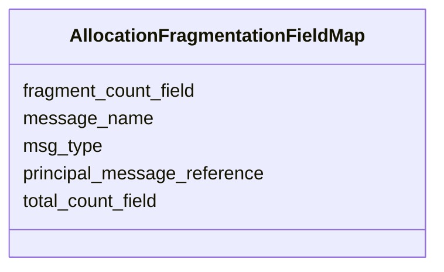

```mermaid
 classDiagram
    class AllocationFragmentationFieldMap
    click AllocationFragmentationFieldMap href "../AllocationFragmentationFieldMap"
      AllocationFragmentationFieldMap : fragment_count_field
        
      AllocationFragmentationFieldMap : message_name
        
      AllocationFragmentationFieldMap : msg_type
        
      AllocationFragmentationFieldMap : principal_message_reference
        
      AllocationFragmentationFieldMap : total_count_field
        
      
```
