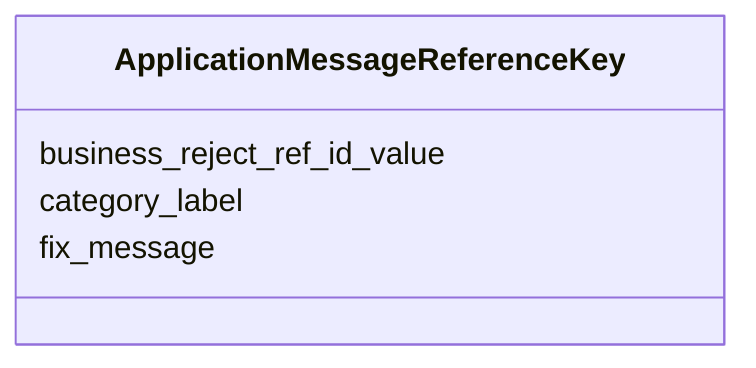

```mermaid
 classDiagram
    class ApplicationMessageReferenceKey
    click ApplicationMessageReferenceKey href "../ApplicationMessageReferenceKey"
      ApplicationMessageReferenceKey : business_reject_ref_id_value
        
      ApplicationMessageReferenceKey : category_label
        
      ApplicationMessageReferenceKey : fix_message
        
      
```
