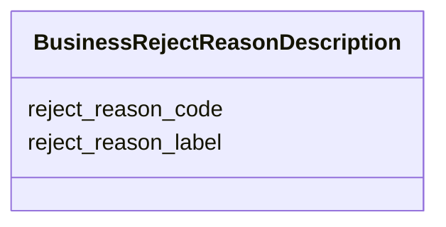

```mermaid
 classDiagram
    class BusinessRejectReasonDescription
    click BusinessRejectReasonDescription href "../BusinessRejectReasonDescription"
      BusinessRejectReasonDescription : reject_reason_code
        
      BusinessRejectReasonDescription : reject_reason_label
        
      
```
