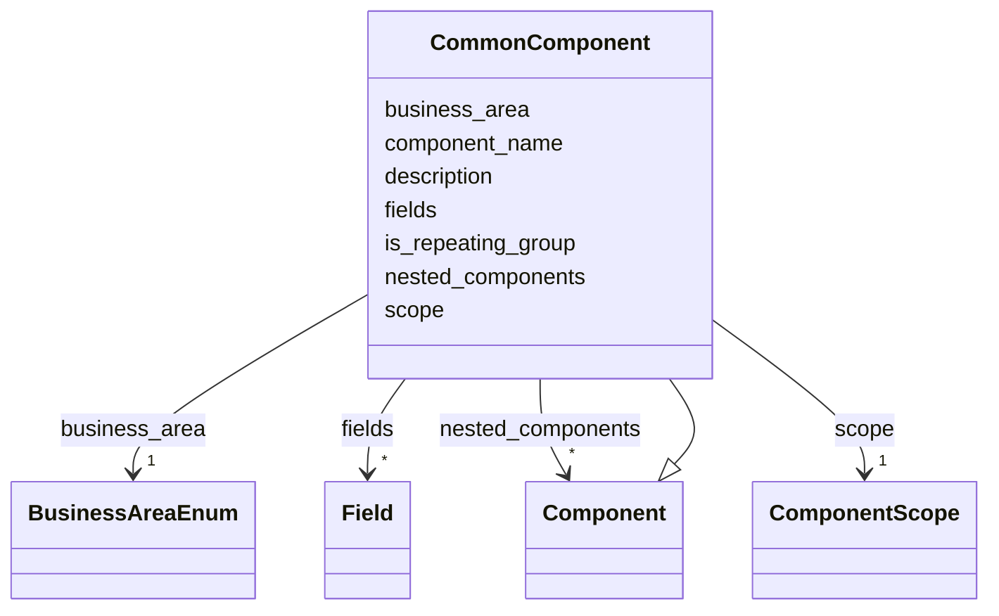

```mermaid
 classDiagram
    class CommonComponent
    click CommonComponent href "../CommonComponent"
      Component <|-- CommonComponent
        click Component href "../Component"
      
      CommonComponent : business_area
        
          
    
        
        
        CommonComponent --> "1" BusinessAreaEnum : business_area
        click BusinessAreaEnum href "../BusinessAreaEnum"
    

        
      CommonComponent : component_name
        
      CommonComponent : description
        
      CommonComponent : fields
        
          
    
        
        
        CommonComponent --> "*" Field : fields
        click Field href "../Field"
    

        
      CommonComponent : is_repeating_group
        
      CommonComponent : nested_components
        
          
    
        
        
        CommonComponent --> "*" Component : nested_components
        click Component href "../Component"
    

        
      CommonComponent : scope
        
          
    
        
        
        CommonComponent --> "1" ComponentScope : scope
        click ComponentScope href "../ComponentScope"
    

        
      
```
