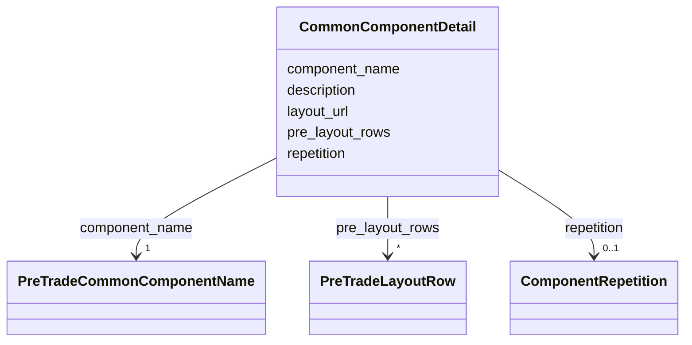

```mermaid
 classDiagram
    class CommonComponentDetail
    click CommonComponentDetail href "../CommonComponentDetail"
      CommonComponentDetail : component_name
        
          
    
        
        
        CommonComponentDetail --> "1" PreTradeCommonComponentName : component_name
        click PreTradeCommonComponentName href "../PreTradeCommonComponentName"
    

        
      CommonComponentDetail : description
        
      CommonComponentDetail : layout_url
        
      CommonComponentDetail : pre_layout_rows
        
          
    
        
        
        CommonComponentDetail --> "*" PreTradeLayoutRow : pre_layout_rows
        click PreTradeLayoutRow href "../PreTradeLayoutRow"
    

        
      CommonComponentDetail : repetition
        
          
    
        
        
        CommonComponentDetail --> "0..1" ComponentRepetition : repetition
        click ComponentRepetition href "../ComponentRepetition"
    

        
      
```
