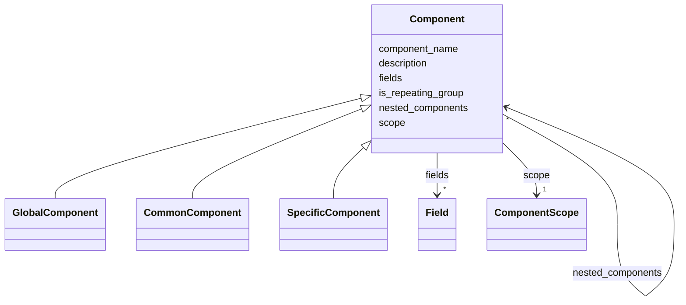

```mermaid
 classDiagram
    class Component
    click Component href "../Component"
      Component <|-- GlobalComponent
        click GlobalComponent href "../GlobalComponent"
      Component <|-- CommonComponent
        click CommonComponent href "../CommonComponent"
      Component <|-- SpecificComponent
        click SpecificComponent href "../SpecificComponent"
      
      Component : component_name
        
      Component : description
        
      Component : fields
        
          
    
        
        
        Component --> "*" Field : fields
        click Field href "../Field"
    

        
      Component : is_repeating_group
        
      Component : nested_components
        
          
    
        
        
        Component --> "*" Component : nested_components
        click Component href "../Component"
    

        
      Component : scope
        
          
    
        
        
        Component --> "1" ComponentScope : scope
        click ComponentScope href "../ComponentScope"
    

        
      
```
