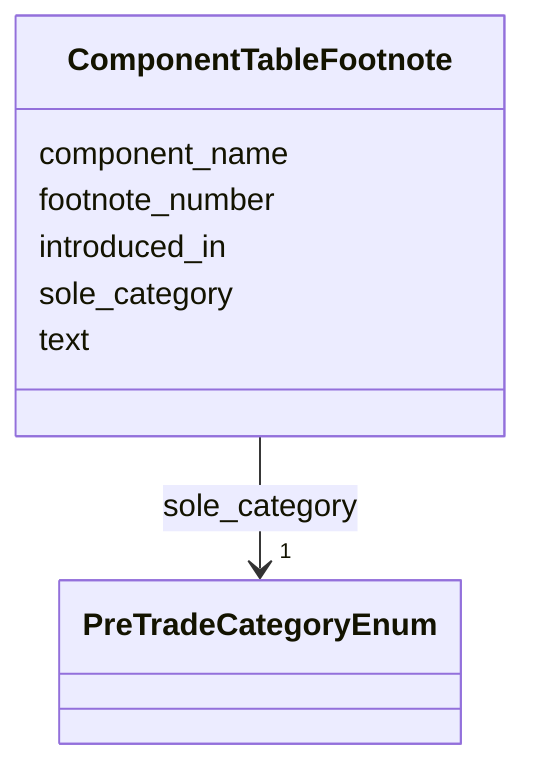

```mermaid
 classDiagram
    class ComponentTableFootnote
    click ComponentTableFootnote href "../ComponentTableFootnote"
      ComponentTableFootnote : component_name
        
      ComponentTableFootnote : footnote_number
        
      ComponentTableFootnote : introduced_in
        
      ComponentTableFootnote : sole_category
        
          
    
        
        
        ComponentTableFootnote --> "1" PreTradeCategoryEnum : sole_category
        click PreTradeCategoryEnum href "../PreTradeCategoryEnum"
    

        
      ComponentTableFootnote : text
        
      
```
