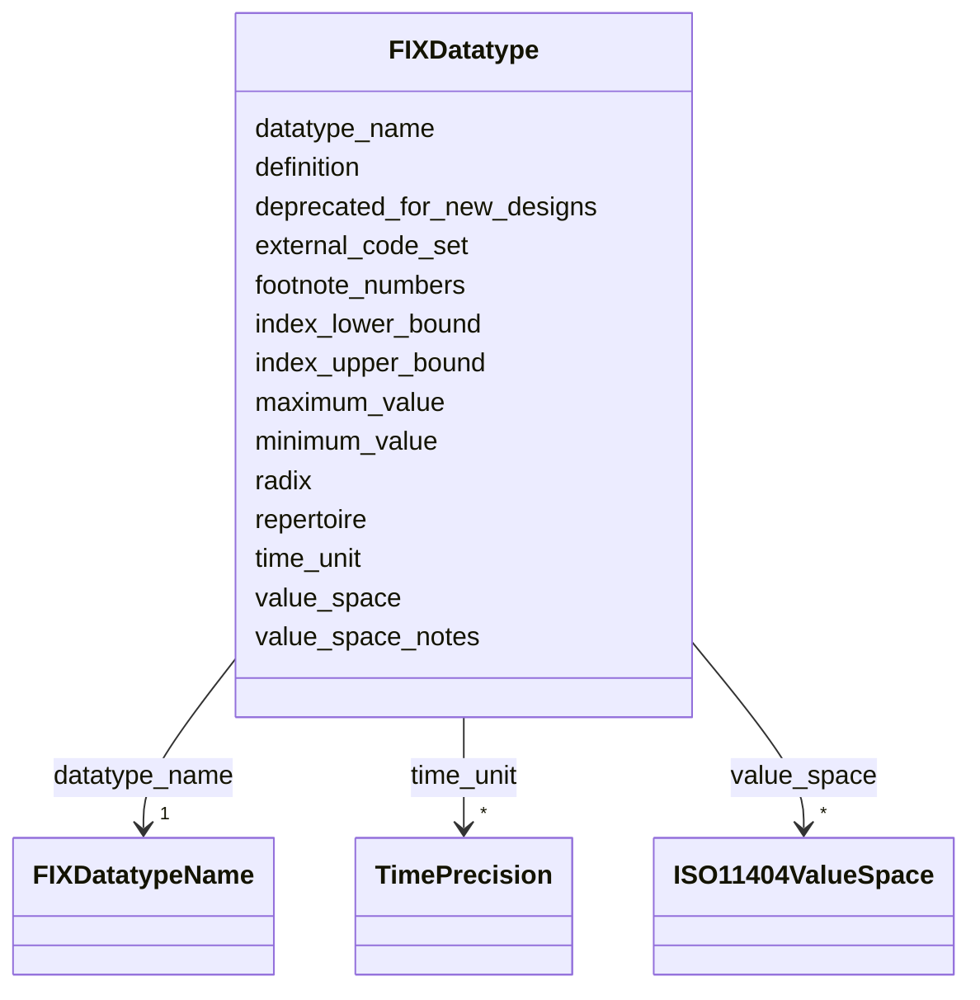

```mermaid
 classDiagram
    class FIXDatatype
    click FIXDatatype href "../FIXDatatype"
      FIXDatatype : datatype_name
        
          
    
        
        
        FIXDatatype --> "1" FIXDatatypeName : datatype_name
        click FIXDatatypeName href "../FIXDatatypeName"
    

        
      FIXDatatype : definition
        
      FIXDatatype : deprecated_for_new_designs
        
      FIXDatatype : external_code_set
        
      FIXDatatype : footnote_numbers
        
      FIXDatatype : index_lower_bound
        
      FIXDatatype : index_upper_bound
        
      FIXDatatype : maximum_value
        
      FIXDatatype : minimum_value
        
      FIXDatatype : radix
        
      FIXDatatype : repertoire
        
      FIXDatatype : time_unit
        
          
    
        
        
        FIXDatatype --> "*" TimePrecision : time_unit
        click TimePrecision href "../TimePrecision"
    

        
      FIXDatatype : value_space
        
          
    
        
        
        FIXDatatype --> "*" ISO11404ValueSpace : value_space
        click ISO11404ValueSpace href "../ISO11404ValueSpace"
    

        
      FIXDatatype : value_space_notes
        
      
```
