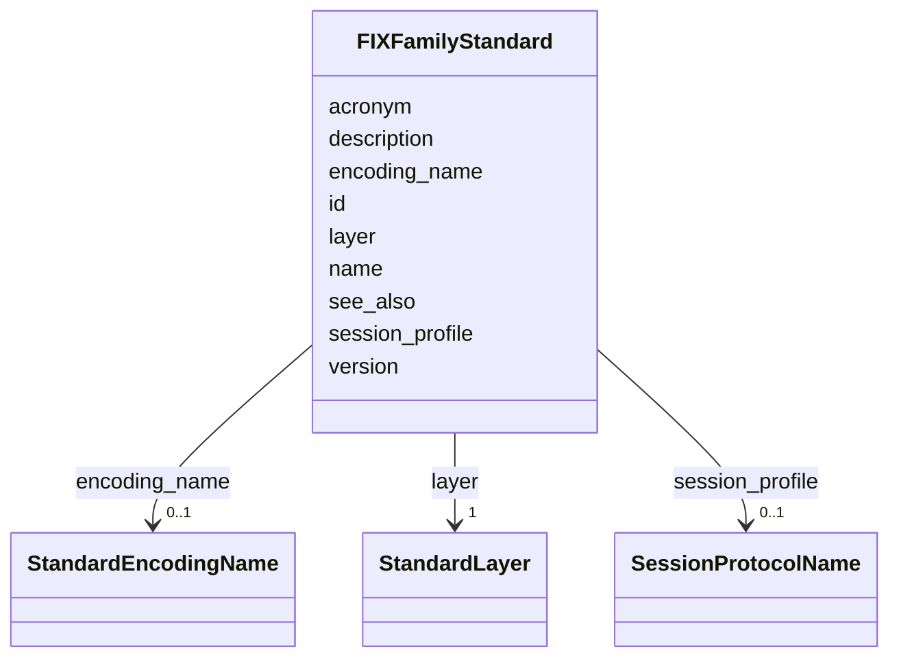

```mermaid
 classDiagram
    class FIXFamilyStandard
    click FIXFamilyStandard href "../FIXFamilyStandard"
      FIXFamilyStandard : acronym
        
      FIXFamilyStandard : description
        
      FIXFamilyStandard : encoding_name
        
          
    
        
        
        FIXFamilyStandard --> "0..1" StandardEncodingName : encoding_name
        click StandardEncodingName href "../StandardEncodingName"
    

        
      FIXFamilyStandard : id
        
      FIXFamilyStandard : layer
        
          
    
        
        
        FIXFamilyStandard --> "1" StandardLayer : layer
        click StandardLayer href "../StandardLayer"
    

        
      FIXFamilyStandard : name
        
      FIXFamilyStandard : see_also
        
      FIXFamilyStandard : session_profile
        
          
    
        
        
        FIXFamilyStandard --> "0..1" SessionProtocolName : session_profile
        click SessionProtocolName href "../SessionProtocolName"
    

        
      FIXFamilyStandard : version
        
      
```
