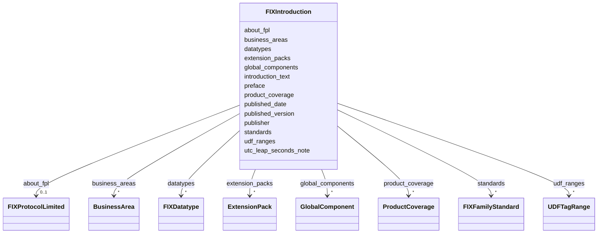

```mermaid
 classDiagram
    class FIXIntroduction
    click FIXIntroduction href "../FIXIntroduction"
      FIXIntroduction : about_fpl
        
          
    
        
        
        FIXIntroduction --> "0..1" FIXProtocolLimited : about_fpl
        click FIXProtocolLimited href "../FIXProtocolLimited"
    

        
      FIXIntroduction : business_areas
        
          
    
        
        
        FIXIntroduction --> "*" BusinessArea : business_areas
        click BusinessArea href "../BusinessArea"
    

        
      FIXIntroduction : datatypes
        
          
    
        
        
        FIXIntroduction --> "*" FIXDatatype : datatypes
        click FIXDatatype href "../FIXDatatype"
    

        
      FIXIntroduction : extension_packs
        
          
    
        
        
        FIXIntroduction --> "*" ExtensionPack : extension_packs
        click ExtensionPack href "../ExtensionPack"
    

        
      FIXIntroduction : global_components
        
          
    
        
        
        FIXIntroduction --> "*" GlobalComponent : global_components
        click GlobalComponent href "../GlobalComponent"
    

        
      FIXIntroduction : introduction_text
        
      FIXIntroduction : preface
        
      FIXIntroduction : product_coverage
        
          
    
        
        
        FIXIntroduction --> "*" ProductCoverage : product_coverage
        click ProductCoverage href "../ProductCoverage"
    

        
      FIXIntroduction : published_date
        
      FIXIntroduction : published_version
        
      FIXIntroduction : publisher
        
      FIXIntroduction : standards
        
          
    
        
        
        FIXIntroduction --> "*" FIXFamilyStandard : standards
        click FIXFamilyStandard href "../FIXFamilyStandard"
    

        
      FIXIntroduction : udf_ranges
        
          
    
        
        
        FIXIntroduction --> "*" UDFTagRange : udf_ranges
        click UDFTagRange href "../UDFTagRange"
    

        
      FIXIntroduction : utc_leap_seconds_note
        
      
```
