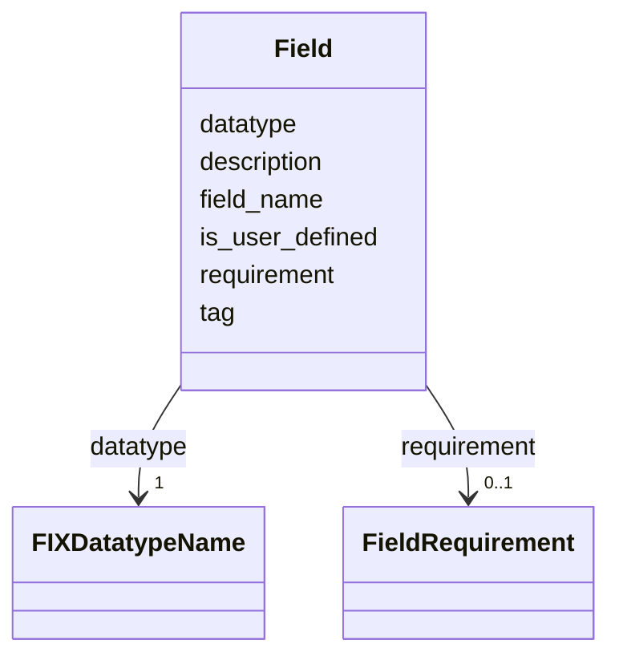

```mermaid
 classDiagram
    class Field
    click Field href "../Field"
      Field : datatype
        
          
    
        
        
        Field --> "1" FIXDatatypeName : datatype
        click FIXDatatypeName href "../FIXDatatypeName"
    

        
      Field : description
        
      Field : field_name
        
      Field : is_user_defined
        
      Field : requirement
        
          
    
        
        
        Field --> "0..1" FieldRequirement : requirement
        click FieldRequirement href "../FieldRequirement"
    

        
      Field : tag
        
      
```
