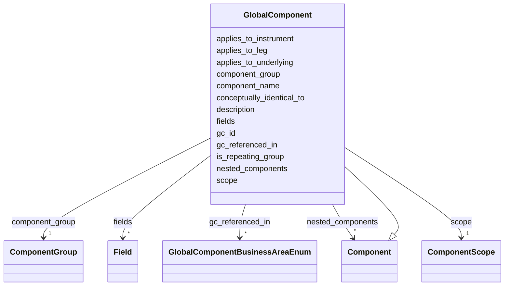

```mermaid
 classDiagram
    class GlobalComponent
    click GlobalComponent href "../GlobalComponent"
      Component <|-- GlobalComponent
        click Component href "../Component"
      
      GlobalComponent : applies_to_instrument
        
      GlobalComponent : applies_to_leg
        
      GlobalComponent : applies_to_underlying
        
      GlobalComponent : component_group
        
          
    
        
        
        GlobalComponent --> "1" ComponentGroup : component_group
        click ComponentGroup href "../ComponentGroup"
    

        
      GlobalComponent : component_name
        
      GlobalComponent : conceptually_identical_to
        
      GlobalComponent : description
        
      GlobalComponent : fields
        
          
    
        
        
        GlobalComponent --> "*" Field : fields
        click Field href "../Field"
    

        
      GlobalComponent : gc_id
        
      GlobalComponent : gc_referenced_in
        
          
    
        
        
        GlobalComponent --> "*" GlobalComponentBusinessAreaEnum : gc_referenced_in
        click GlobalComponentBusinessAreaEnum href "../GlobalComponentBusinessAreaEnum"
    

        
      GlobalComponent : is_repeating_group
        
      GlobalComponent : nested_components
        
          
    
        
        
        GlobalComponent --> "*" Component : nested_components
        click Component href "../Component"
    

        
      GlobalComponent : scope
        
          
    
        
        
        GlobalComponent --> "1" ComponentScope : scope
        click ComponentScope href "../ComponentScope"
    

        
      
```
