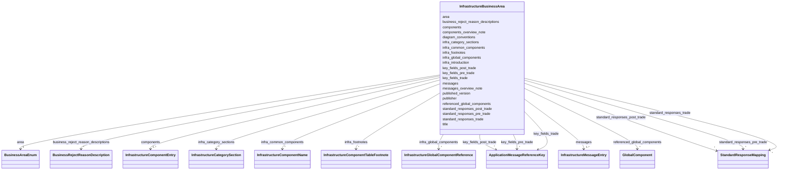

```mermaid
 classDiagram
    class InfrastructureBusinessArea
    click InfrastructureBusinessArea href "../InfrastructureBusinessArea"
      InfrastructureBusinessArea : area
        
          
    
        
        
        InfrastructureBusinessArea --> "1" BusinessAreaEnum : area
        click BusinessAreaEnum href "../BusinessAreaEnum"
    

        
      InfrastructureBusinessArea : business_reject_reason_descriptions
        
          
    
        
        
        InfrastructureBusinessArea --> "*" BusinessRejectReasonDescription : business_reject_reason_descriptions
        click BusinessRejectReasonDescription href "../BusinessRejectReasonDescription"
    

        
      InfrastructureBusinessArea : components
        
          
    
        
        
        InfrastructureBusinessArea --> "1..*" InfrastructureComponentEntry : components
        click InfrastructureComponentEntry href "../InfrastructureComponentEntry"
    

        
      InfrastructureBusinessArea : components_overview_note
        
      InfrastructureBusinessArea : diagram_conventions
        
      InfrastructureBusinessArea : infra_category_sections
        
          
    
        
        
        InfrastructureBusinessArea --> "*" InfrastructureCategorySection : infra_category_sections
        click InfrastructureCategorySection href "../InfrastructureCategorySection"
    

        
      InfrastructureBusinessArea : infra_common_components
        
          
    
        
        
        InfrastructureBusinessArea --> "*" InfrastructureComponentName : infra_common_components
        click InfrastructureComponentName href "../InfrastructureComponentName"
    

        
      InfrastructureBusinessArea : infra_footnotes
        
          
    
        
        
        InfrastructureBusinessArea --> "*" InfrastructureComponentTableFootnote : infra_footnotes
        click InfrastructureComponentTableFootnote href "../InfrastructureComponentTableFootnote"
    

        
      InfrastructureBusinessArea : infra_global_components
        
          
    
        
        
        InfrastructureBusinessArea --> "*" InfrastructureGlobalComponentReference : infra_global_components
        click InfrastructureGlobalComponentReference href "../InfrastructureGlobalComponentReference"
    

        
      InfrastructureBusinessArea : infra_introduction
        
      InfrastructureBusinessArea : key_fields_post_trade
        
          
    
        
        
        InfrastructureBusinessArea --> "*" ApplicationMessageReferenceKey : key_fields_post_trade
        click ApplicationMessageReferenceKey href "../ApplicationMessageReferenceKey"
    

        
      InfrastructureBusinessArea : key_fields_pre_trade
        
          
    
        
        
        InfrastructureBusinessArea --> "*" ApplicationMessageReferenceKey : key_fields_pre_trade
        click ApplicationMessageReferenceKey href "../ApplicationMessageReferenceKey"
    

        
      InfrastructureBusinessArea : key_fields_trade
        
          
    
        
        
        InfrastructureBusinessArea --> "*" ApplicationMessageReferenceKey : key_fields_trade
        click ApplicationMessageReferenceKey href "../ApplicationMessageReferenceKey"
    

        
      InfrastructureBusinessArea : messages
        
          
    
        
        
        InfrastructureBusinessArea --> "1..*" InfrastructureMessageEntry : messages
        click InfrastructureMessageEntry href "../InfrastructureMessageEntry"
    

        
      InfrastructureBusinessArea : messages_overview_note
        
      InfrastructureBusinessArea : published_version
        
      InfrastructureBusinessArea : publisher
        
      InfrastructureBusinessArea : referenced_global_components
        
          
    
        
        
        InfrastructureBusinessArea --> "*" GlobalComponent : referenced_global_components
        click GlobalComponent href "../GlobalComponent"
    

        
      InfrastructureBusinessArea : standard_responses_post_trade
        
          
    
        
        
        InfrastructureBusinessArea --> "*" StandardResponseMapping : standard_responses_post_trade
        click StandardResponseMapping href "../StandardResponseMapping"
    

        
      InfrastructureBusinessArea : standard_responses_pre_trade
        
          
    
        
        
        InfrastructureBusinessArea --> "*" StandardResponseMapping : standard_responses_pre_trade
        click StandardResponseMapping href "../StandardResponseMapping"
    

        
      InfrastructureBusinessArea : standard_responses_trade
        
          
    
        
        
        InfrastructureBusinessArea --> "*" StandardResponseMapping : standard_responses_trade
        click StandardResponseMapping href "../StandardResponseMapping"
    

        
      InfrastructureBusinessArea : title
        
      
```
