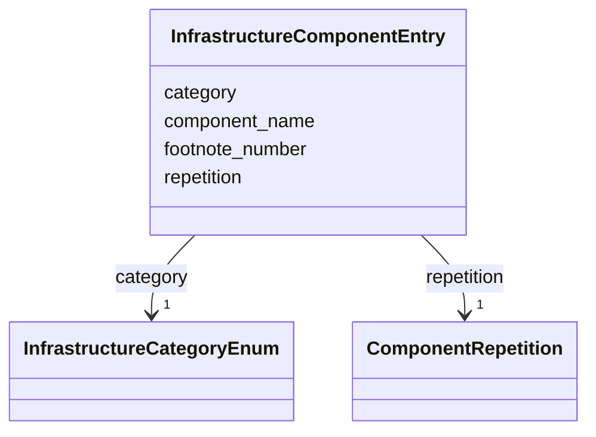

```mermaid
 classDiagram
    class InfrastructureComponentEntry
    click InfrastructureComponentEntry href "../InfrastructureComponentEntry"
      InfrastructureComponentEntry : category
        
          
    
        
        
        InfrastructureComponentEntry --> "1" InfrastructureCategoryEnum : category
        click InfrastructureCategoryEnum href "../InfrastructureCategoryEnum"
    

        
      InfrastructureComponentEntry : component_name
        
      InfrastructureComponentEntry : footnote_number
        
      InfrastructureComponentEntry : repetition
        
          
    
        
        
        InfrastructureComponentEntry --> "1" ComponentRepetition : repetition
        click ComponentRepetition href "../ComponentRepetition"
    

        
      
```
