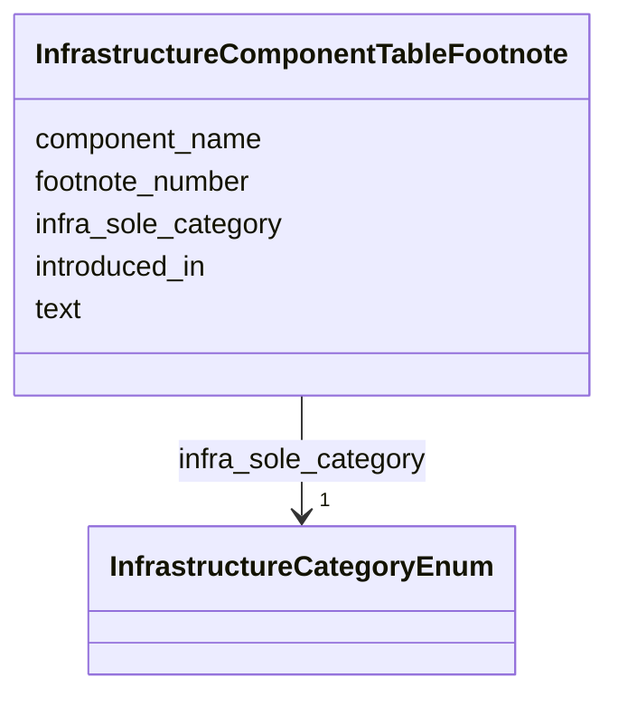

```mermaid
 classDiagram
    class InfrastructureComponentTableFootnote
    click InfrastructureComponentTableFootnote href "../InfrastructureComponentTableFootnote"
      InfrastructureComponentTableFootnote : component_name
        
      InfrastructureComponentTableFootnote : footnote_number
        
      InfrastructureComponentTableFootnote : infra_sole_category
        
          
    
        
        
        InfrastructureComponentTableFootnote --> "1" InfrastructureCategoryEnum : infra_sole_category
        click InfrastructureCategoryEnum href "../InfrastructureCategoryEnum"
    

        
      InfrastructureComponentTableFootnote : introduced_in
        
      InfrastructureComponentTableFootnote : text
        
      
```
