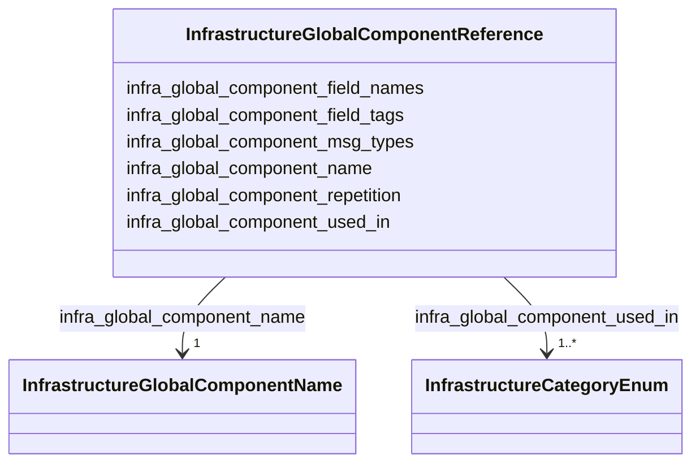

```mermaid
 classDiagram
    class InfrastructureGlobalComponentReference
    click InfrastructureGlobalComponentReference href "../InfrastructureGlobalComponentReference"
      InfrastructureGlobalComponentReference : infra_global_component_field_names
        
      InfrastructureGlobalComponentReference : infra_global_component_field_tags
        
      InfrastructureGlobalComponentReference : infra_global_component_msg_types
        
      InfrastructureGlobalComponentReference : infra_global_component_name
        
          
    
        
        
        InfrastructureGlobalComponentReference --> "1" InfrastructureGlobalComponentName : infra_global_component_name
        click InfrastructureGlobalComponentName href "../InfrastructureGlobalComponentName"
    

        
      InfrastructureGlobalComponentReference : infra_global_component_repetition
        
      InfrastructureGlobalComponentReference : infra_global_component_used_in
        
          
    
        
        
        InfrastructureGlobalComponentReference --> "1..*" InfrastructureCategoryEnum : infra_global_component_used_in
        click InfrastructureCategoryEnum href "../InfrastructureCategoryEnum"
    

        
      
```
