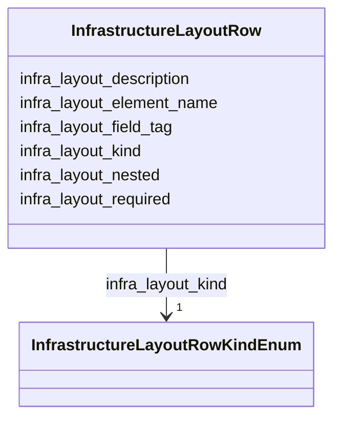

```mermaid
 classDiagram
    class InfrastructureLayoutRow
    click InfrastructureLayoutRow href "../InfrastructureLayoutRow"
      InfrastructureLayoutRow : infra_layout_description
        
      InfrastructureLayoutRow : infra_layout_element_name
        
      InfrastructureLayoutRow : infra_layout_field_tag
        
      InfrastructureLayoutRow : infra_layout_kind
        
          
    
        
        
        InfrastructureLayoutRow --> "1" InfrastructureLayoutRowKindEnum : infra_layout_kind
        click InfrastructureLayoutRowKindEnum href "../InfrastructureLayoutRowKindEnum"
    

        
      InfrastructureLayoutRow : infra_layout_nested
        
      InfrastructureLayoutRow : infra_layout_required
        
      
```
