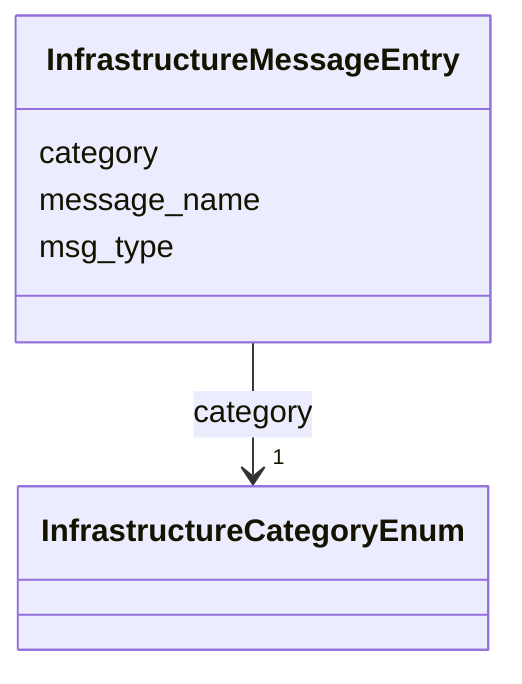

```mermaid
 classDiagram
    class InfrastructureMessageEntry
    click InfrastructureMessageEntry href "../InfrastructureMessageEntry"
      InfrastructureMessageEntry : category
        
          
    
        
        
        InfrastructureMessageEntry --> "1" InfrastructureCategoryEnum : category
        click InfrastructureCategoryEnum href "../InfrastructureCategoryEnum"
    

        
      InfrastructureMessageEntry : message_name
        
      InfrastructureMessageEntry : msg_type
        
      
```
