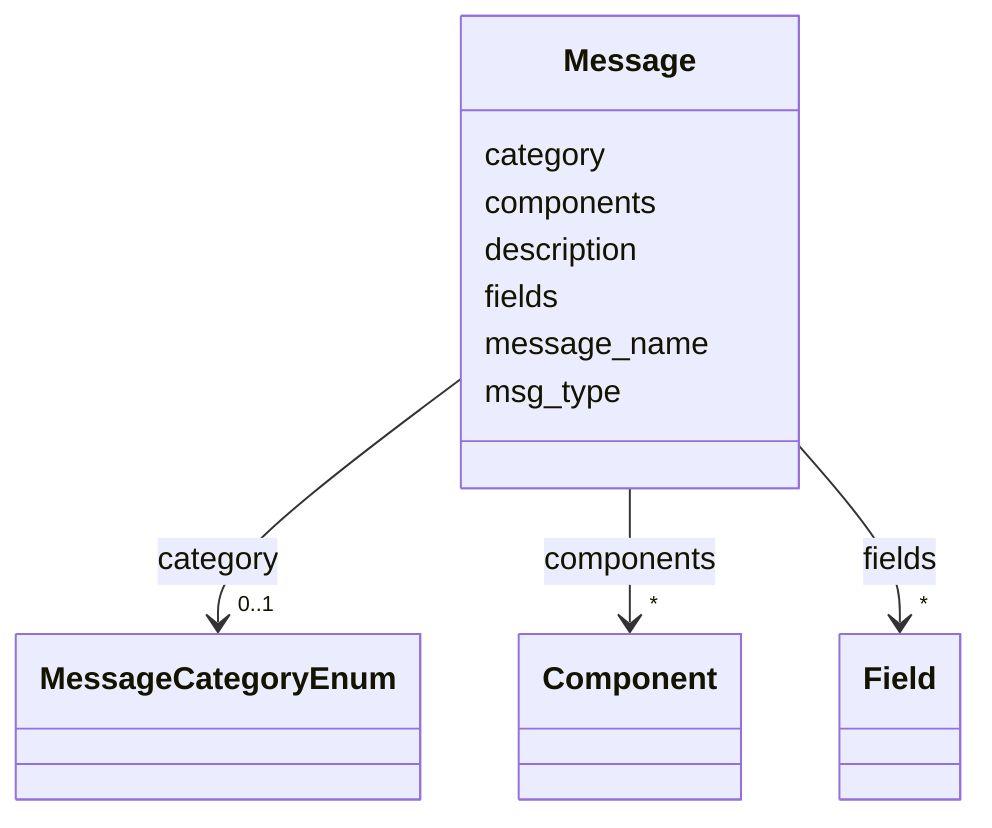

```mermaid
 classDiagram
    class Message
    click Message href "../Message"
      Message : category
        
          
    
        
        
        Message --> "0..1" MessageCategoryEnum : category
        click MessageCategoryEnum href "../MessageCategoryEnum"
    

        
      Message : components
        
          
    
        
        
        Message --> "*" Component : components
        click Component href "../Component"
    

        
      Message : description
        
      Message : fields
        
          
    
        
        
        Message --> "*" Field : fields
        click Field href "../Field"
    

        
      Message : message_name
        
      Message : msg_type
        
      
```
