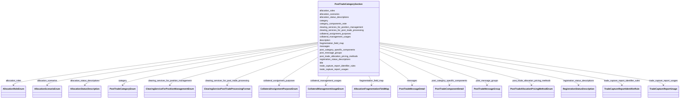

```mermaid
 classDiagram
    class PostTradeCategorySection
    click PostTradeCategorySection href "../PostTradeCategorySection"
      PostTradeCategorySection : allocation_roles
        
          
    
        
        
        PostTradeCategorySection --> "*" AllocationRoleEnum : allocation_roles
        click AllocationRoleEnum href "../AllocationRoleEnum"
    

        
      PostTradeCategorySection : allocation_scenarios
        
          
    
        
        
        PostTradeCategorySection --> "*" AllocationScenarioEnum : allocation_scenarios
        click AllocationScenarioEnum href "../AllocationScenarioEnum"
    

        
      PostTradeCategorySection : allocation_status_descriptions
        
          
    
        
        
        PostTradeCategorySection --> "*" AllocationStatusDescription : allocation_status_descriptions
        click AllocationStatusDescription href "../AllocationStatusDescription"
    

        
      PostTradeCategorySection : category
        
          
    
        
        
        PostTradeCategorySection --> "1" PostTradeCategoryEnum : category
        click PostTradeCategoryEnum href "../PostTradeCategoryEnum"
    

        
      PostTradeCategorySection : category_components_note
        
      PostTradeCategorySection : clearing_services_for_position_management
        
          
    
        
        
        PostTradeCategorySection --> "*" ClearingServiceForPositionManagementEnum : clearing_services_for_position_management
        click ClearingServiceForPositionManagementEnum href "../ClearingServiceForPositionManagementEnum"
    

        
      PostTradeCategorySection : clearing_services_for_post_trade_processing
        
          
    
        
        
        PostTradeCategorySection --> "*" ClearingServicePostTradeProcessingFormat : clearing_services_for_post_trade_processing
        click ClearingServicePostTradeProcessingFormat href "../ClearingServicePostTradeProcessingFormat"
    

        
      PostTradeCategorySection : collateral_assignment_purposes
        
          
    
        
        
        PostTradeCategorySection --> "*" CollateralAssignmentPurposeEnum : collateral_assignment_purposes
        click CollateralAssignmentPurposeEnum href "../CollateralAssignmentPurposeEnum"
    

        
      PostTradeCategorySection : collateral_management_usages
        
          
    
        
        
        PostTradeCategorySection --> "*" CollateralManagementUsageEnum : collateral_management_usages
        click CollateralManagementUsageEnum href "../CollateralManagementUsageEnum"
    

        
      PostTradeCategorySection : description
        
      PostTradeCategorySection : fragmentation_field_map
        
          
    
        
        
        PostTradeCategorySection --> "*" AllocationFragmentationFieldMap : fragmentation_field_map
        click AllocationFragmentationFieldMap href "../AllocationFragmentationFieldMap"
    

        
      PostTradeCategorySection : messages
        
          
    
        
        
        PostTradeCategorySection --> "*" PostTradeMessageDetail : messages
        click PostTradeMessageDetail href "../PostTradeMessageDetail"
    

        
      PostTradeCategorySection : post_category_specific_components
        
          
    
        
        
        PostTradeCategorySection --> "*" PostTradeComponentDetail : post_category_specific_components
        click PostTradeComponentDetail href "../PostTradeComponentDetail"
    

        
      PostTradeCategorySection : post_message_groups
        
          
    
        
        
        PostTradeCategorySection --> "*" PostTradeMessageGroup : post_message_groups
        click PostTradeMessageGroup href "../PostTradeMessageGroup"
    

        
      PostTradeCategorySection : post_trade_allocation_pricing_methods
        
          
    
        
        
        PostTradeCategorySection --> "*" PostTradeAllocationPricingMethodEnum : post_trade_allocation_pricing_methods
        click PostTradeAllocationPricingMethodEnum href "../PostTradeAllocationPricingMethodEnum"
    

        
      PostTradeCategorySection : registration_status_descriptions
        
          
    
        
        
        PostTradeCategorySection --> "*" RegistrationStatusDescription : registration_status_descriptions
        click RegistrationStatusDescription href "../RegistrationStatusDescription"
    

        
      PostTradeCategorySection : title
        
      PostTradeCategorySection : trade_capture_report_identifier_rules
        
          
    
        
        
        PostTradeCategorySection --> "*" TradeCaptureReportIdentifierRule : trade_capture_report_identifier_rules
        click TradeCaptureReportIdentifierRule href "../TradeCaptureReportIdentifierRule"
    

        
      PostTradeCategorySection : trade_capture_report_usages
        
          
    
        
        
        PostTradeCategorySection --> "*" TradeCaptureReportUsage : trade_capture_report_usages
        click TradeCaptureReportUsage href "../TradeCaptureReportUsage"
    

        
      
```
