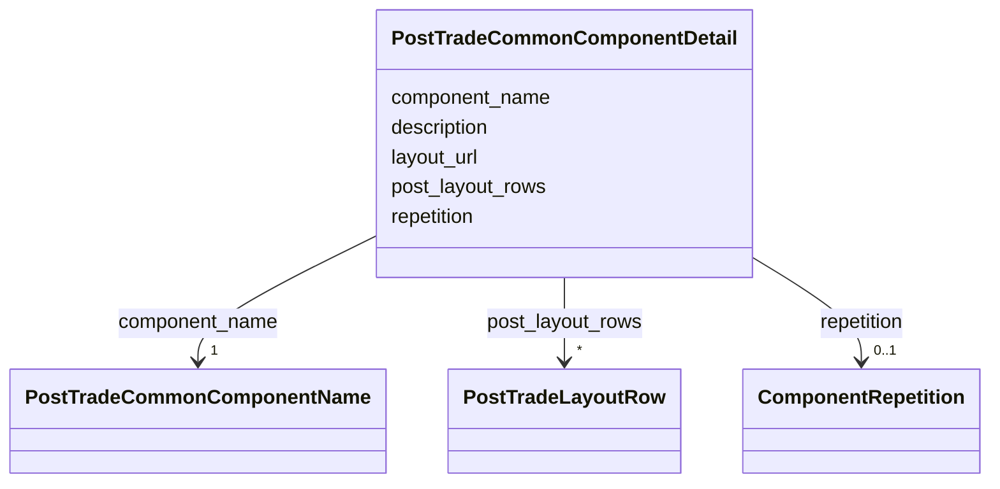

```mermaid
 classDiagram
    class PostTradeCommonComponentDetail
    click PostTradeCommonComponentDetail href "../PostTradeCommonComponentDetail"
      PostTradeCommonComponentDetail : component_name
        
          
    
        
        
        PostTradeCommonComponentDetail --> "1" PostTradeCommonComponentName : component_name
        click PostTradeCommonComponentName href "../PostTradeCommonComponentName"
    

        
      PostTradeCommonComponentDetail : description
        
      PostTradeCommonComponentDetail : layout_url
        
      PostTradeCommonComponentDetail : post_layout_rows
        
          
    
        
        
        PostTradeCommonComponentDetail --> "*" PostTradeLayoutRow : post_layout_rows
        click PostTradeLayoutRow href "../PostTradeLayoutRow"
    

        
      PostTradeCommonComponentDetail : repetition
        
          
    
        
        
        PostTradeCommonComponentDetail --> "0..1" ComponentRepetition : repetition
        click ComponentRepetition href "../ComponentRepetition"
    

        
      
```
