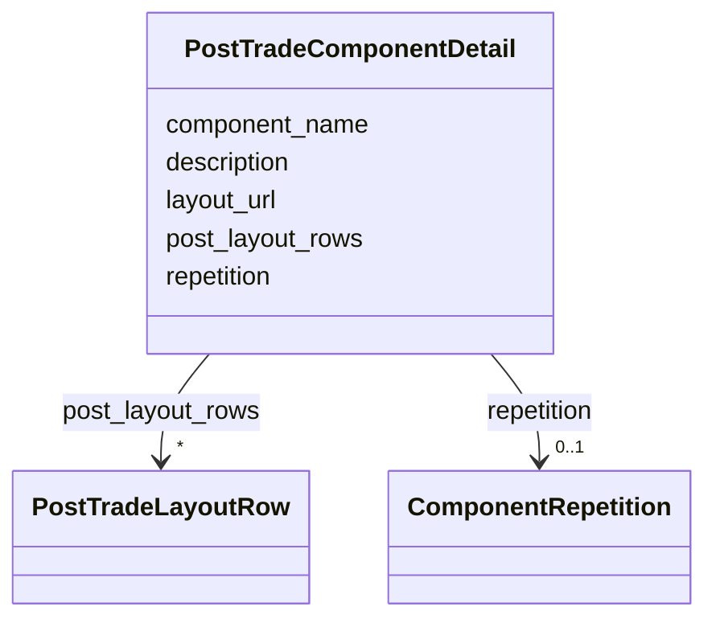

```mermaid
 classDiagram
    class PostTradeComponentDetail
    click PostTradeComponentDetail href "../PostTradeComponentDetail"
      PostTradeComponentDetail : component_name
        
      PostTradeComponentDetail : description
        
      PostTradeComponentDetail : layout_url
        
      PostTradeComponentDetail : post_layout_rows
        
          
    
        
        
        PostTradeComponentDetail --> "*" PostTradeLayoutRow : post_layout_rows
        click PostTradeLayoutRow href "../PostTradeLayoutRow"
    

        
      PostTradeComponentDetail : repetition
        
          
    
        
        
        PostTradeComponentDetail --> "0..1" ComponentRepetition : repetition
        click ComponentRepetition href "../ComponentRepetition"
    

        
      
```
