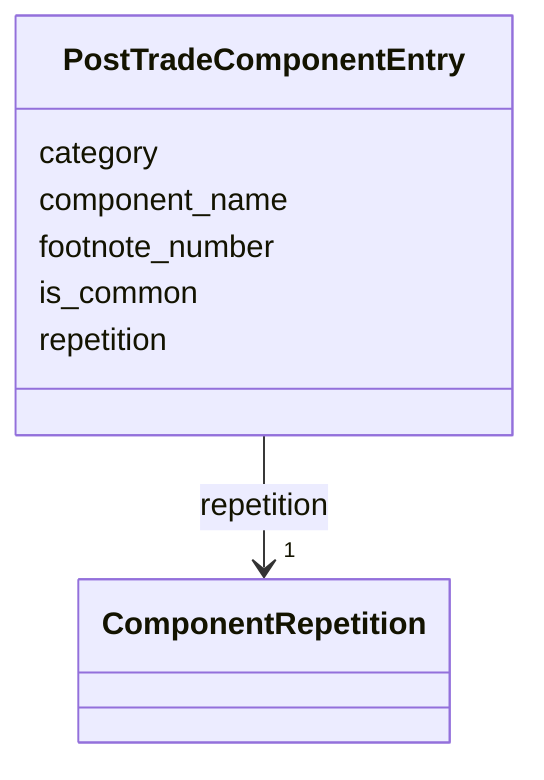

```mermaid
 classDiagram
    class PostTradeComponentEntry
    click PostTradeComponentEntry href "../PostTradeComponentEntry"
      PostTradeComponentEntry : category
        
      PostTradeComponentEntry : component_name
        
      PostTradeComponentEntry : footnote_number
        
      PostTradeComponentEntry : is_common
        
      PostTradeComponentEntry : repetition
        
          
    
        
        
        PostTradeComponentEntry --> "1" ComponentRepetition : repetition
        click ComponentRepetition href "../ComponentRepetition"
    

        
      
```
