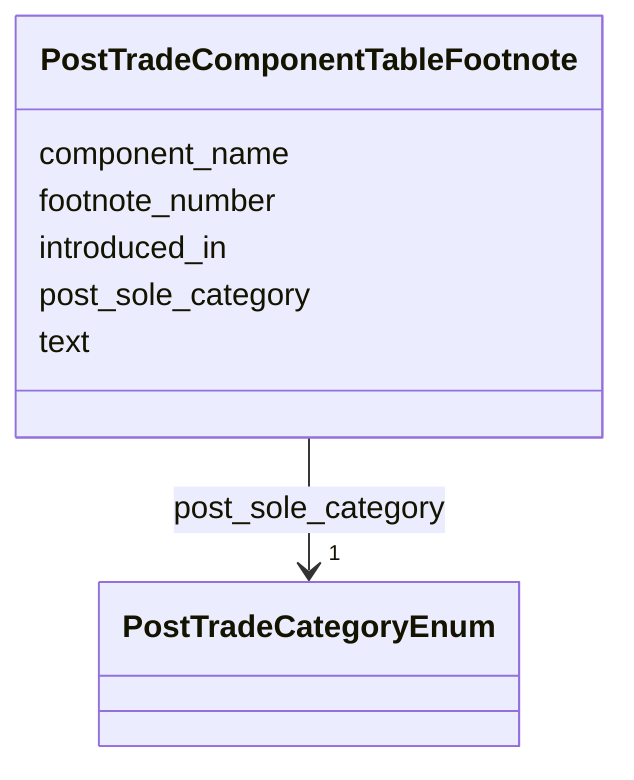

```mermaid
 classDiagram
    class PostTradeComponentTableFootnote
    click PostTradeComponentTableFootnote href "../PostTradeComponentTableFootnote"
      PostTradeComponentTableFootnote : component_name
        
      PostTradeComponentTableFootnote : footnote_number
        
      PostTradeComponentTableFootnote : introduced_in
        
      PostTradeComponentTableFootnote : post_sole_category
        
          
    
        
        
        PostTradeComponentTableFootnote --> "1" PostTradeCategoryEnum : post_sole_category
        click PostTradeCategoryEnum href "../PostTradeCategoryEnum"
    

        
      PostTradeComponentTableFootnote : text
        
      
```
