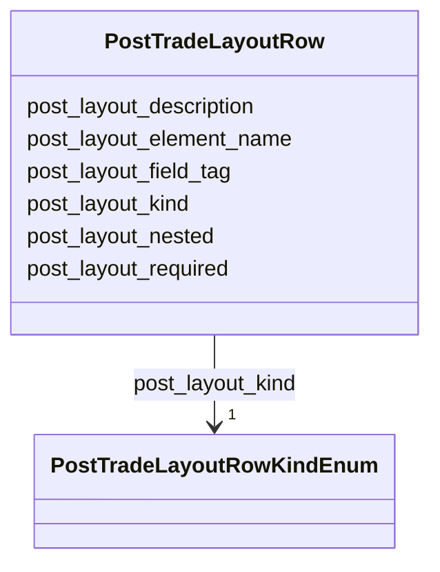

```mermaid
 classDiagram
    class PostTradeLayoutRow
    click PostTradeLayoutRow href "../PostTradeLayoutRow"
      PostTradeLayoutRow : post_layout_description
        
      PostTradeLayoutRow : post_layout_element_name
        
      PostTradeLayoutRow : post_layout_field_tag
        
      PostTradeLayoutRow : post_layout_kind
        
          
    
        
        
        PostTradeLayoutRow --> "1" PostTradeLayoutRowKindEnum : post_layout_kind
        click PostTradeLayoutRowKindEnum href "../PostTradeLayoutRowKindEnum"
    

        
      PostTradeLayoutRow : post_layout_nested
        
      PostTradeLayoutRow : post_layout_required
        
      
```
