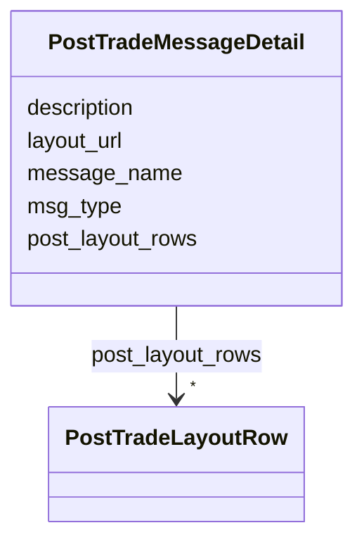

```mermaid
 classDiagram
    class PostTradeMessageDetail
    click PostTradeMessageDetail href "../PostTradeMessageDetail"
      PostTradeMessageDetail : description
        
      PostTradeMessageDetail : layout_url
        
      PostTradeMessageDetail : message_name
        
      PostTradeMessageDetail : msg_type
        
      PostTradeMessageDetail : post_layout_rows
        
          
    
        
        
        PostTradeMessageDetail --> "*" PostTradeLayoutRow : post_layout_rows
        click PostTradeLayoutRow href "../PostTradeLayoutRow"
    

        
      
```
