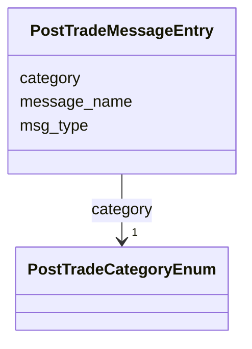

```mermaid
 classDiagram
    class PostTradeMessageEntry
    click PostTradeMessageEntry href "../PostTradeMessageEntry"
      PostTradeMessageEntry : category
        
          
    
        
        
        PostTradeMessageEntry --> "1" PostTradeCategoryEnum : category
        click PostTradeCategoryEnum href "../PostTradeCategoryEnum"
    

        
      PostTradeMessageEntry : message_name
        
      PostTradeMessageEntry : msg_type
        
      
```
