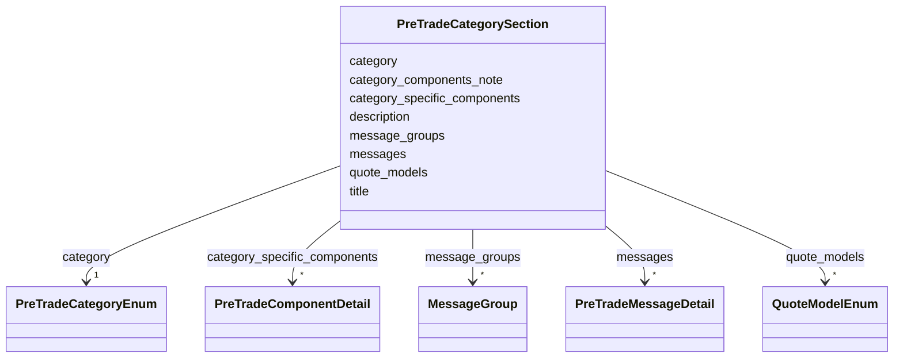

```mermaid
 classDiagram
    class PreTradeCategorySection
    click PreTradeCategorySection href "../PreTradeCategorySection"
      PreTradeCategorySection : category
        
          
    
        
        
        PreTradeCategorySection --> "1" PreTradeCategoryEnum : category
        click PreTradeCategoryEnum href "../PreTradeCategoryEnum"
    

        
      PreTradeCategorySection : category_components_note
        
      PreTradeCategorySection : category_specific_components
        
          
    
        
        
        PreTradeCategorySection --> "*" PreTradeComponentDetail : category_specific_components
        click PreTradeComponentDetail href "../PreTradeComponentDetail"
    

        
      PreTradeCategorySection : description
        
      PreTradeCategorySection : message_groups
        
          
    
        
        
        PreTradeCategorySection --> "*" MessageGroup : message_groups
        click MessageGroup href "../MessageGroup"
    

        
      PreTradeCategorySection : messages
        
          
    
        
        
        PreTradeCategorySection --> "*" PreTradeMessageDetail : messages
        click PreTradeMessageDetail href "../PreTradeMessageDetail"
    

        
      PreTradeCategorySection : quote_models
        
          
    
        
        
        PreTradeCategorySection --> "*" QuoteModelEnum : quote_models
        click QuoteModelEnum href "../QuoteModelEnum"
    

        
      PreTradeCategorySection : title
        
      
```
