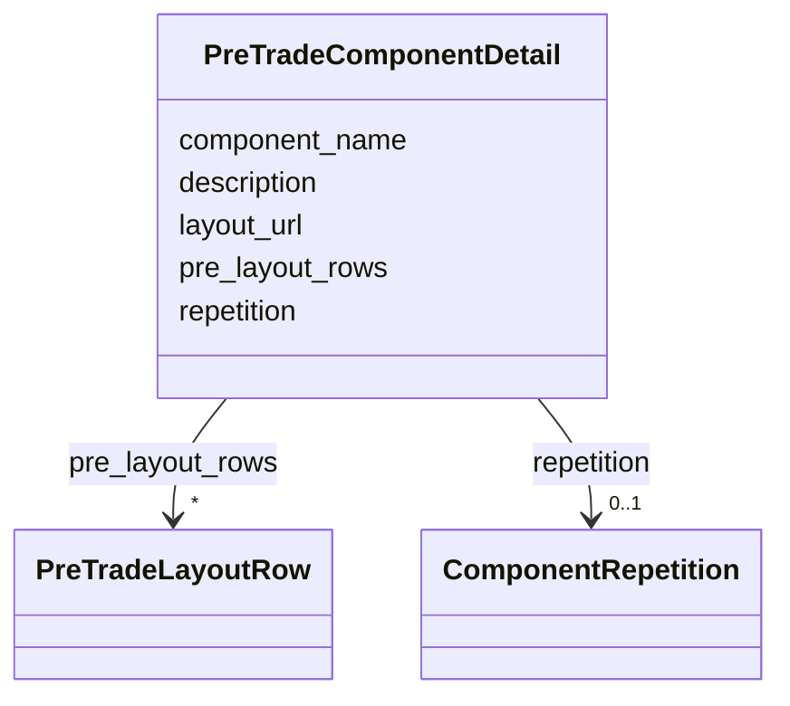

```mermaid
 classDiagram
    class PreTradeComponentDetail
    click PreTradeComponentDetail href "../PreTradeComponentDetail"
      PreTradeComponentDetail : component_name
        
      PreTradeComponentDetail : description
        
      PreTradeComponentDetail : layout_url
        
      PreTradeComponentDetail : pre_layout_rows
        
          
    
        
        
        PreTradeComponentDetail --> "*" PreTradeLayoutRow : pre_layout_rows
        click PreTradeLayoutRow href "../PreTradeLayoutRow"
    

        
      PreTradeComponentDetail : repetition
        
          
    
        
        
        PreTradeComponentDetail --> "0..1" ComponentRepetition : repetition
        click ComponentRepetition href "../ComponentRepetition"
    

        
      
```
