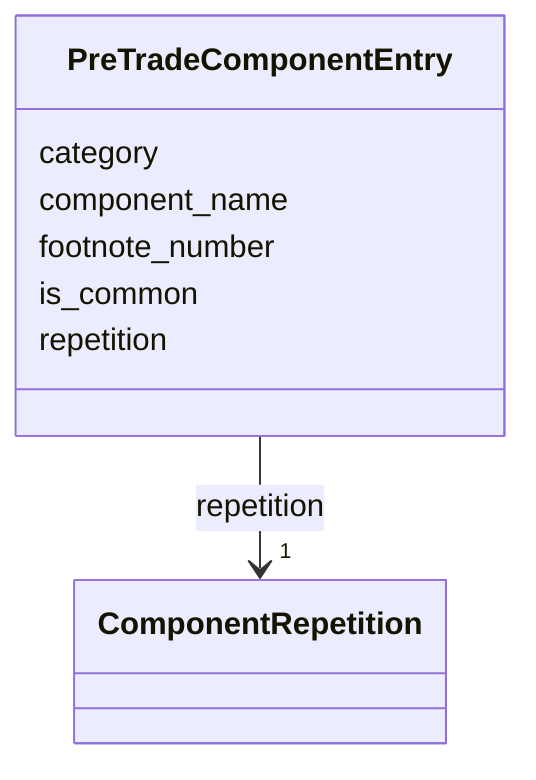

```mermaid
 classDiagram
    class PreTradeComponentEntry
    click PreTradeComponentEntry href "../PreTradeComponentEntry"
      PreTradeComponentEntry : category
        
      PreTradeComponentEntry : component_name
        
      PreTradeComponentEntry : footnote_number
        
      PreTradeComponentEntry : is_common
        
      PreTradeComponentEntry : repetition
        
          
    
        
        
        PreTradeComponentEntry --> "1" ComponentRepetition : repetition
        click ComponentRepetition href "../ComponentRepetition"
    

        
      
```
