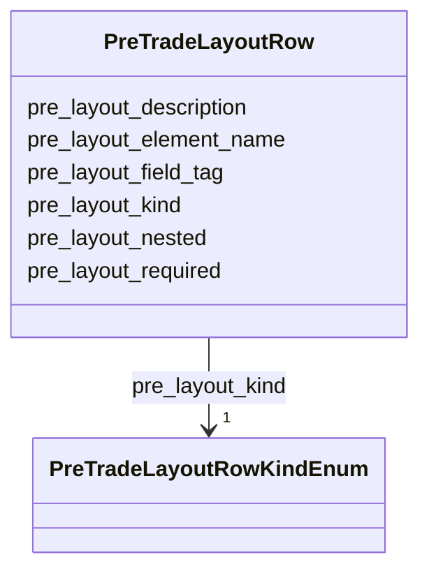

```mermaid
 classDiagram
    class PreTradeLayoutRow
    click PreTradeLayoutRow href "../PreTradeLayoutRow"
      PreTradeLayoutRow : pre_layout_description
        
      PreTradeLayoutRow : pre_layout_element_name
        
      PreTradeLayoutRow : pre_layout_field_tag
        
      PreTradeLayoutRow : pre_layout_kind
        
          
    
        
        
        PreTradeLayoutRow --> "1" PreTradeLayoutRowKindEnum : pre_layout_kind
        click PreTradeLayoutRowKindEnum href "../PreTradeLayoutRowKindEnum"
    

        
      PreTradeLayoutRow : pre_layout_nested
        
      PreTradeLayoutRow : pre_layout_required
        
      
```
