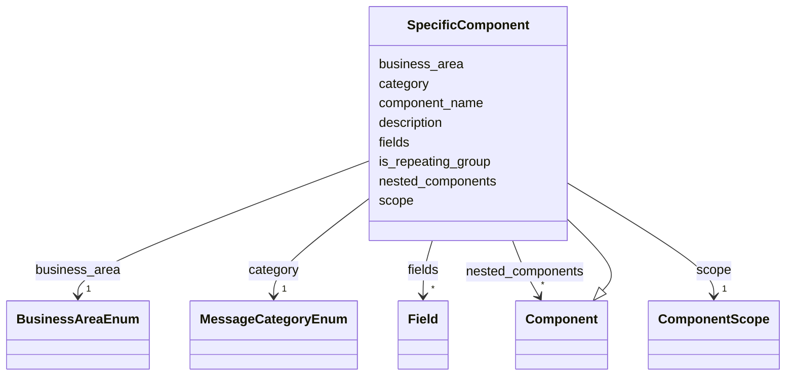

```mermaid
 classDiagram
    class SpecificComponent
    click SpecificComponent href "../SpecificComponent"
      Component <|-- SpecificComponent
        click Component href "../Component"
      
      SpecificComponent : business_area
        
          
    
        
        
        SpecificComponent --> "1" BusinessAreaEnum : business_area
        click BusinessAreaEnum href "../BusinessAreaEnum"
    

        
      SpecificComponent : category
        
          
    
        
        
        SpecificComponent --> "1" MessageCategoryEnum : category
        click MessageCategoryEnum href "../MessageCategoryEnum"
    

        
      SpecificComponent : component_name
        
      SpecificComponent : description
        
      SpecificComponent : fields
        
          
    
        
        
        SpecificComponent --> "*" Field : fields
        click Field href "../Field"
    

        
      SpecificComponent : is_repeating_group
        
      SpecificComponent : nested_components
        
          
    
        
        
        SpecificComponent --> "*" Component : nested_components
        click Component href "../Component"
    

        
      SpecificComponent : scope
        
          
    
        
        
        SpecificComponent --> "1" ComponentScope : scope
        click ComponentScope href "../ComponentScope"
    

        
      
```
