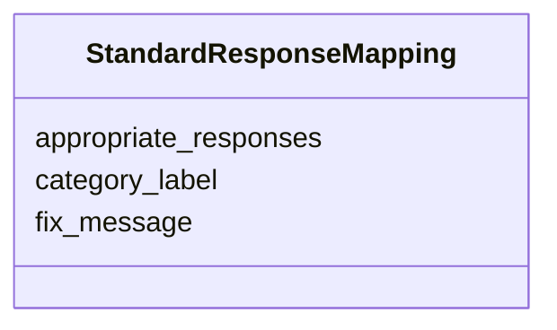

```mermaid
 classDiagram
    class StandardResponseMapping
    click StandardResponseMapping href "../StandardResponseMapping"
      StandardResponseMapping : appropriate_responses
        
      StandardResponseMapping : category_label
        
      StandardResponseMapping : fix_message
        
      
```
