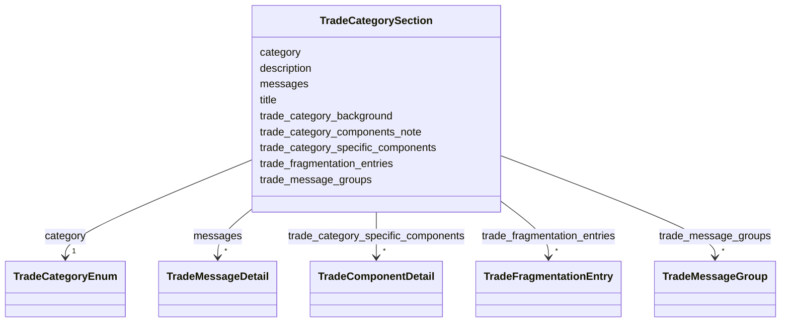

```mermaid
 classDiagram
    class TradeCategorySection
    click TradeCategorySection href "../TradeCategorySection"
      TradeCategorySection : category
        
          
    
        
        
        TradeCategorySection --> "1" TradeCategoryEnum : category
        click TradeCategoryEnum href "../TradeCategoryEnum"
    

        
      TradeCategorySection : description
        
      TradeCategorySection : messages
        
          
    
        
        
        TradeCategorySection --> "*" TradeMessageDetail : messages
        click TradeMessageDetail href "../TradeMessageDetail"
    

        
      TradeCategorySection : title
        
      TradeCategorySection : trade_category_background
        
      TradeCategorySection : trade_category_components_note
        
      TradeCategorySection : trade_category_specific_components
        
          
    
        
        
        TradeCategorySection --> "*" TradeComponentDetail : trade_category_specific_components
        click TradeComponentDetail href "../TradeComponentDetail"
    

        
      TradeCategorySection : trade_fragmentation_entries
        
          
    
        
        
        TradeCategorySection --> "*" TradeFragmentationEntry : trade_fragmentation_entries
        click TradeFragmentationEntry href "../TradeFragmentationEntry"
    

        
      TradeCategorySection : trade_message_groups
        
          
    
        
        
        TradeCategorySection --> "*" TradeMessageGroup : trade_message_groups
        click TradeMessageGroup href "../TradeMessageGroup"
    

        
      
```
