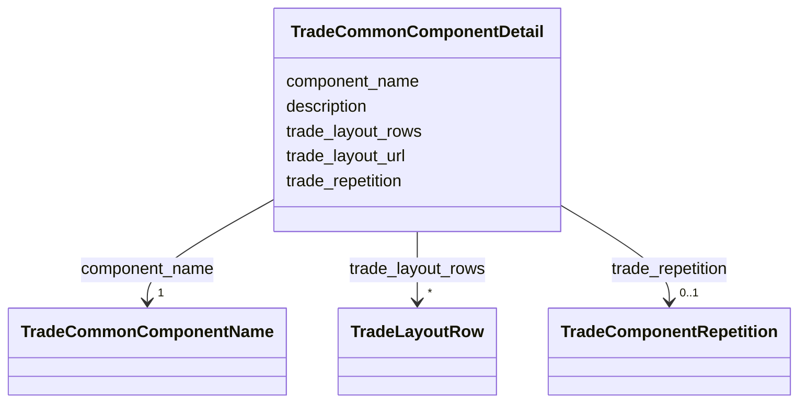

```mermaid
 classDiagram
    class TradeCommonComponentDetail
    click TradeCommonComponentDetail href "../TradeCommonComponentDetail"
      TradeCommonComponentDetail : component_name
        
          
    
        
        
        TradeCommonComponentDetail --> "1" TradeCommonComponentName : component_name
        click TradeCommonComponentName href "../TradeCommonComponentName"
    

        
      TradeCommonComponentDetail : description
        
      TradeCommonComponentDetail : trade_layout_rows
        
          
    
        
        
        TradeCommonComponentDetail --> "*" TradeLayoutRow : trade_layout_rows
        click TradeLayoutRow href "../TradeLayoutRow"
    

        
      TradeCommonComponentDetail : trade_layout_url
        
      TradeCommonComponentDetail : trade_repetition
        
          
    
        
        
        TradeCommonComponentDetail --> "0..1" TradeComponentRepetition : trade_repetition
        click TradeComponentRepetition href "../TradeComponentRepetition"
    

        
      
```
