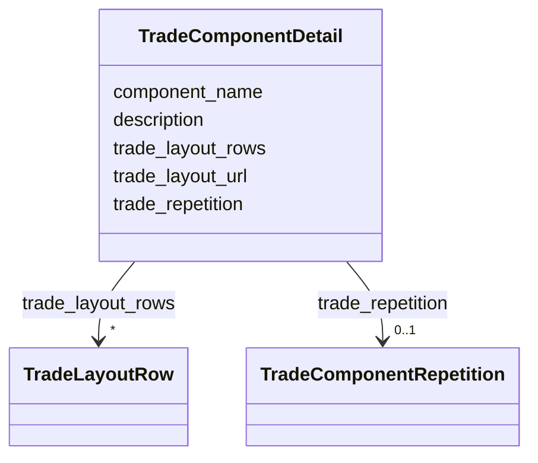

```mermaid
 classDiagram
    class TradeComponentDetail
    click TradeComponentDetail href "../TradeComponentDetail"
      TradeComponentDetail : component_name
        
      TradeComponentDetail : description
        
      TradeComponentDetail : trade_layout_rows
        
          
    
        
        
        TradeComponentDetail --> "*" TradeLayoutRow : trade_layout_rows
        click TradeLayoutRow href "../TradeLayoutRow"
    

        
      TradeComponentDetail : trade_layout_url
        
      TradeComponentDetail : trade_repetition
        
          
    
        
        
        TradeComponentDetail --> "0..1" TradeComponentRepetition : trade_repetition
        click TradeComponentRepetition href "../TradeComponentRepetition"
    

        
      
```
