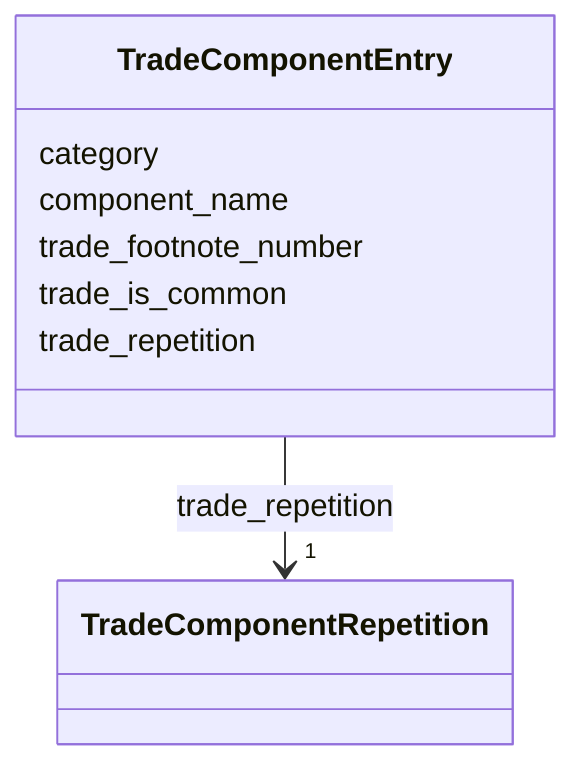

```mermaid
 classDiagram
    class TradeComponentEntry
    click TradeComponentEntry href "../TradeComponentEntry"
      TradeComponentEntry : category
        
      TradeComponentEntry : component_name
        
      TradeComponentEntry : trade_footnote_number
        
      TradeComponentEntry : trade_is_common
        
      TradeComponentEntry : trade_repetition
        
          
    
        
        
        TradeComponentEntry --> "1" TradeComponentRepetition : trade_repetition
        click TradeComponentRepetition href "../TradeComponentRepetition"
    

        
      
```
