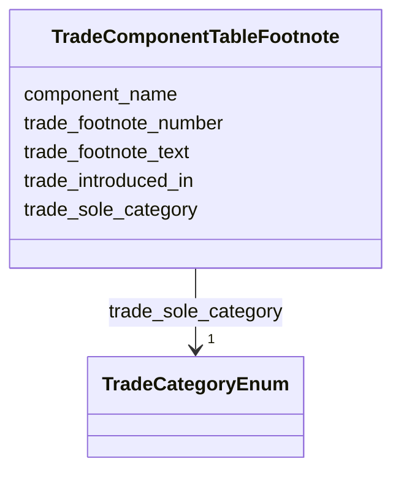

```mermaid
 classDiagram
    class TradeComponentTableFootnote
    click TradeComponentTableFootnote href "../TradeComponentTableFootnote"
      TradeComponentTableFootnote : component_name
        
      TradeComponentTableFootnote : trade_footnote_number
        
      TradeComponentTableFootnote : trade_footnote_text
        
      TradeComponentTableFootnote : trade_introduced_in
        
      TradeComponentTableFootnote : trade_sole_category
        
          
    
        
        
        TradeComponentTableFootnote --> "1" TradeCategoryEnum : trade_sole_category
        click TradeCategoryEnum href "../TradeCategoryEnum"
    

        
      
```
