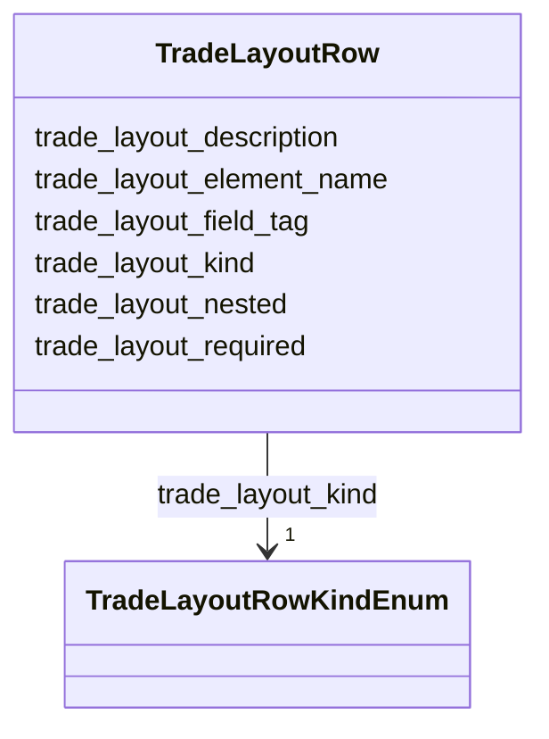

```mermaid
 classDiagram
    class TradeLayoutRow
    click TradeLayoutRow href "../TradeLayoutRow"
      TradeLayoutRow : trade_layout_description
        
      TradeLayoutRow : trade_layout_element_name
        
      TradeLayoutRow : trade_layout_field_tag
        
      TradeLayoutRow : trade_layout_kind
        
          
    
        
        
        TradeLayoutRow --> "1" TradeLayoutRowKindEnum : trade_layout_kind
        click TradeLayoutRowKindEnum href "../TradeLayoutRowKindEnum"
    

        
      TradeLayoutRow : trade_layout_nested
        
      TradeLayoutRow : trade_layout_required
        
      
```
