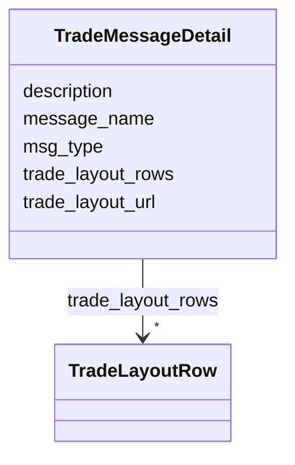

```mermaid
 classDiagram
    class TradeMessageDetail
    click TradeMessageDetail href "../TradeMessageDetail"
      TradeMessageDetail : description
        
      TradeMessageDetail : message_name
        
      TradeMessageDetail : msg_type
        
      TradeMessageDetail : trade_layout_rows
        
          
    
        
        
        TradeMessageDetail --> "*" TradeLayoutRow : trade_layout_rows
        click TradeLayoutRow href "../TradeLayoutRow"
    

        
      TradeMessageDetail : trade_layout_url
        
      
```
