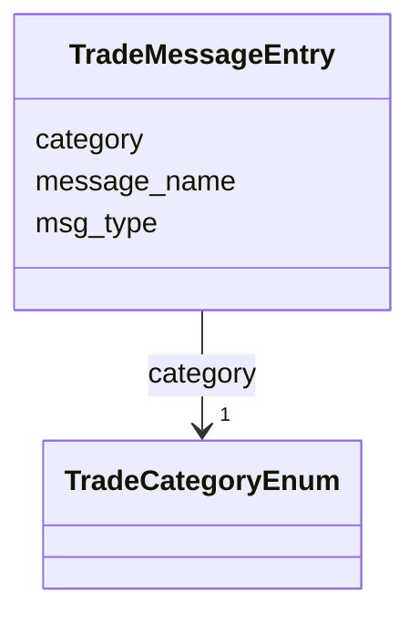

```mermaid
 classDiagram
    class TradeMessageEntry
    click TradeMessageEntry href "../TradeMessageEntry"
      TradeMessageEntry : category
        
          
    
        
        
        TradeMessageEntry --> "1" TradeCategoryEnum : category
        click TradeCategoryEnum href "../TradeCategoryEnum"
    

        
      TradeMessageEntry : message_name
        
      TradeMessageEntry : msg_type
        
      
```
